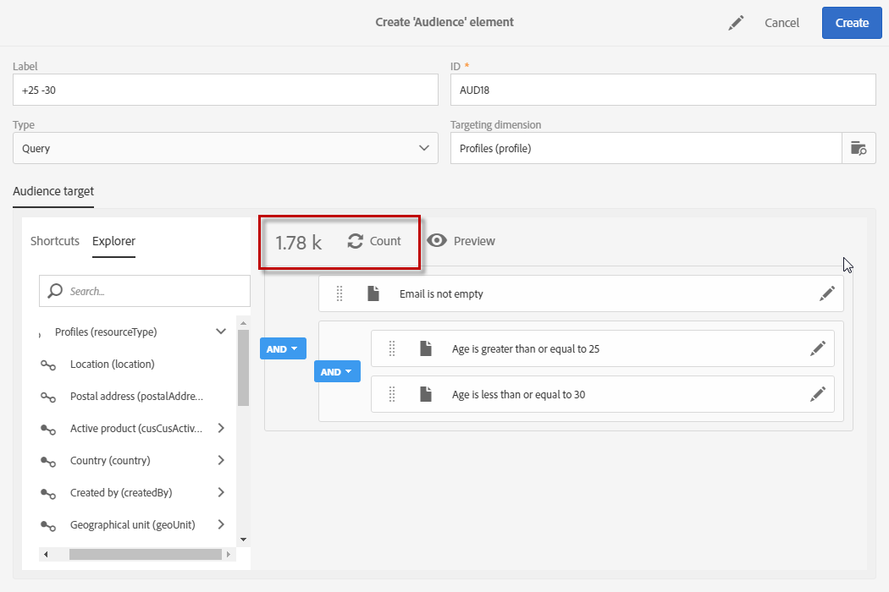

# Editing queries{#editing-queries}

## About query editor {#about-query-editor}

查询编辑器是一个向导，用于过滤Adobe Campaign数据库中包含的数据。

通过此功能，您可以通过预定义的过滤器和规则来构建用户以更好地定位收件人。

一些应用程序功能使用它来：

* Create **Query** type **audiences**
* Define **email** targets
* Define populations in **workflow** activities

## Query editor interface {#query-editor-interface}

The query editor is made up of a **Palette** and a **Workspace**.

### Palette {#palette}

调色板位于编辑器左侧，分为两个选项卡，它们包含划分为主题块的元素。这些选项卡有：

* **快捷键**、默认情况下可用或由实例管理员创建的快捷键。您可以在此处找到字段、节点、分组、1-1链接、1-N链接和其他预定义筛选器。
* **用于** 访问目标资源中所有可用字段的资源管理器：节点，分组元素，链接(1-1和1-N)。

必须将选项卡中包含的元素移入工作区，以便进行配置并考虑查询。Depending on the targeting dimension selected (see [Targeting dimensions and resources](../../automating/using/query.md#targeting-dimensions-and-resources)), you can:

* 逐个选择受众或档案
* 使用预定义滤镜
* 为您选择的字段定义简单规则
* 定义允许您将函数应用于特定字段的高级规则

### Workspace {#workspace}

工作区是中心区域，您可以在该区域中配置和合并规则、受众以及从调色板中添加的预定义筛选器。

When you move an element from the palette into the workspace, a new window opens and you can start [Creating queries](../../automating/using/editing-queries.md#creating-queries).

## Creating queries {#creating-queries}

查询编辑器可用于定义消息中的受众或测试配置文件、工作流中的人群以及创建查询类型受众。

Queries can be defined in the **[!UICONTROL Audience]** window while creating a delivery or in a **Query** activity while creating a workflow.

1. 将元素从调色板移至工作区。此时将打开编辑规则的窗口。

   * For a string or numerical **field**, specify the comparison operator and the value.

      

   * For a date or date and time **field**, you can choose to define a specific date, a range between two dates, or a period relative to the query's execution date.

      

   * For a Boolean **field**, check the boxes linked to the possible values for the field.
   * For a **grouping** field, select the grouping field on which you want to create the rule, then define the condition in the same way as for the other fields.

      

   * For a **1-1** link with another database resource, select a value directly from the table targeted.

      

   * For a **1-N** link with another database resource, you can define a sub-query on the fields of this second resource.

      您无需指定子条件。

      For example, you can only select the **[!UICONTROL Exists]** operator on the profile tracking logs and approve the rule. 该规则将返回跟踪日志存在的所有配置文件。

      

   * For a **predefined filter**, enter or select the elements you like according to the criteria offered.

      管理员可以创建过滤器以促进复杂和重复的查询。它们将以预配置规则的形式显示在查询编辑器中，并限制用户执行的步骤数。

      

1. 您可以指定规则的名称。然后，它将显示为工作区中的规则名称。如果未提供规则，则会自动显示条件的自动描述。
1. 要组合工作区元素，请将它们彼此锁定以创建不同的组和/或组级别。然后，您可以选择一个逻辑运算符，将元素组合到同一级别：

   * **[!UICONTROL AND]**：两个条件的交叉点。只考虑与每个标准匹配的元素。
   * **[!UICONTROL OR]**：两个条件的联合。考虑到至少两个条件之一的元素被考虑在内。
   * **[!UICONTROL EXCEPT]**：排除条件。与第一个标准匹配的元素会被考虑在内，除非它们也符合第二个标准。

1. You can now calculate and preview the number of elements targeted by your query using the  and  buttons from the action bar.

   

如果要修改查询的元素，请单击编辑图标。规则将在之前配置时打开，然后您可以执行必要的调整。

您的查询现已创建并定义，这使您能够建立一个人群以更好地个性化您的交付。

**相关主题：**

* [高级函数](../../automating/using/advanced-expression-editing.md)
* [定义过滤器](../../developing/using/configuring-filter-definition.md)

