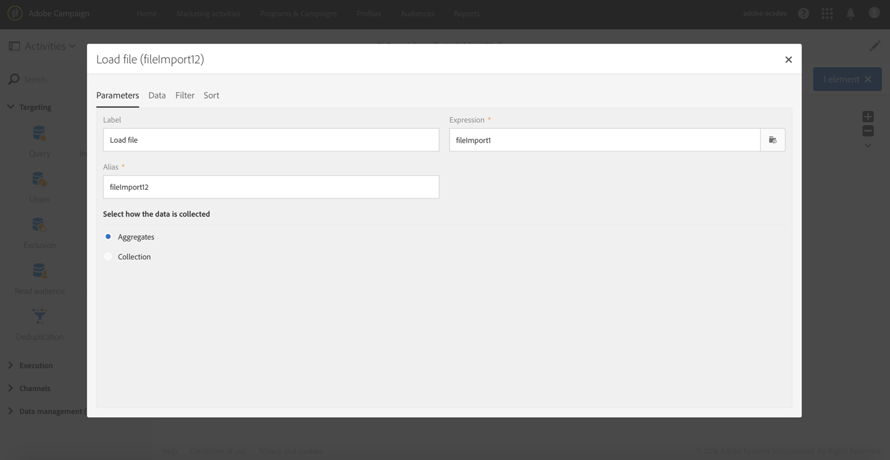

# 使用文件中包含的数据扩充轮廓数据 {#enriching-profile-data-with-data-contained-in-a-file}

此示例展示了如何使用文件中包含的购买数据扩充轮廓的数据。在本案例中，我们假设购买数据存储在第三方系统中。每个轮廓都可以在文件中存储多次购买。该工作流的最终目标是向至少购买了两件物品的目标轮廓发送电子邮件，以感谢他们对于品牌的信任。

工作流的配置如下所示：


* [查询](../../automating/using/query.md)活动，用于定向接收消息的用户档案。
* 加载购买数据的[加载文件](../../automating/using/load-file.md)活动。 例如：

  ```
  tcode;tdate;customer;product;tamount
  aze123;21/05/2017;dannymars@example.com;TV;799
  aze124;28/05/2017;dannymars@example.com;Headphones;8
  aze125;31/07/2017;john.smith@example.com;Headphones;8
  aze126;14/12/2017;john.smith@example.com;Plastic Cover;4
  aze127;02/01/2018;dannymars@example.com;Case Cover;79
  aze128;04/03/2017;clara.smith@example.com;Phone;149
  ```

  对于此示例文件，使用电子邮件地址将数据与数据库用户档案协调。 您还可以启用唯一 ID，如[此文档](../../developing/using/configuring-the-resource-s-data-structure.md#generating-a-unique-id-for-profiles-and-custom-resources)所述。

* 一个[扩充](../../automating/using/enrichment.md)活动，用于在从文件加载的交易处理数据与&#x200B;**[!UICONTROL Query]**&#x200B;中选择的用户档案之间创建链接。 在活动的 **[!UICONTROL Advanced relations]** 选项卡中定义链接。链接基于来自 **[!UICONTROL Load file]** 活动的过渡。工作流使用了轮廓资源的“email”字段和导入文件的“customer”列作为协调条件。

  

  创建链接后，将添加两组 **[!UICONTROL Additional data]**：

   * 包含两个行的集合，对应于各个轮廓的最后两次交易。对于此集合，将添加产品名称、交易日期和产品价格作为附加数据。对数据应用降序排序。要创建集合，请从 **[!UICONTROL Additional data]** 选项卡：

     选择之前在活动的 **[!UICONTROL Advanced relations]** 选项卡中定义的链接。

     

     勾选 **[!UICONTROL Collection]** 并指定要检索的行数（在本例中为“2”）。在此屏幕中，您可以自定义集合的 **[!UICONTROL Alias]** 和 **[!UICONTROL Label]**。引用此集合时，在工作流的以下活动中会显示这些值。

     

     对于集合中要保留的 **[!UICONTROL Data]**，请选择要用在最终投放中的列。

     

     对交易日期应用降序排序，以确保检索最新交易。

     

   * 聚合可计入每个轮廓的交易总数。此聚合稍后将用于筛选至少记录了两次交易的轮廓。要创建聚合，请从 **[!UICONTROL Additional data]** 选项卡：

     选择之前在活动的 **[!UICONTROL Advanced relations]** 选项卡中定义的链接。

     

     选择 **[!UICONTROL Aggregate]**。

     

     要保留 **[!UICONTROL Data]**，请定义 **Count All** 聚合。需要时请指定自定义别名，以便在后续活动中更快地找到它。

     

* 仅带有一个区段的[分段](../../automating/using/segmentation.md)活动，用于检索至少记录了两次交易的原始目标的用户档案。 仅进行了一次交易的轮廓将被排除。要实现此目的，应根据之前定义的聚合进行分段查询。

  

* 一个[电子邮件投放](../../automating/using/email-delivery.md)活动，它使用&#x200B;**[!UICONTROL Enrichment]**&#x200B;中定义的附加数据动态检索该用户档案进行的最后两次购买。 添加个性化字段时，**Additional data (TargetData)** 节点中会显示附加数据。

  

**相关主题：**

* [利用外部数据扩充客户的轮廓](https://helpx.adobe.com/cn/campaign/kb/simplify-campaign-management.html#Managedatatofuelengagingexperiences)
