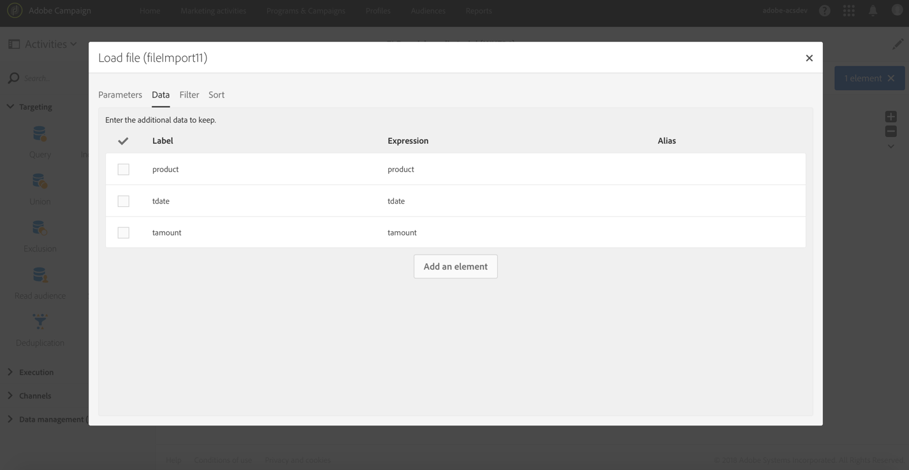

# 丰富性{#enrichment}

## 描述 {#description}


**[!UICONTROL Enrichment]** 活动是一个高级活动，允许您定义工作流中要处理的其他数据。

## 使用情境 {#context-of-use}

**[!UICONTROL Enrichment]** 活动通常用于定位活动或导入文件之后，在允许使用目标数据的活动之前。

此活动包含比 **[!UICONTROL Query]** 活动更高级的丰富功能。一些简单的丰富化情况可在 [查询活动](../../automating/using/query.md#enriching-data)中直接执行。

在 **[!UICONTROL Enrichment]** 活动中，您可以利用入站过渡并配置活动，以完成输出过渡并使用额外的数据完成输出过渡。它允许合并来自多个集合的数据，或创建指向临时资源的链接。

## 配置 {#configuration}

配置 **[!UICONTROL Enrichment]** 活动：

1. 将 **[!UICONTROL Enrichment]** 活动拖放到工作流中。
1. 选择活动，然后使用出现的快速操作中  的按钮打开该活动。
1. 如果活动有多个入站过渡，请选择 **[!UICONTROL Primary set]**&#x200B;该选项。此活动中配置的其他数据将添加到出站过渡中的此主要设置。

   如果主集合已经包含其他数据，您可以选择保留它们或删除它们。如果取消选中 **[!UICONTROL Keep all additional data from the main set]** 此选项，则只有在该 **[!UICONTROL Enrichment]** 选项中配置的附加数据才会保留在出站过渡中。

1. 如果有多个入站过渡，则定义主要集合与活动 **[!UICONTROL Advanced Relations]** 选项卡中其他入站数据之间的关系。您可以使用 **[!UICONTROL Add element]** 按钮添加多个关系。

   定义新关系时，请选择要链接到主集合的集数据集。然后定义关系类型。有几种类型的关系可用，具体取决于入站数据和您的数据模型：

   * **[!UICONTROL 1 cardinality simple link]**：传入数据的每个记录与一个记录相关联，并且只与主要集中的一个记录相关联。主集合中的每个记录都有关联的数据中的一个关联记录。
   * **[!UICONTROL N cardinality collection link]**：链接数据中的0、1或更多(N)记录可与主要设置的记录相关联。
   * **[!UICONTROL 0 or 1 cardinality simple link]**：主集合中的记录可以与链接数据中的0或记录关联，但不能与多个记录关联。
   定义 **[!UICONTROL Cardinality]** 后，定义 **[!UICONTROL Reconciliation criteria]**&#x200B;一个。对帐条件可以 **[!UICONTROL Source expression]** 是目标资源、 [表达式](../../automating/using/advanced-expression-editing.md) 或直接在引号之间指定的值的字段。

   定义稍后在工作流中很容易识别的一个 **[!UICONTROL Label]** 和一个 **[!UICONTROL ID]** 。

   >[!NOTE]
   >
   >您只能定义主要集与与 **[!UICONTROL Enrichment]** 活动连接的其他入站过渡之间的关系。对于用于定义与数据库资源的关系的简单案例，请使用 [“对帐](../../automating/using/reconciliation.md) 活动”。

1. 从活动 **[!UICONTROL Additional data]** 选项卡中定义其他数据。您可以定义与主要设置的定位维度相关的其他数据(简单字段、集合和集合)，或基于活动 **[!UICONTROL Advanced relations]** 选项卡中创建的链接 **[!UICONTROL Enrichment]** 。

   请参阅 [丰富的数据](../../automating/using/query.md#enriching-data) 部分。

1. 确认活动的配置并保存工作流。

该数据现在可用于之后连接的活动中 **[!UICONTROL Enrichment]**。例如，您可以在电子邮件内容中的个性化字段Explorer **[!UICONTROL Additional data (targetData)]** 链接下找到它。

## 示例：使用文件中包含的数据丰富个人资料数据 {#example--enriching-profile-data-with-data-contained-in-a-file}

此示例显示如何使用文件中包含的购买数据来丰富配置文件数据。我们在此处考虑购买数据存储在第三方系统中。每个配置文件都可以存储在文件中的多个购买。工作流程的最后目标是向已购买至少两个项目的目标档案发送电子邮件，感谢他们忠诚度。

工作流的配置如下：


* 面向将收到消息的档案的 **[!UICONTROL Query]** 活动。
* 加载购买数据的 **[!UICONTROL Load file]** 活动。例如：

   ```
   tcode;tdate;customer;product;tamount
   aze123;21/05/2017;dannymars@example.com;TV;799
   aze124;28/05/2017;dannymars@example.com;Headphones;8
   aze125;31/07/2017;john.smith@example.com;Headphones;8
   aze126;14/12/2017;john.smith@example.com;Plastic Cover;4
   aze127;02/01/2018;dannymars@example.com;Case Cover;79
   aze128;04/03/2017;clara.smith@example.com;Phone;149
   ```

   通过此示例文件，我们将使用电子邮件地址将数据与数据库配置文件协调。您还可以按照本文档 [](../../developing/using/configuring-the-resource-s-data-structure.md#generating-a-unique-id-for-profiles-and-custom-resources)中的说明启用唯一ID。

* **[!UICONTROL Enrichment]** 创建从文件加载的事务数据和在中选择的配置文件之间的链接的活动 **[!UICONTROL Query]**。链接在活动 **[!UICONTROL Advanced relations]** 的选项卡中定义。链接基于 **[!UICONTROL Load file]** 活动所带来的过渡。它使用配置文件资源的“电子邮件”字段和导入文件的“客户”列作为排序标准。

   

   创建链接后，将添加 **[!UICONTROL Additional data]** 两组：

   * 与每个配置文件的最后两个事务对应的两行的集合。对于此集合，产品名称、事务日期和产品价格将添加为其他数据。对数据应用降序排序。要创建集合，请从 **[!UICONTROL Additional data]** 选项卡中：

      选择先前在活动 **[!UICONTROL Advanced relations]** 选项卡中定义的链接。

      

      选中 **[!UICONTROL Collection]** 并指定要检索的行数(本例中为2)。在此屏幕中，您可以自定义集合的和 **[!UICONTROL Alias]** 列表 **[!UICONTROL Label]** 。引用此集合时，这些值将在工作流的以下活动中可见。

      

      要 **[!UICONTROL Data]** 保留集合，请选择将在最终交付中使用的列。

      

      对事务日期应用降序排序以确保检索最新事务。

      

   * 汇总每个配置文件的事务总数的汇总。以后将使用此汇总过滤至少录制了两个事务的配置文件。要创建聚合，请从 **[!UICONTROL Additional data]** 选项卡中：

      选择先前在活动 **[!UICONTROL Advanced relations]** 选项卡中定义的链接。

      

      选择 **[!UICONTROL Aggregate]**。

      

      如 **[!UICONTROL Data]** 要保留，请定义 **全部** 汇总。如果需要，请指定自定义别名以在以下活动中更快地找到它。

      

* **[!UICONTROL Segmentation]** 仅具有一个区段的活动，该区段检索至少已记录两个事务的初始目标的配置文件。仅包含一个事务的配置文件被排除。为此，对之前定义的聚合进行了查询查询。

   

* **[!UICONTROL Email delivery]** 使用中定义的附加数据动态检索 **[!UICONTROL Enrichment]** 配置文件所做的两次购买的活动。添加个性化字段时，可在 **附加数据(targetData)** 节点中找到其他数据。

   

**相关主题：**

* [利用外部数据丰富客户档案](https://helpx.adobe.com/campaign/kb/simplify-campaign-management.html#Managedatatofuelengagingexperiences)

