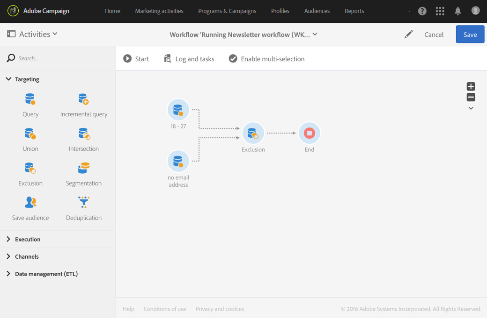

# 差集{#exclusion}

## 说明 {#description}

利用 **[!UICONTROL Exclusion]** 活动，可根据特定条件从一个群体中排除某些元素。

## 使用环境 {#context-of-use}

**[!UICONTROL Exclusion]** 活动主要用于对集客过渡群体进行附加筛选。

主集在集客过渡中定义。其他集客过渡的成员将从主集中排除。叫客过渡的排除活动只包含其他集客过渡中未出现的主集成员。

## 配置 {#configuration}

1. 将 **[!UICONTROL Exclusion]** 活动拖放到工作流中。
1. 选择活动，然后使用所显示快速操作中的  按钮将其打开。
1. 从集客过渡中选择 **[!UICONTROL Primary set]**。这是排除了元素的集合。其他集合用于匹配从主集中排除之前的元素。

   >[!NOTE]
   >
   >集客过渡必须包含相同类型的群体。例如，如果主集包含测试轮廓，则其他过渡也必须包含测试轮廓。

1. 如果需要，可以管理活动的[过渡](../../automating/using/activity-properties.md)，以访问叫客群体的高级选项。
1. 确认活动的配置并保存工作流。

## 示例 {#example}

下方示例显示了两个查询活动，配置为从 Adobe Campaign 数据库筛选年龄在 18 到 27 岁之间且电子邮件地址无效的轮廓。随后，具有无效电子邮件地址的轮廓将从第一个集合中排除。随后即可进行发送电子邮件之类的操作。

