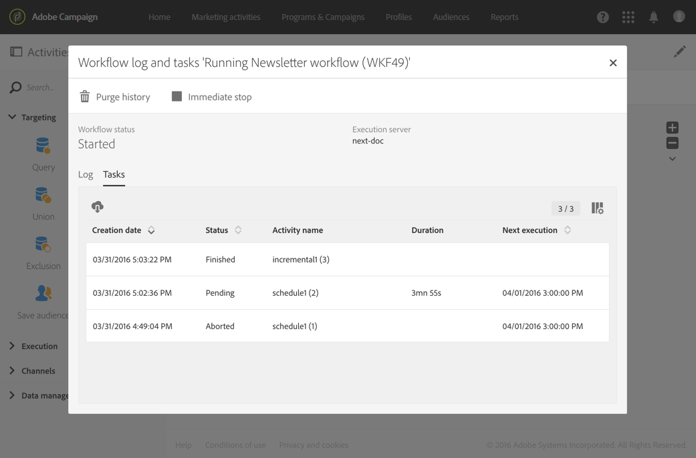

# 执行工作流{#executing-a-workflow}

## 关于工作流执行 {#about-workflow-execution}

工作流始终手动启动。 但是，一旦启动，它就可能保持不活动状态，具体取决于在 [调度程序活动中指定的信](../../automating/using/scheduler.md) 息。

>[!CAUTION]
>
> Adobe建议客户优先处理工作流执行，并运行多达二十个并发工作流执行，以始终如一地在实例中实现最佳性能。 可能计划并执行超过20个并发工作流，默认情况下将按顺序执行。 您可以通过向客户服务部门提交票证来调整并发工作流执行的最大次数的默认设置。

与执行相关的操作(开始、停止、暂停等)是异 **步进程** :保存该命令，并在服务器可用来应用该命令后生效。

在工作流中，每个活动的结果通常通过过渡（由箭头表示）发送到以下活动。

如果过渡未链接到目标活动，则该将不终止。

>[!NOTE]
>
>仍可以执行包含未结束过渡的工作流：将生成一条警告消息，工作流到达过渡后将暂停，但这不会生成错误。 您还可以开始工作流程，而无需完成设计，并可以随时完成设计。

执行活动后，过渡中发送的记录数将显示在其上方。

您可以打开过渡，以检查在执行工作流期间或之后发送的数据是否正确。 您可以视图数据和数据结构。

默认情况下，只能访问工作流上次过渡的详细信息。 要能够访问前面活动的结果，您需要在启动工作流之前检查 **[!UICONTROL Keep interim results]** 工作流属 **[!UICONTROL Execution]** 性部分中的选项。

>[!NOTE]
>
>此选项占用大量内存，旨在帮助构建工作流并确保其正确配置和行为。 在生产实例中不选中它。

打开过渡后，您可以编辑该或将 **[!UICONTROL Label]** 其链接到该 **[!UICONTROL Segment code]** 中。 为此，请编辑相应的字段并确认修改。

使用Campaign StandardAPI，您可以 **开始、暂**&#x200B;停 **、恢复和**&#x200B;停止Rest工 **作流程****** 的、暂停和停止Rest工作流。 您可以在 [API文档中找到更多详细信息和REST调用示例。](../../api/using/controlling-a-workflow.md)

## 生命周期 {#life-cycle}

工作流的生命周期包括三个主要步骤，每个步骤都链接到状态和颜色：

* **编辑** （灰色）

   这是工作流的初始设计阶段(请参阅 [创建工作流](../../automating/using/building-a-workflow.md#creating-a-workflow))。 该工作流尚未由服务器处理，并且可以在不发生任何风险的情况下进行修改。

* **进行中** （蓝色）

   初始设计阶段完成后，可以启动工作流并由服务器处理。

* **已完成** （绿色）

   当不再有任何任务在进行中或操作符明确停止实例时，工作流即告完成。

启动工作流后，该工作流可能还有两种其他状态：

* **警告** （黄色）

   工作流无法完成或使用按钮暂停  或  完成。

* **错误** （红色）

   执行工作流时出错。 此工作流已停止，用户必须执行操作。 要进一步了解此错误，请使用按  钮访问工作流日志(请参阅 [监视](#monitoring))。

营销活动的列表允许您显示所有工作流及其状态。 有关此方面的详细信息，请参阅 [管理营销活动](../../start/using/marketing-activities.md#about-marketing-activities)。

## 执行命令 {#execution-commands}

操作栏中的图标允许您开始、跟踪和修改工作流的执行。 请参阅 [操作栏](../../automating/using/workflow-interface.md#action-bar)。

可用的操作如下：

**开始**

按  钮开始执行工作流，然后该工作流进 **行中** （蓝色）状态。 如果暂停了工作流，则它会恢复，否则会启动它，然后激活初始活动。

>[!NOTE]
>
>启动是一个异步进程：此时会保存请求，并且工作流执行引擎将尽快处理该请求。

**暂停**

该按  钮会暂停执行。 该工作流将处于“警 **告** （黄色）”状态。 新活动在恢复之前不会激活，但正在进行的操作不会暂停。

**停止**

该  按钮会停止正在执行的工作流，然后该工作流将进入“已完 **成** ”（绿色）状态。 正在进行的操作会尽可能中断，并且导入或正在进行的SQL查询会立即取消。 您无法从停止工作流的同一位置恢复工作流。

**重新启动**

该按  钮涉及停止，然后重新启动工作流。 在大多数情况下，这允许您更快地重新启动。 在停止操作需要一定时间后自动重新启动也很有用，因为只有在停止有效  时，按钮才可用。

选择工作流中的一个或多个活动后，您可以执行其他操作，例如：

**立即执行**

该按  钮会开始所有选定的待定活动。

**正常执行**

该按  钮可重新激活任何已暂停或已取消激活的活动。

**已暂停执行**

该按  钮将在选定的活动暂停工作流：不会执行此任务及其后面的所有操作（在同一分支中）。

**不执行**

该按  钮可停用任何选定的活动。

>[!NOTE]
>
>快速操作允许您访问与某个特定活动相关的不同操作，并在选择活动时显示这些操作。

## 监控 {#monitoring}

该图  标将打开工作流日志和任务菜单。

在工作流执行选项中指定的持续时间内保存工作流历史记录(请参 [阅工作流属性](#workflow-properties))。 因此，在此期间，即使重新启动后，也会保存所有消息。 如果不希望保存先前执行中的消息，则必须单击按钮以清除历史记  录。

该选 **[!UICONTROL Log]** 项卡包含所有活动或任何选定活动的执行历史记录。 它按时间顺序对执行的操作和执行错误进行索引。

此标 **[!UICONTROL Tasks]** 签详细说明了活动的执行顺序。 单击任务可获取更多信息。

在这两个列表中：

* 单击计数器可查看根据所应用的筛选器的活动总数。 默认情况下，如果列表中的元素数少于30，则显示计数器。
* 通过 **[!UICONTROL Configure list]** 该按钮，您可以选择显示的信息、定义列顺序和对列表排序。
* 您可以使用过滤器更快地查找所需的信息。 使用搜索字段在工作流活动名称中查找特定文本(例如：“查询”)和日志。

## 错误管理 {#error-management}

发生错误时，工作流暂停，遇到错误时正在执行的活动闪烁红色。

工作流状态将变为红色，错误将记录在日志中。

您可以配置工作流，使其不会暂停并继续执行，而不会出现任何错误。 为此，请通过按钮转到工作流属性，  并在部分中 **[!UICONTROL Execution]** ，选择“发生错误时 **”** 字段中的“忽略”选项 **** 。

在这种情况下，将中止错误的任务。 此模式特别适用于设计为稍后重新尝试操作（定期操作）的工作流。

>[!NOTE]
>
>您可以对每个活动单独应用此配置。 为此，请选择一个活动，然后使用快速操作将其打开 。 然后在“执行选项”选项卡中选择错 **误管理模** 式。 请参阅 [活动执行选项](#activity-execution-options)。

在工作 [流的属性中](#workflow-properties)，提供了与错误管理相关的其他选项。

可能的选项包括：

* **[!UICONTROL Supervisors]**:允许您定义在工作流遇到错误时要通知的用户组（电子邮件和应用程序内通知）。 如果未定义组，则不会通知任何用户。 有关Adobe Campaign通知的详细信息，请参阅 [Adobe Campaign通知](../../administration/using/sending-internal-notifications.md)。

* **[!UICONTROL In case of error]**:允许您指定在活动遇到错误时要执行的操作。 有两个选项可用于此：

   * **暂停进程**:工作流会自动挂起。 然后，工作流状态 **为“错误** ”，且关联的颜色将变为红色。 问题解决后，请重新启动工作流。
   * **忽略**:活动不会执行，因此，后面的任何活动（在同一分支中）也不会执行。 这可能证明对重复任务有用。 如果分支将调度程序放在上游，则应在下一个执行日期触发。

* **[!UICONTROL Consecutive errors]** :允许您定义在工作流执行自动挂起之前已授权的多个连续错误。

   * 如果指定的数字 **[!UICONTROL 0]**&#x200B;为，或者只要未达到指定的数字，则会忽略遇到错误的活动。 其他工作流分支正常执行。

   * 如果达到指定的数量，则整个工作流将暂停并变为 **[!UICONTROL Erroneous]**。 如果已定义监事，则会通过电子邮件自动通知他们。 请参阅 [Adobe Campaign通知](../../administration/using/sending-internal-notifications.md)。

## 工作流属性 {#workflow-properties}

要修改工作流的执行选项，请使用  按钮访问工作流属性并选择 **[!UICONTROL Execution]** 部分。

可能的选项包括：

* **[!UICONTROL Default affinity]**:此字段允许您强制在特定计算机上执行工作流或工作流活动。

* **[!UICONTROL History in days]**:指定清除历史记录的天数。 历史记录包含与工作流相关的元素：日志、任务、事件（链接到工作流操作的技术对象）以及由活动下载的文 **[!UICONTROL Transfer file]** 件。 现成工作流模板的默认值是30天。

   历史记录的清除由数据库清除技术工作流执行，默认情况下每天执行该工作流(请参 [阅技术工作流列表](../../administration/using/technical-workflows.md))。

   >[!IMPORTANT]
   >
   >如果字 **[!UICONTROL History in days]** 段留空，则其值将视为“1”，这意味着历史记录将在1天后清除。

* **[!UICONTROL Save SQL queries in the log]**:允许您将工作流中的SQL查询保存到日志中。

* **[!UICONTROL Keep interim results]**:如果您希望能够视图过渡的详细信息，请选中此选项。 警告：选中此选项可能会显着降低工作流执行速度。

* **[!UICONTROL Execute in the engine (do not use in production)]**:允许您在本地执行工作流，以便进行开发环境测试。

* **[!UICONTROL Severity]**:允许您指定在工作流实例中执行Adobe Campaign的优先级。 将首先执行关键工作流。

该部 **[!UICONTROL Error management]** 分提供了其他选项，允许您管理出错时工作流的行为方式。 这些选项在“错误管理” [部分中有详细](#error-management) 说明。

## 活动属性 {#activity-properties}

### 活动的常规属性 {#general-properties-of-an-activity}

每个活动都有一个 **[!UICONTROL Properties]** 选项卡。 此选项卡允许您修改活动的常规参数，特别是标签和ID。 配置此选项卡是可选的。

### 管理活动的对外过渡 {#managing-an-activity-s-outbound-transitions}

默认情况下，某些活动没有出站过渡。 您可以从选项卡或活动 **[!UICONTROL Transitions]** 选项卡中添加一个， **[!UICONTROL Properties]** 以将其他进程应用到同一工作流中的人群。

根据活动，您可以添加几种类型的出站过渡:

* 标准过渡:由活动计算的人口
* 过渡无人口：可以添加此类出站过渡以继续工作流，并且不包含任何人口以不占用系统上任何不必要的空间。
* 拒绝：人口遭到拒绝。 例如，如果由于活动的入站数据不正确或不完整而无法处理该数据。
* 补充：执行活动后剩余的人口。 例如，如果将分段活动配置为仅保存入站人口的百分比。

如果适用，请为活动 **[!UICONTROL Segment code]** 的出站过渡指定一个值。 此段代码将允许您确定目标群体的子集来自何处，并稍后可能用于消息个性化目的。

### 活动执行选项 {#activity-execution-options}

在活动的属性屏幕中，有一个选 **[!UICONTROL Advanced options]** 项卡允许您定义活动的执行模式和行为，以防出错。

要访问这些选项，请在工作流中选择一个活动，然后使用操作栏中  的按钮将其打开。

该 **[!UICONTROL Execution]** 字段允许您定义在启动任务时要执行的操作。 这有三种选择：

* **正常**:活动正常执行。
* **启用但不执行**:活动会暂停，因此后续的任何进程也会暂停。 如果您希望在任务启动时出现，这可能会很有用。
* **不启用**:活动不会执行，因此，（在同一分支中）后续的所有活动也不会执行。

该 **[!UICONTROL In case of error]** 字段允许您指定在活动遇到错误时要执行的操作。 有两个选项可用于此：

* **暂停进程**:工作流会自动挂起。 然后，工作流状态 **为“错误** ”，且关联的颜色将变为红色。 问题解决后，请重新启动工作流。
* **忽略**:活动不会执行，因此，后面的任何活动（在同一分支中）也不会执行。 这可能证明对重复任务有用。 如果分支将调度程序放在上游，则应在下一个执行日期触发。

该字 **[!UICONTROL Behavior]** 段允许您定义在使用异步任务时要遵循的过程。 有两个选项可用于此：

* **多任务授权**:即使第一任务未完成，也可以同时执行多个。
* **当前任务具有优先级**:一旦任务进行中，这就是当务之急。 只要一项任务仍在进行中，就不会执行其他任务。

字 **[!UICONTROL Max. execution duration]** 段允许您指定持续时间，如“30秒”或“1h”。 如果活动在指定的持续时间过后未完成，则会触发警报。 这不会影响工作流的工作方式。

该字 **[!UICONTROL Affinity]** 段允许您强制在特定计算机上执行工作流或工作流活动。 为此，您必须为相关工作流或关联指定一个或多个活动。

该 **[!UICONTROL Time zone]** 字段允许您选择活动的时区。 Adobe Campaign允许您管理同一实例上多个国家／地区之间的时间差。 创建实例时将配置所应用的设置。

>[!NOTE]
>
>默认情况下，如果未选择时区，活动将使用在工作流属性中定义的时区。

“注 **释** ”字段是允许您添加注释的免费字段。
