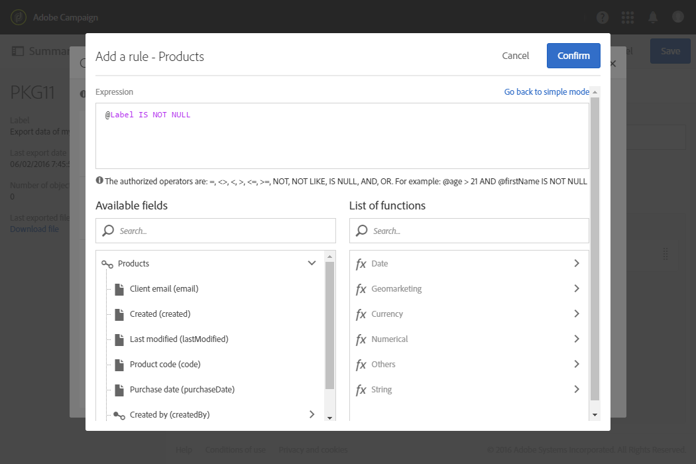

# 导出／导入自定义资源 {#exporting-importing-custom-resources}

本教程介绍如何将自定义资源包从开发环境导出并导入到生产环境。

此示例面向链接到Adobe Campaign的职能管理员。

先决条件是：

* **一个或多个可用和已发布的自定义资源** 。

   此外，您必须为这些资源定义一个唯一的键，因为自动主键不会在包中导出。 因此，该资源可以具有主键和额外的唯一键，以保证记录的唯一性。
* **创建和导出包** ，需要的权限。

其他资源：

* [管理包](../../automating/using/managing-packages.md)
* [部署包：工作原理](../../developing/using/data-model-concepts.md)
* [添加或扩展资源](../../developing/using/key-steps-to-add-a-resource.md)

## 第1步：导出结构 {#exporting-the-structure}

在本节中，我们将执行第一个包导出，其中详细描述了自定义资源数据的物理结构。

此示例包含两个自定义资源：产 **品和****订单**。

1. 转到/ **[!UICONTROL Administration]****[!UICONTROL Deployment]** /菜 **[!UICONTROL Package exports]** 单。

   我们将创建一个新包，以导出使用两个自定 **[!UICONTROL Custom resource (cusResource)]** 义资源“产品”和“订单”筛选的包。

1. 在页 **[!UICONTROL Package exports]** 面中，单 **[!UICONTROL Create]** 击以创建新包。
1. 完成标签，然后单击 **[!UICONTROL Create element]**。

   

1. 搜索并选择 **[!UICONTROL Custom resource (cusResource)]**。

   

1. 在筛选条件中 **[!UICONTROL Custom resource]** 选择两个资源， **产品****和订单**，配置详细信息。

   确保不要忘记更改逻辑运算符。 必须将该值设置为 **OR** ，这样产品资源和订单资源的结构就会集成到包中。

   

1. 确认并保存包定义。

您现在可以单击 **[!UICONTROL Start export]**。

生成的包位于“下载”文件夹中。 zip文件的名称是随机生成的。 您可以重命名它。

## 导出数据 {#exporting-the-data}

第二次导出将允许我们从“产品”和“订 **单”** 自定 **义资源导** 出数据。

根据与结构导出相同的导出类型，您将创建另一个包含数据的包。

1. 在页 **[!UICONTROL Package exports]** 面中，单 **[!UICONTROL Create]** 击以创建新包。
1. 填写标签，然 **[!UICONTROL Export data of my resources]** 后单 **[!UICONTROL Create element]** 击选项卡 **[!UICONTROL Export content]** 中。
1. 搜索并选择产 **品资源** 。

   

1. 配置高级 **过滤条件** , **@Label IS NOT NULL**。

   

1. 检查计数。

   

1. 对“订单”自定义资源重复 **相同** 的操作。

   

1. 确认并保存包定义。

您现在可以单击 **[!UICONTROL Start export]**。

生成的包位于“下载”文件夹中。 zip文件的名称是随机生成的。 您可以重命名它。

## 导入结构 {#importing-the-structure}

### 导入包 {#importing-the-structure-package}

1. 连接到要 **导入新创建的包的目标实例** 。
1. 转到/ **[!UICONTROL Administration]** /菜 **[!UICONTROL Deployment]****[!UICONTROL Package imports]** 单以创建新包，从第一个导出中导入文件。
1. 将结构文件拖 **放到为此目的** 提供的区域中。 接受的格式为ZIP或XML。

   

1. 修改标签，例如“导 **入结构**”，然后单击 **[!UICONTROL Save]**。
1. Click **[!UICONTROL Start import]**.

   

### 发布 {#publish-structure}

1. 转到/ **[!UICONTROL Administration]****[!UICONTROL Development]** /菜 **[!UICONTROL Publication]** 单。
1. 单 **[!UICONTROL Prepare publication]** 击， **[!UICONTROL Publish]** 然后使用来自新自定义资源的数据更新实例。
1. 与所安装的包对应的菜单条目将插入到菜单 **[!UICONTROL Client data]** 中。

   

## 导入数据 {#importing-the-data}

在本节中，我们将导入链 **接到上一步中** ，实例上安装的包的数据。

与上一步相同，它分为两个部分：导入包并发布。

### 导入包 {#importing-the-data-package}

1. 转到/ **[!UICONTROL Administration]** /菜 **[!UICONTROL Deployment]****[!UICONTROL Package imports]** 单以创建新包以导入包含数据的文件。
1. 将数据文件拖放到为此目的提供的区域中。 接受的格式为ZIP或XML。
1. 修改标签，例如“导入数据”，然后单击 **[!UICONTROL Save]**。
1. Click **[!UICONTROL Start import]**.

   

### 发布 {#publish-data}

1. 转到/ **[!UICONTROL Administration]****[!UICONTROL Development]** /菜 **[!UICONTROL Publication]** 单。
1. 单 **[!UICONTROL Prepare publication]** 击， **[!UICONTROL Publish]** 然后使用自定义资源中的数据更新实例。
