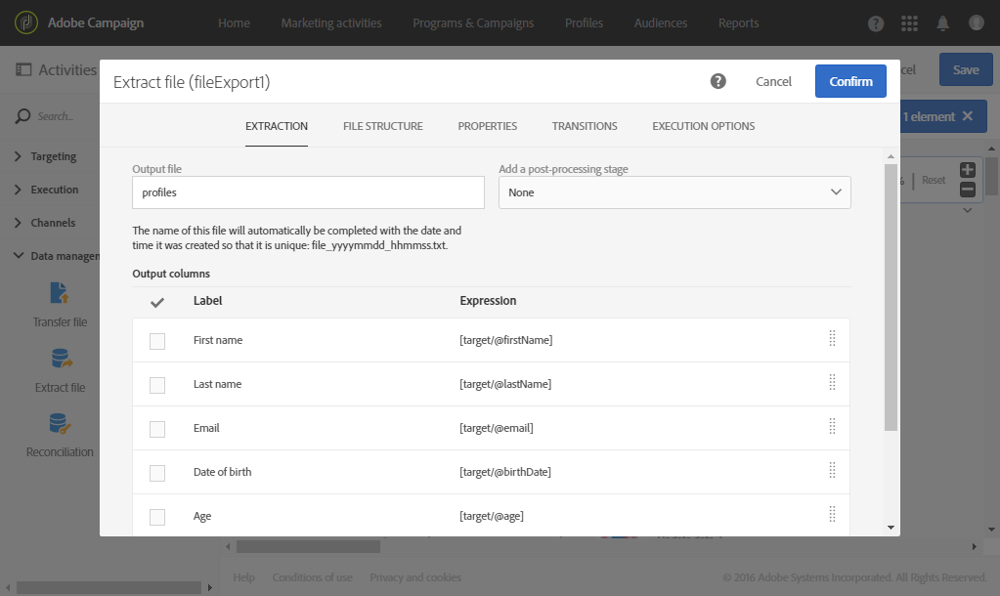
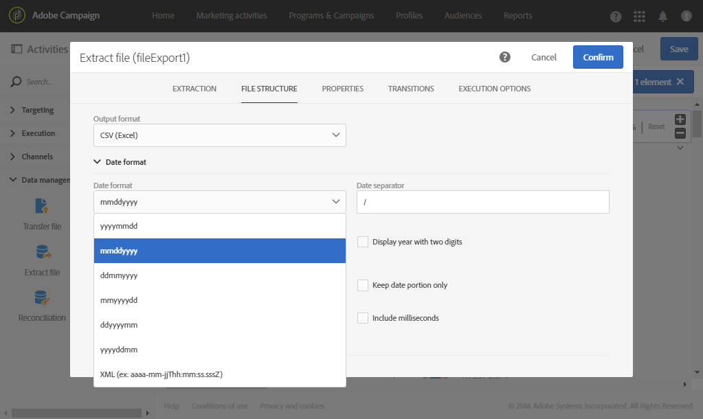

# 在外部文件中导出用户档案 {#exporting-profiles-external-file}

以下示例说明如何在活动 **[!UICONTROL Extract file]** 后配置 **[!UICONTROL Query]** 活动。

此工作流的目的是以外部文件的形式导出列表用户档案，以便在Adobe Campaign之外使用数据。

1. 将Extract文件 [活动拖放](../../automating/using/extract-file.md) 到您的工作流中，并将其放在 [查询活动](../../automating/using/query.md) 之后。

   在本例中，对18至30岁的所有用户档案执行查询。

1. 打开 **[!UICONTROL Extract file]** 活动进行编辑。
1. 命名输出文件。
1. 添加输出列。

   在此示例中，用户档案的电子邮件、年龄、出生日期、名和姓氏将添加为输出列。

   

1. 单击选 **[!UICONTROL File structure]** 项卡以定义：

   * CSV输出格式

      

   * 日期格式

      

1. 确认您的活动。
1. 在活动后拖 [放传输文](../../automating/using/transfer-file.md) 件活动 **[!UICONTROL Extract file]** ，以在外部帐户上恢复提取文件。
1. 打开活动并选择 **[!UICONTROL File upload]** 操作。

   

1. 选择外部帐户，然后输入服务器上文件夹的路径。

   

1. 确认您的活动并保存您的工作流。
1. 开始工作流。

   正确执行工作流后，提取的文件在外部帐户上可用。
