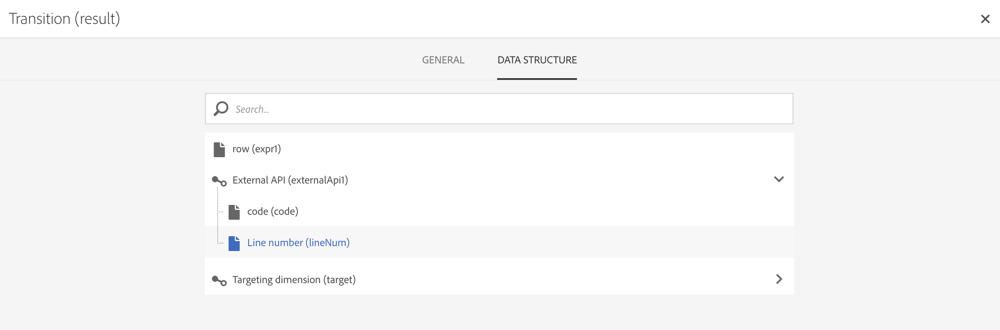

# External API{#external-api}

## 说明{#description}

利用 **[!UICONTROL External API]** 活动，可通过 **HTTP API** 调用，将来自&#x200B;**外部系统**&#x200B;的数据引入工作流。

举例而言，外部系统端点可以是公共 API 端点、客户管理系统或无服务器应用程序实例（例如 [Adobe I/O Runtime](https://www.adobe.io/apis/experienceplatform/runtime.html)）。

>[!NOTE]
>
>出于安全原因，Campaign Standard 中不支持使用 JSSP。如果需要执行代码，可以通过 External API 活动调用 Adobe I/O Runtime 实例。

本活动的主要特点是：

* 能将 JSON 格式的数据传递到第三方 REST API 端点
* 能够接收发回的 JSON 响应，将其映射到输出表格，并向下游传递到其他工作流活动。
* 具有叫客特定过渡的失败管理

### 向后兼容性声明 {#from-beta-to-ga}

在Campaign Standard20.4版本中，已降低http响应数据大小限制和响应超时护栏，以符合最佳实践——请参阅[限制和护栏](#guardrails)。 这些护栏修改将不会对现有外部 API 活动生效；因此，建议在所有工作流中将现有外部 API 活动替换为新版本。

替换 External API 活动时，将新的 External API 活动添加到工作流、手动复制配置详细信息，然后删除旧活动。

>[!NOTE]
>
>您将无法复制特定于活动的标头值，因为这些值在活动中已屏蔽。

### 限制和防护{#guardrails}

以下护栏适用于此活动：

* 5MB HTTP 响应数据大小限制（注意：这与先前版本中的 50MB 限制相比有所变化）
* 请求超时为 1 分钟（注意：这与先前版本中的 10 分钟超时相比有所变化）
* 不允许 HTTP 重定向
* 拒绝非 HTTPS URL
* 允许使用“Accept: application/json”请求标头和“Content-Type: application/json”响应标头

已设定特定护栏：

* **JSON Max Depth**：将可处理自定义嵌套 JSON 的最大深度限制为 10 级。
* **JSON Max Key Length**：将生成内部键值的最大长度限制为 255。此键值与列 ID 关联。
* **JSON Max Duplicate Keys Allowed**：将用作列 ID 的 JSON 属性名称重复项总数上限设置为 150。

>[!CAUTION]
>
>外部 API 活动旨在用于获取营销活动范围的数据（最新优惠集、最新分数等），而非用于检索每个用户档案的特定信息，因为这可能会导致传输大量数据。如果使用案例要求进行检索，建议使用[传输文件](../../automating/using/transfer-file.md)活动。

## 配置{#configuration}

将 **[!UICONTROL External API]** 活动拖放到工作流中，然后打开活动以开始配置。

### 集客映射

集客映射是由以前的集客活动生成的临时表格，将在 UI 中以 JSON 形式显示和发送。
用户可以根据此临时表格对集客数据进行修改。

利用 **Inbound resource** 下拉列表，可选择将要创建临时表格的查询活动。

勾选 **Add count parameter** 复选框，可为来自临时表格的每个行添加一个计数值。请注意，只有集客活动生成临时表格时，此复选框才可用。

利用 **Inbound Columns** 部分，用户可添加来自集客过渡表格的任何字段。所选列将成为数据对象中的键值。JSON 格式的列表对象将是一个数组列表，其中包含来自集客过渡表格各行的选定列数据。

使用&#x200B;**自定义参数**&#x200B;文本框，您可以添加 External API 所需的有效 JSON 和附加数据。该附加数据将添加到所生成 JSON 中的参数对象。

### 叫客映射

利用此选项卡，可定义 API 调用返回的示例 **JSON 结构**。

JSON 解析器设计为适应标准 JSON 结构模式类型，但也存在一些例外。标准模式的示例有：`{“data”:[{“key”:“value”}, {“key”:“value”},...]}`

示例 JSON 定义必须具有&#x200B;**以下特征**：

* **数组元素**必须包含第一级属性（不支持更深层级别）。
   **属性名称**&#x200B;最终将成为输出临时表之输出架构的列名称。
* 要捕获的 **JSON 元素** 在 JSON 响应中的嵌套级别不得大于 10。
* **列名称**定义基于“data”数组的第一个元素。
列定义（添加/删除）和属性的类型值，可以在 **Column definition** 选项卡中进行编辑。

**扁平化复选框**&#x200B;行为：

提供了扁平化复选框（默认：未选中）用于指示是否将 JSON 扁平化为键值/值映射。

* **禁用此复选框**（取消选中）后，将解析示例 JSON 以查找数组对象。用户需要提供 API 响应示例 JSON 格式的精简版本，以便 Adobe Campaign 精确定位用户希望使用的数组。创作工作流时，会确定并记录嵌套数组对象的路径，以便在执行时使用该路径访问接收自 API 调用的 JSON 响应体数组对象。

* **启用此复选框**（选中）后，会将示例 JSON 扁平化，将所提供示例 JSON 中指定的所有属性用于创建输出临时表格的列，并显示在 Column Definitions 选项卡中。请注意，如果示例 JSON 中存在任何数组对象，则这些数组对象的所有元素也将被扁平化。

如果&#x200B;**已验证解析**，则会显示一条消息，邀请您在“Column definition”选项卡中自定义数据映射。在其他情况下，会显示错误消息。

### 执行

通过此选项卡，可以定义连接端点。**[!UICONTROL URL]**&#x200B;字段允许您定义将向活动发送数据的&#x200B;**HTTPS端点**。

如果端点需要，可使用两种类型的身份验证方法：

* 基本身份验证：在 **[!UICONTROL Request Header(s)]** 字段中输入用户名/密码信息。

* OAuth 身份验证：通过单击 **[!UICONTROL Use connection parameters defined in an external account]**，可以选择定义了 OAuth 身份验证的外部帐户。有关更多信息，请参阅[外部帐户](../../administration/using/external-accounts.md)部分。

### 属性

利用此选项卡，您可以控制 External API 活动上的&#x200B;**常规属性**，如 UI 中显示的标签。不可自定义内部 ID。

### 列定义

>[!NOTE]
>
>填写并验证 Outbound Mapping 选项卡中的&#x200B;**响应数据格式** 后，将显示此选项卡。

利用 **Column definition** 选项卡，可精确指定每列的数据结构，以便导入不包含任何错误的数据，并使其与 Adobe Campaign 数据库中已存在的类型匹配，以便将来进行操作。

例如，您可以更改列的标签，选择其类型（字符串、整数、日期等）甚至指定错误处理。

有关更多信息，请参阅[加载文件](../../automating/using/load-file.md)。

### 过渡

利用此选项卡可激活&#x200B;**叫客过渡**&#x200B;及其标签。此特定过渡适合用于&#x200B;**超时**&#x200B;或有效载荷超过&#x200B;**数据大小限制**&#x200B;时。

### 执行选项

大多数工作流活动中都提供了此选项卡。有关更多信息，请参阅[活动属性](../../automating/using/activity-properties.md)一节。

## 疑难解答

此新工作流活动已添加了两种类型的日志消息：信息和错误。它们可以帮助您排除潜在的问题。

### 信息

这些日志消息用于在执行工作流活动期间，记录关于有用检查点的信息。
<table> 
 <thead> 
  <tr> 
   <th> 消息格式  </th> 
   <th> 示例  </th> 
  </tr> 
 </thead> 
 <tbody> 
  <tr> 
   <td> Invoking API URL '%s'.</td> 
   <td> 
正在调用 API URL 'https://example.com/api/v1/web-coupon?count=2'。
</td> 
  </tr> 
  <tr> 
   <td> Retrying API URL '%s' due to %s in %d ms, attempt %d.</td> 
   <td> 
由于在 2364 毫秒内出现 HTTP - 401，正在重试 API URL 'https://example.com/api/v1/web-coupon?count=0'，请尝试 2。
</td>
  </tr> 
  <tr> 
   <td> Transferring content from '%s' (%s / %s).</td> 
   <td> 
正在从 'https://example.com/api/v1/web-coupon?count=2’ 传输内容 (1234 / 1234)。
</td> 
  </tr>
  <tr> 
   <td> Using cached access token for provider ID '%s'.</td> 
   <td> 
正在对提供程序 ID 'EXT25’ 使用缓存访问令牌。注意：EXT25 是外部帐户的 ID（或名称）。 
</td> 
  </tr>
  <tr> 
   <td> Fetched access token from server for provider ID '%s'.</td> 
   <td> 
已从服务器获取提供程序 ID 'EXT25’ 的访问令牌。注意：EXT25 是外部帐户的 ID（或名称）。
</td> 
  </tr>
  <tr> 
   <td> Refreshing OAuth access token due to error (HTTP: '%d').</td> 
   <td> 
由于错误，正在刷新 OAuth 访问令牌 (HTTP: '401')。
</td> 
  </tr>
  <tr> 
   <td> Error refreshing OAuth access token (error: '%d'). </td> 
   <td> 
刷新 OAuth 访问令牌时出错（错误：'404’）。
</td> 
  </tr>
  <tr> 
   <td> Failed to fetch the OAuth access token using the specified external account on attempt %d, retrying in %d ms.</td> 
   <td> 
在尝试 1 时使用指定的外部帐户获取 OAuth 访问令牌失败，将在 1387 毫秒内重试。
</td> 
  </tr>
 </tbody> 
</table>

### 错误

这些日志消息用于记录有关意外错误情况的信息，这些错误情况最终会导致工作流活动失败。

<table> 
 <thead> 
  <tr> 
   <th> “代码 - 消息”格式  </th> 
   <th> 示例  </th> 
  </tr> 
 </thead> 
 <tbody> 
  <tr> 
   <td> WKF-560250 - API request body exceeded limit (limit: '%d').</td> 
   <td> 
API 请求正文超出限制（限制：'5242880'）。
</td> 
  </tr> 
  <tr> 
   <td> WKF-560239 -  API response exceeded limit (limit: '%d').</td> 
   <td> 
API 响应超出限制（限制：'5242880'）。
</td> 
  </tr> 
  <tr> 
   <td> WKF-560245 - API URL could not be parsed (error: '%d').</td> 
   <td> 
无法解析 API URL（错误：'-2010'）。

   
 注意：当 API URL 验证规则失败时，将记录此错误。
</td>
  </tr> 
  <tr>
   <td> WKF-560244 - API URL host must not be 'localhost', or IP address literal (URL host: '%s').</td> 
   <td> 
API URL 主机不能为“localhost”或 IP 地址文字（URL 主机：'localhost'）。

    
API URL 主机不能为“localhost”或 IP 地址文字（URL 主机：'192.168.0.5'）。

    
API URL 主机不能为“localhost”或 IP 地址文字（URL 主机：'[2001]'）。
</td>
  </tr> 
  <tr> 
   <td> WKF-560238 - API URL must be a secure URL (https) (requested URL: '%s').</td> 
   <td> 
API URL 必须是安全 URL (https)（请求的 URL：'https://example.com/api/v1/web-coupon?count=2'）。
</td> 
  </tr> 
  <tr> 
   <td> WKF-560249 - 无法创建请求主体 JSON。Error when adding '%s'.</td> 
   <td> 
无法创建请求主体 JSON。添加“params”时出错。

    
无法创建请求主体 JSON。添加“data”时出错。
</td>
  </tr> 
  <tr> 
   <td> WKF-560246 - HTTP header key is bad (header key: '%s').</td> 
   <td> 
HTTP header key is bad (header key: '%s').

   
 注意：根据 <a href="https://tools.ietf.org/html/rfc7230#section-3.2.html">RFC</a> 验证自定义标头键值失败时，将记录此错误。
</td> 
  </tr>
 <tr> 
   <td> WKF-560248 - HTTP header key is not allowed (header key: '%s').</td> 
   <td> 
不允许的 HTTP 标头键值（标头键值：'%s'）。
</td> 
  </tr> 
  <tr> 
   <td> WKF-560247 -  A HTTP header value is bad (header value: '%s').</td> 
   <td> 
HTTP header value is bad (header value: '%s'). 

    
注意：根据 <a href="https://tools.ietf.org/html/rfc7230#section-3.2.html">RFC</a> 验证自定义标头值失败时，将记录此错误。
</td> 
  </tr> 
  <tr> 
   <td> WKF-560240 - JSON payload has bad property '%s'.</td> 
   <td> 
JSON 有效载荷的属性“blah”不正确。
</td>
  </tr> 
  <tr>
   <td> WKF-560241 - Malformed JSON or unacceptable format.</td> 
   <td> 
JSON 格式不正确或不可接受。

   
注意：此消息仅适用于从外部 API 解析响应主体，并在尝试验证响应主体是否符合本活动强制规定的 JSON 格式时记录。
</td>
  </tr>
  <tr> 
   <td> WKF-560246 - Activity failed (reason: '%s').</td> 
   <td> 
因 HTTP 401 错误响应导致活动失败时 - 活动失败（原因：'HTTP - 401'）。

        
因内部调用失败导致活动失败时 - 活动失败（原因：'iRc - -Nn'）。

        
因 Content-Type 标头无效导致活动失败时- 活动失败（原因：'Content-Type - application/html'）。
</td> 
  </tr>
  <tr> 
   <td> WKF-560278 - "Error initializing OAuth helper (error: '%d')" .</td> 
   <td> 
此错误表示活动无法初始化内部 OAuth2.0 帮助程序工具，因为使用外部帐户中配置的属性初始化帮助程序时出错。
</td>
  </tr>
  <tr> 
   <td> WKF-560279 - "HTTP header key is not allowed (header key: '%s')."</td> 
   <td> 
此警告（非错误）消息表示 OAuth 2.0 外部帐户已配置为将凭据添加为 HTTP 标头，但不允许使用标头键，因为它是保留的标头键。
</td>
  </tr>
  <tr> 
   <td> WKF-560280 - External account of '%s' ID cannot be found.</td> 
   <td> 
找不到 'EXT25' ID 的外部帐户。  注意：此错误表示活动配置为使用外部帐户，但再也找不到该外部帐户。从数据库中删除帐户后很可能会发生此情况，而在正常操作环境中不可能发生此情况。
</td>
  </tr>
  <tr> 
   <td> WKF-560281 - External account of '%s' ID is disabled.</td> 
   <td> 
已禁用 'EXT25' ID 的外部帐户。注意：此错误表示活动配置为使用外部帐户，但已禁用该帐户（或标记为非活动）。
</td>
  </tr>
  <tr> 
   <td> WKF-560282 - Protocol not supported.</td> 
   <td> 
此错误表示与活动关联的外部帐户不是 OAuth2.0 外部帐户。因此，除非出现某些损坏或手动更改活动配置，否则不可能发生此错误。
</td>
  </tr>
  <tr> 
   <td> WKF-560283 - Failed to fetch the OAuth access token.</td> 
   <td> 
此错误的最常见原因是外部帐户配置错误（例如，使用外部帐户，但未测试连接是否成功）。外部帐户上的 URL/凭据可能已更改。
</td>
  </tr>
  <tr> 
   <td> CRL-290199 - Cannot reach page at: %s.</td> 
   <td> 
为 OAuth 设置外部帐户 UI 时，在该屏幕上会显示此错误消息。这意味着外部授权服务器的 URL 不正确/已更改/来自服务器的响应为“找不到页面”。
</td>
  </tr>
  <tr> 
   <td> CRL-290200 - Incomplete/Incorrect credentials.</td> 
   <td> 
为 OAuth 设置外部帐户 UI 时，在该屏幕上会显示此错误消息。这意味着凭据不正确或缺少连接到身份验证服务器所需的其他凭据。

</td>
  </tr>
 </tbody> 
</table>

<!--
## Example: Managing coupons with External API Activity

This example illustrates how to **add coupon value** retrieving by a REST call to profiles and then sending an email containing these coupon values.

The workflow is presented as follows:

1. Drag and drop an **External API** activity
    1. Parse the JSON sample responsa as {"data":[{"code":"value"}]}.
    1. Add the **Rest endpoint URL** and define authentication setting if needed
    
    1. In the **column definition** tab, add a new column called **code** that will store the code value.
        
    1. Enabled an **outbound transition** to manage request failures.
1. Drag and drop a **Query** activity
    1. Configure the **Target** tab to query all the **@adobe.com** email. For different Query samples, refer to the [Query](../../automating/using/query.md) section.
    1. In the **additional data** tab, add a new column based on **rowId()** function. This additional column allows you to reconciliate coupon code with the profile ID..
        

        >[!NOTE]
        >
        >This reconciliation approach means that the profile query number is equal to the number of coupon values returned by the REST call.
1. Once this two activities are configured, drag and drop an **Enrichment** activity to associate coupon values with profiles.
    1. Select the previous Query activity in the **primarySet** field.
        
    1. Create a new relation in the **Advanced relations** tab, and add the following reconciliation criteria:
    1. **@expr1** coming grom the Query activity in the source expression field.
    1. **@lineNum** as an expression that returns the line number for each coupon value in the destination field.
        
        More information on the enrichment activity are available [here](../../automating/using/enrichment.md)

    1. The transition **Data Structure** will contain:
        
1. Finally drag and drop a **Send via Email** activity.
    You can modify your email template by adding the **code** personnalized field.

-->
