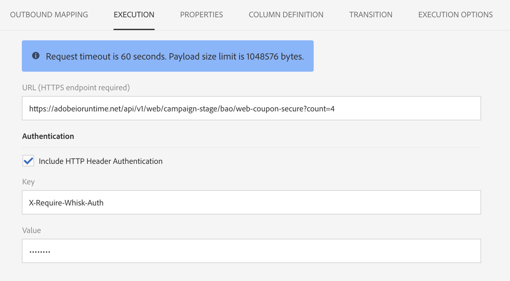

# External API {#external-api}

## Description {#description}

**[!UICONTROL External API]** 该活动通过REST API调用将数据从 **外部系统** 引入 **工作流** 。

The REST endpoints can be a customer management system, an [Adobe I/O Runtime](https://www.adobe.io/apis/experienceplatform/runtime.html) instance or an Experience Cloud REST endpoints (Data Platform, Target, Analytics, Campaign, etc).

>[!CAUTION]
>
>此功能目前处于公共测试版中。在开始使用外部API活动之前，您需要接受使用协议。请注意，由于此公共Beta功能尚未被Adobe商业发布，因此Adobe客户关怀不支持该功能，它可能包含错误并且可能无法使用其他发布的功能。

此活动的主要特性包括：

* 能够将数据以JSON格式传递给第三方REST API端点
* 能够接收JSON响应，将其映射到输出表并将下游传递到其他工作流程活动。
* 包含出站特定过渡的失败管理

此活动已落实以下指南：

* MB http响应数据大小限制
* 请求超时是60秒
* 不允许HTTP重定向
* 非HTTPS URL被拒绝
* “接受：application/json“request header and”Content-Type：允许application/json“响应头”

>[!CAUTION]
>
>请注意，该活动用于获取活动范围内的数据(最新的推广信息集、最新得分等)。而不是检索每个配置文件的特定信息，因为这会导致传输大量数据。If the use case requires this, the recommendation is to use the [Transfer File](../../automating/using/transfer-file.md) activity.

## Configuration {#configuration}

Drag and drop an **[!UICONTROL External API]** activity into your workflow and open the activity to start the configuration.

### 入站映射

入站映射是由上一个入站活动生成的临时表，该临时表将作为JSON在UI中显示并作为JSON发送。
根据此临时表，用户可以修改入站数据。

**入站资源** 下拉列表允许您选择将创建临时表的查询活动。

**添加计数参数** 复选框将为来自临时表的每行的计数值。请注意，仅当入站活动生成临时表时，此复选框才可用。

**“入站列”** 部分允许用户从入站转换表中添加任何字段。选定的列将是数据对象中的键。JSON中的数据对象将是一个数组列表，其中包含从入站转换表的每行中选定列的数据。

**自定义参数** 文本框允许您添加有效的JSON，其中包含外部API所需的其他数据。此额外数据将添加到生成的JSON中的params对象。

### 出站映射

This tab lets you define the sample **JSON structure** returned by the API Call.

The JSON structure pattern is: `{“data”:[{“key”:“value”}, {“key”:“value”},...]}`

The sample JSON definition must have the **following characteristics**:

* **数据** 是JSON中必需的属性名称，“data”的内容是JSON数组。
* **数组元素** 必须包含一级属性(不支持更深级别)。
   **属性名称** 最终会成为输出临时表输出架构的列名称。
* **列名称** 定义基于“数据”数组的第一个元素。
Columns definition (add/remove) and the type value of the property can be edited in the **Column definition** tab.

**如果解析已验证** ，则会显示一条消息，邀请您在“列定义”选项卡中自定义数据映射。在其他情况下，会显示错误消息。

### 执行执行

This tab lets you define the **HTTPS Endpoint** that will send data to ACS. If needed, you can enter authentication information in the fields below.

### 属性

This tab lets you control **general properties** on the external API activity like the displayed label in the UI. 内部ID不可自定义。

### 列定义

>[!NOTE]
>
>**当响应数据格式** 在“出站映射”选项卡中完成并验证时，将显示此选项卡。

**列定义** 选项卡允许您精确指定每个列的数据结构，以便导入不包含任何错误的数据，并使它与Adobe Campaign数据库中已有的类型匹配，以便将来操作。

例如，您可以更改列的标签，选择它的类型(字符串、整数、日期等)。甚至指定错误处理。

For more information, refer to the [Load File](../../automating/using/load-file.md) section.

### 过渡

This tab lets you activate the **outbound transition** and its label. This specific transition is useful in case of **timeout** or if the payload exceed the **data size limit**.

### 执行选项

此选项卡在大多数工作流活动中可用。For more information, consult the [Activity properties](../../automating/using/executing-a-workflow.md#activity-properties) section.

## 疑难解答

这种新的工作流程活动中增加了两种类型的日志消息：信息和错误。它们可以帮助您解决潜在问题。

### 信息

这些日志消息用于在执行工作流活动期间记录有关有用检查点的信息。具体而言，使用以下日志消息记录第一次尝试，以及重试尝试(首次尝试失败的原因)以访问API。

<table> 
 <thead> 
  <tr> 
   <th> Message format  </th> 
   <th> Example  </th> 
  </tr> 
 </thead> 
 <tbody> 
  <tr> 
   <td> 调用API URL'%s'。</td> 
   <td> 
调用API URL'。
</td> 
  </tr> 
  <tr> 
   <td> 重试API URL'%s'，以前的尝试失败('%s')。</td> 
   <td> 
重试API URL'https://example.com/api/v1/web-coupon?count=2'，以前的尝试失败('HTTP-401')。
</td>
  </tr> 
  <tr> 
   <td> 从“%s”(%s/%s)传输内容。</td> 
   <td> 
从“https://example.com/api/v1/web-coupon?count=2'”传输内容(1234/1234)。
</td> 
  </tr>
 </tbody> 
</table>

### 错误

这些日志消息用于记录有关意外错误情况的日志信息，这最终会导致工作流活动失败。

<table> 
 <thead> 
  <tr> 
   <th> Code - Message format  </th> 
   <th> Example  </th> 
  </tr> 
 </thead> 
 <tbody> 
  <tr> 
   <td> WKF-560250- API请求正文超出限制(限制：'% d')。</td> 
   <td> 
API请求正文超出限制(限制：'5242880')。
</td> 
  </tr> 
  <tr> 
   <td> WKF-560239- API响应超出限制(限制：'% d')。</td> 
   <td> 
API响应超出限制(限制：5242880”)。
</td> 
  </tr> 
  <tr> 
   <td> WKF-560245- API URL无法解析(错误：'% d')。</td> 
   <td> 
无法解析API URL(错误：“-2010”)。

   
 注意：当API URL失败验证规则时记录此错误。
</td>
  </tr> 
  <tr>
   <td> WKF-560244- API URL主机不能为“localhost”或IP地址文本(URL主机：'% s')。</td> 
   <td> 
API URL主机不得为“localhost”或IP地址文本(URL主机：“localhost”)。

    
API URL主机不得为“localhost”或IP地址文本(URL主机：'192.168.0.5')。

    
API URL主机不得为“localhost”或IP地址文本(URL主机：'[2001]')。
</td>
  </tr> 
  <tr> 
   <td> WKF-560238- API URL必须是安全URL(https)(请求的URL：'% s')。</td> 
   <td> 
API URL必须是安全URL(https)(请求的URL：。
</td> 
  </tr> 
  <tr> 
   <td> WKF-560249-无法创建请求主体JSON。添加“%s”时出错。</td> 
   <td> 
无法创建请求主体JSON。添加“params”时出错。

    
无法创建请求主体JSON。添加“data”时出错。
</td>
  </tr> 
  <tr> 
   <td> WKF-560246- HTTP头密钥不正确(标题键：'% s')。</td> 
   <td> 
HTTP头密钥很坏(标题键：'% s')。

   
 Note: This error is logged when the custom header key fails validation according to <a href="https://tools.ietf.org/html/rfc7230#section-3.2.html">RFC</a>
</td> 
  </tr>
 <tr> 
   <td> WKF-560248-不允许HTTP头密钥(标题键：'% s')。</td> 
   <td> 
不允许HTTP头密钥(标题键：“接受”)。
</td> 
  </tr> 
  <tr> 
   <td> WKF-560247- AHTTTP标题值不正确(标题值：'% s')。</td> 
   <td> 
HTTP头值不正确(标题值：'% s')。 

    
Note: This error is logged when the custom header value fails validation according to <a href="https://tools.ietf.org/html/rfc7230#section-3.2.html">RFC</a>
</td> 
  </tr> 
  <tr> 
   <td> WKF-560240- JSON有效负荷存在不良属性“%s”。</td> 
   <td> 
JSON有效负荷的属性“blah”不正确。
</td>
  </tr> 
  <tr>
   <td> WKF-560241-格式不正确的JSON或不可接受的格式。</td> 
   <td> 
格式不正确的JSON或不可接受的格式。

   
注意：此消息仅适用于从外部API解析响应主体，在尝试验证响应主体是否符合此活动所需的JSON格式时记录。
</td>
  </tr>
  <tr> 
   <td> WKF-560246-活动失败(原因：'% s')。</td> 
   <td> 
由于HTTP401错误响应导致活动失败-活动失败(原因：“HTTP-401”)

        
由于失败的内部调用失败而活动失败-活动失败(原因：'IRC- -n')。

        
当活动由于内容类型无效而失败时。- 活动失败(原因：“Content-Type- application/html”)。
</td> 
  </tr>
 </tbody> 
</table>

<!--
## Example: Managing coupons with External API Activity

This example illustrates how to **add coupon value** retrieving by a REST call to profiles and then sending an email containing these coupon values.

The workflow is presented as follows:

1. Drag and drop an **External API** activity
    1. Parse the JSON sample responsa as {"data":[{"code":"value"}]}.
    1. Add the **Rest endpoint URL** and define authentication setting if needed
    
    1. In the **column definition** tab, add a new column called **code** that will store the code value.
        
    1. Enabled an **outbound transition** to manage request failures.
1. Drag and drop a **Query** activity
    1. Configure the **Target** tab to query all the **@adobe.com** email. For different Query samples, refer to the [Query](../../automating/using/query.md) section.
    1. In the **additional data** tab, add a new column based on **rowId()** function. This additional column allows you to reconciliate coupon code with the profile ID..
        

        >[!NOTE]
        >
        >This reconciliation approach means that the profile query number is equal to the number of coupon values returned by the REST call.
1. Once this two activities are configured, drag and drop an **Enrichment** activity to associate coupon values with profiles.
    1. Select the previous Query activity in the **primarySet** field.
        
    1. Create a new relation in the **Advanced relations** tab, and add the following reconciliation criteria:
    1. **@expr1** coming grom the Query activity in the source expression field.
    1. **@lineNum** as an expression that returns the line number for each coupon value in the destination field.
        
        More information on the enrichment activity are available [here](../../automating/using/enrichment.md)

    1. The transition **Data Structure** will contain:
        
1. Finally drag and drop a **Send via Email** activity.
    You can modify your email template by adding the **code** personnalized field.

-->
