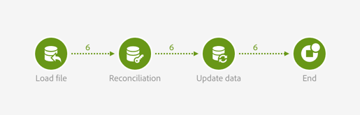

# 外部信号{#external-signal}

## 说明 {#description}


当在 **[!UICONTROL External signal]** 另一个工作流中或通过REST API调用成功满足某些条件时，活动将触发工作流。

## 使用环境 {#context-of-use}

该活 **[!UICONTROL External signal]** 动用于组织和编排不同的流程，这些流程是进入不同工作流的同一客户旅程的一部分。 它允许从另一个工作流开始一个工作流，支持更复杂的客户旅程，同时能够更好地监控和应对问题。

该 **[!UICONTROL External signal]** 活动设计为作为工作流的第一个活动。 它可以从其他工作流 **[!UICONTROL End]** 的活动或REST API调用中触发(有关详细信息，请参阅 [API文档](../../api/using/triggering-a-signal-activity.md))。

触发后，可以定义外部参数，并在工作流事件变量中可用。 使用外部参数调用工作流的过程在本节中有 [详细介绍](../../automating/using/calling-a-workflow-with-external-parameters.md)。

>[!NOTE]
>
>不能比每10分钟触发一次更频繁。

请注意，活 **[!UICONTROL External signal]** 动可以从多个不同的事件触发。 在这种情况下， **[!UICONTROL External signal]** 一旦执行源工作流或API调用之一，就会触发该事件。 它不要求所有源工作流都完成。

## 配置 {#configuration}

配置外部信号时，务必首先在目标工作流 **[!UICONTROL External signal]** 中配置活动。 完成此配置后，此工作 **[!UICONTROL External signal]** 流的活动便可用于配置源工作流 **[!UICONTROL End]** 的活动。

1. 将活动拖放到 **[!UICONTROL External signal]** 目标工作流中。
1. 选择活动，然后使用显示的快  速操作中的按钮将其打开。
1. 编辑活动的标签。 配置触发的源工作流时需要此标签 **[!UICONTROL External signal]**。

   如果要使用参数调用工作流，请使用区 **[!UICONTROL Parameters]** 域声明它们。 如需详细信息，请参阅[此部分](../../automating/using/calling-a-workflow-with-external-parameters.md#declaring-the-parameters-in-the-external-signal-activity)。

   

1. 确认活动的配置，添加您需要的任何其他活动并保存工作流。

   >[!NOTE]
   >
   >如果要从其他工作流触发目标工作流，请继续执行以下步骤。 如果要通过REST API调用触发目标工作流，请查阅 [API文档](../../api/using/triggering-a-signal-activity.md) ，以获取更多详细信息。

1. 打开源工作流并选择一个 **[!UICONTROL End]** 活动。 如果没有可用 **[!UICONTROL End]** 的活动，请在工作流分支的最后一个活动之后添加一个活动。

   默认情况下，某些活动没有任何出站过渡。 从这些 **[!UICONTROL Properties]** 活动的选项卡中，可以添加出站过渡。

   例如，在活动 **[!UICONTROL Update data]** 中，转到选项卡并 **[!UICONTROL Transitions]** 选中相应的选 **[!UICONTROL Add an outbound transition without the population]** 项。 此选项允许添加不包含任何数据且不占用系统中任何不必要的空间的过渡。 它仅用于连接触发目标工作 **[!UICONTROL End]** 流的额外活动。

   

1. 在活动 **[!UICONTROL External signal]** 的选项卡中， **[!UICONTROL End]** 选择目标工作流以及要在该工作流 **[!UICONTROL External signal]** 中触发的活动。

   当您设置活动以触 **[!UICONTROL End]** 发另一个工作流时，其图标会更新，并带有额外的信号符号。

   如果要使用参数调用工作流，请使用该区 **[!UICONTROL Parameters and values]** 域。 如需详细信息，请参阅[此部分](../../automating/using/calling-a-workflow-with-external-parameters.md#defining-the-parameters-when-calling-the-workflow)。

   

1. 保存源工作流。

一旦执 **[!UICONTROL End]** 行源工作流或REST API调用的活动，目标工作流就会从活动自动触发 **[!UICONTROL External signal]** 。

>[!NOTE]
>
>必须手动启动目标工作流，才能触发该工作流。 启动时，将激 **[!UICONTROL External activity]** 活源工作流并等待源工作流中的信号。

## Example {#example}

以下示例说明了 **[!UICONTROL External signal]** 典型用例中的活动。 在源工作流中执行数据导入。 完成导入并更新数据库后，将触发另一个工作流。 第二个工作流用于更新导入数据上的聚合。

源工作流如下所示：

* “加 [载文件](../../automating/using/load-file.md) ”活动上传包含新购买数据的文件。 请注意，数 [据库已相应地扩展](../../developing/using/data-model-concepts.md) ，因为默认情况下，数据库中不存在购买数据。

   例如：

   ```
   tcode;tdate;customer;product;tamount
   aze123;21/05/2015;dannymars@example.com;A2;799
   aze124;28/05/2015;dannymars@example.com;A7;8
   aze125;31/07/2015;john.smith@example.com;A7;8
   aze126;14/12/2015;john.smith@example.com;A10;4
   aze127;02/01/2016;dannymars@example.com;A3;79
   aze128;04/03/2016;clara.smith@example.com;A8;149
   ```

* “对 [帐](../../automating/using/reconciliation.md) ”活动创建导入的数据与数据库之间的链接，以便事务数据能够正确地连接到配置文件和产品。
* “更 [新数据](../../automating/using/update-data.md) ”活动会插入数据库的“事务”资源，并用传入的数据更新该资源。
* 活动 **[!UICONTROL End]** 会触发目标工作流，该工作流用于更新聚合。



目标工作流如下所示：

* 活动 **[!UICONTROL External signal]** 会等待源工作流成功完成。
* 查询 [活动目标配置文件](../../automating/using/query.md#enriching-data) ，并使用集合集来丰富这些配置文件，以检索上次购买日期。
* “更 [新数据](../../automating/using/update-data.md) ”活动将附加数据存储在专用自定义字段中。 请注意，配置文件资源已扩展以添加上次购 **买日期字段** 。


