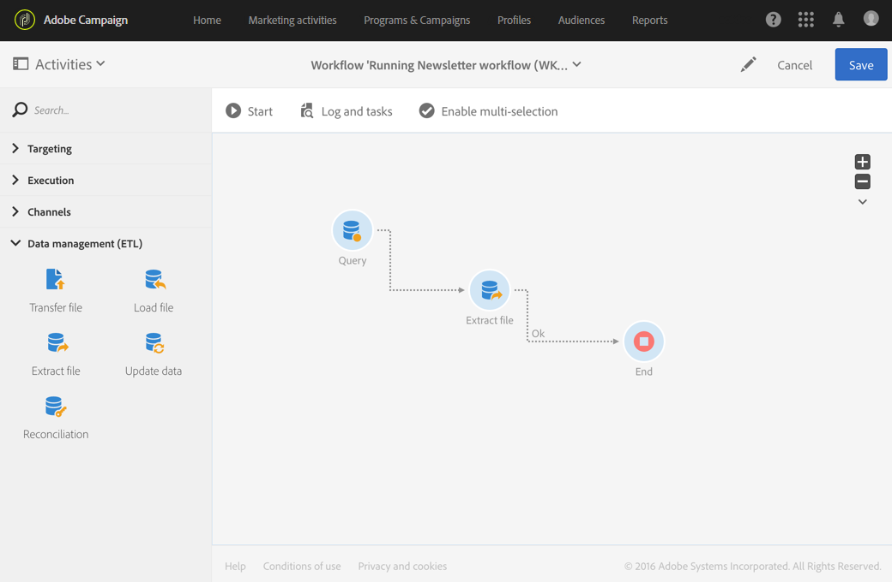

# 提取文件{#extract-file}

## 说明{#description}

利用 **[!UICONTROL Extract file]** 活动，可将数据以外部文件的形式从 Adobe Campaign 中导出。

## 使用环境{#context-of-use}

可在配置活动时定义数据的提取方式。

>[!CAUTION]
>
>**[!UICONTROL Extract file]** 活动必须放在 **[!UICONTROL Query]** 活动之后才能使用。

**相关主题：**

* [用例：在外部文件中导出用户档案](../../automating/using/exporting-profiles-in-file.md)

## 配置{#configuration}

1. 将 **[!UICONTROL Extract file]** 活动拖放到工作流中。

   

1. 选择活动，然后使用所显示快捷操作中的  按钮将其打开。
1. 输入&#x200B;**输出文件**&#x200B;的标签。文件的标签将自动添加创建日期和时间，因此具有唯一性。例如：2015 年 8 月 15 日 08:15:32 生成的文件，其名称为 recipients_20150815_081532.txt。

   >[!NOTE]
   >
   >可以使用此字段中的 **[!UICONTROL formatDate]** 函数以指定文件名。

1. 如果需要，可以通过在 **[!UICONTROL Add a post-processing stage]** 字段中选择 **[!UICONTROL Compression]** 以压缩输出文件。输出文件将压缩为 GZIP 文件 (.gz)。

   **[!UICONTROL Add a post-processing stage]**&#x200B;字段还允许您在解压文件之前对其加密。 有关如何使用加密文件的详细信息，请参阅[本节](../../automating/using/managing-encrypted-data.md)

1. 单击&#x200B;**[!UICONTROL Create element]**&#x200B;按钮以添加输出列。

   

   随即会打开一个新窗口。

   

1. 输入表达式。要实现此目的，您可以选择现有表达式，也可以使用&#x200B;**表达式编辑器**&#x200B;创建新表达式。
1. 确认您的表达式。

   表达式将添加到输出列。

1. 根据需要创建所需数量的列。您可以通过单击列的表达式和标签对列进行编辑。

   如果要导出用户档案并希望在外部工具中使用它们，请确保导出唯一标识符。默认情况下，并非所有用户档案都具有唯一标识符，这取决于它们添加到数据库的方式。有关更多信息，请参阅[为用户档案生成唯一 ID](../../developing/using/configuring-the-resource-s-data-structure.md#generating-a-unique-id-for-profiles-and-custom-resources)。

1. 单击 **[!UICONTROL File structure]** 选项卡，为要导出的文件配置输出、日期和编号格式。

   如果导出枚举值，请勾选 **[!UICONTROL Export labels instead of internal values of enumerations]** 选项。利用此选项，可检索易于理解的较短标签（而非 ID）。

1. 在 **[!UICONTROL Properties]** 选项卡中，选择 **[!UICONTROL Do not generate a file if the inbound transition is empty]** 选项，以避免在集客过渡为空时在 SFTP 服务器上创建和上传空文件。
1. 确认活动的配置并保存工作流。
