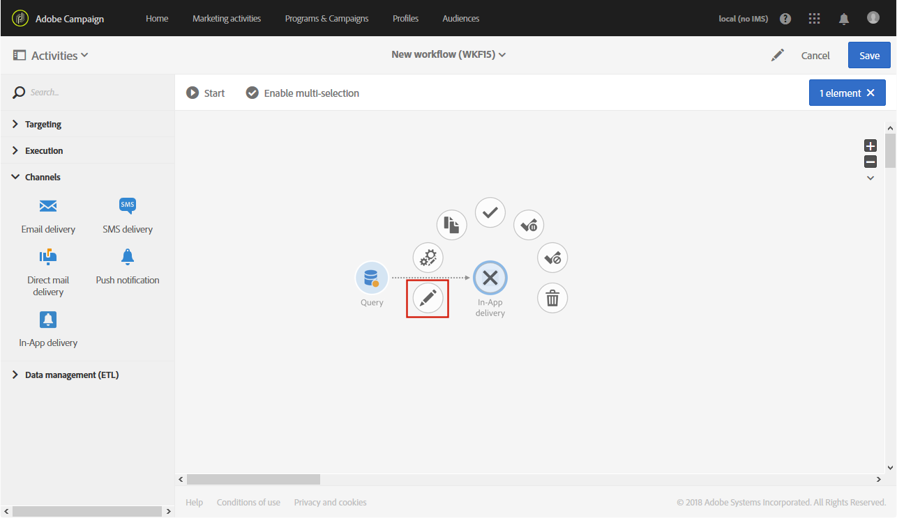

# 应用程序内投放{#in-app-delivery}

## 说明 {#description}

通过 **应用程序内交付** ，您可以配置在工作流中发送应用程序内消息。 应用程序内消息传递允许您在用户在应用程序内处于活动状态时显示消息。 有关应用程序内交付的详细信息，请参阅此 [部分](../../channels/using/about-in-app-messaging.md)。

## 使用环境 {#context-of-use}

活动 **[!UICONTROL In-App delivery]** 通常用于自动将应用程序内消息发送到在同一工作流程中计算的目标受众。

收件人通过查询、交叉点等定位活动在同一工作流中活动的上游进行定义。

根据工作流执行参数触发消息准备。 在消息功能板中，您可以选择是否请求手动确认以发送消息（默认情况下为必需）。 您可以手动启动工作流，或将调度程序活动放入工作流中以自动执行。

## 配置 {#configuration}

1. 将活动拖放 **[!UICONTROL Query]** 到您的工作流中。 请注意，需要根 **[!UICONTROL Query]** 据在步骤4中选 **[!UICONTROL Properties]** 择的模板更新选项卡中的活动定位维：

   * 应将模板的定位维 **[!UICONTROL mobileApp (mobileAppV5)]** 度设置为 **[!UICONTROL Target all users of a Mobile app (inAppBroadcast)]** “”。
   * 应将模板的定位维 **[!UICONTROL profile (profile)]** 度设置为 **[!UICONTROL Target users based on their Campaign profile (inAppProfile)]** “”。
   * 应将模板的定位维 **[!UICONTROL subscriptions to an application (nms:appSubscriptionRcp:appSubscriptionRcpDetail)]** 度设置为 **[!UICONTROL Target users based on their Mobile profile (inApp)]** “”。

1. 将活动拖放 **[!UICONTROL In-App delivery]** 到工作流中。
1. 选择活动，然后使用显示的快  速操作中的按钮将其打开。

   >[!NOTE]
   >
   >您可以通过活动快速操作中的按钮访问活动（而非交付本身）的  常规属性和高级选项。

   

1. 选择应用程序内消息类型。 这取决于活动中的目标数 **[!UICONTROL Query]** 据。

   * **[!UICONTROL Target users based on their Campaign profile (inAppProfile)]**:此消息类型使您能够定位订阅了移动应用程序的Adobe Campaign配置文件，并使用Campaign中提供的配置文件属性个性化应用程序内消息。
   * **[!UICONTROL Target all users of a Mobile app (inAppBroadcast)]**:此消息类型允许您向移动应用程序的所有用户发送消息，即使他们在Campaign中没有现有的配置文件也是如此。
   * **[!UICONTROL Target users based on their Mobile profile (inApp)]**:此消息类型使您能够定位Campaign中具有移动配置文件的所有用户（无论已知或未知），并可以使用从移动设备获取的任何配置文件属性个性化应用程序内消息。
   

1. 输入应用程序内消息属性，然后在字段中选择您的移动应用 **[!UICONTROL Associate a Mobile App to a delivery]** 程序。
1. 在选项卡 **[!UICONTROL Triggers]** 中，拖放将触发您的消息的事件。 有三类活动可用：
1. 定义应用程序内内容。 请参阅有关应用程序 [内自定义的部分](../../channels/using/customizing-an-in-app-message.md)。
1. 默认情况下，活 **[!UICONTROL In-App delivery]** 动不包括任何出站过渡。 如果要向活动添加出站过渡，请转到高级活动选项的选 **[!UICONTROL In-App delivery]** 项卡( **[!UICONTROL General]** 活动快速操作中的按钮)，然后选中以下选项之一：

   * **[!UICONTROL Add outbound transition without the population]**:这样，您就可以生成一个出站过渡，其中包含与入站过渡完全相同的人数。
   * **[!UICONTROL Add outbound transition with the population]**:这样，您就可以生成一个出站过渡，其中包含将消息发送到的人群。 在交付准备过程中被排除的目标成员不在此过渡中。
   

1. 确认活动的配置并保存工作流。

重新打开活动时，您会直接转到应用程序内功能板。 只能编辑其内容。

默认情况下，启动传送工作流只会触发消息准备。 在工作流启动后，仍需要确认从工作流创建的消息的发送。 但是，在消息功能板中，并且仅当消息是从工作流创建的时候，您才能禁用该选 **[!UICONTROL Request confirmation before sending messages]** 项。 取消选中此选项后，准备完成后，消息将发送，无需进一步通知。

## 评论 {#remarks}

在工作流中创建的交货可以在应用程序的营销活动列表中访问。 您可以使用功能板查看工作流的执行状态。 推送通知摘要窗格中的链接允许您直接访问链接的元素（工作流、营销活动等）。

在可从营销活动列表访问的父分发中，您可以查看已处理的发送的总数（根据配置活动时指定的汇总期间）。 **[!UICONTROL In-App delivery]** 为此，请选择以打开父分发块的详细信 **[!UICONTROL Deployment]** 息视图 。
