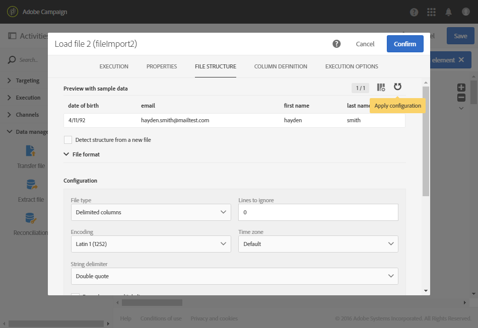
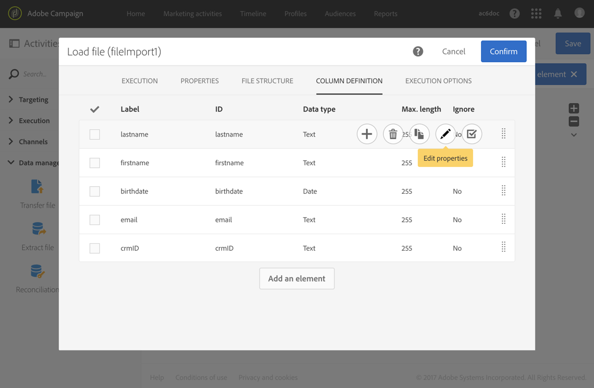

# 加载文件{#load-file}

## 说明{#description}

>[!CAUTION]
>
>使用此功能时，请记住SFTP存储、数据库存储和有效用户档案限制。

利用 **[!UICONTROL Load file]** 活动，可将数据导入一个结构化表单，以便在 Adobe Campaign 中使用该数据。此时数据属于临时导入，需要进行另一个活动才能将其确实集成到 Adobe Campaign 数据库中。

## 使用环境{#context-of-use}

可在配置活动时定义数据的提取方式。例如，要加载的文件可以是联系人的列表。

您可以：

* 使用文件结构以将其应用到其他文件的数据（使用 **[!UICONTROL Transfer file]** 活动取回），或
* 使用来自文件的结构和数据以将其导入 Adobe Campaign。

>[!IMPORTANT]
>
>只考虑“平面”结构文件，如 .txt、.csv 等文件。

**相关主题：**

* [用例：使用外部数据更新数据库](../../automating/using/update-database-file.md)
* [用例：基于自动文件下载更新数据](../../automating/using/update-data-automatic-download.md)
* [用例：发送包含丰富字段的电子邮件](../../automating/using/sending-email-enriched-fields.md)
* [用例：协调文件受众与数据库](../../automating/using/reconcile-file-audience-with-database.md)

## 配置{#configuration}

活动的配置包含两个步骤。首先，您需要通过上传样例文件来定义预期的文件结构。完成此操作后，您可以指定要导入其数据之文件的来源。

>[!NOTE]
>
>并不会导入样例文件的数据，仅将其用于配置活动。我们建议使用包含少量数据的样例文件。

1. 将 **[!UICONTROL Load file]** 活动拖放到工作流中。
1. 选择活动，然后使用所显示快捷操作中的  按钮将其打开。
1. 上传样例文件，在导入最终文件时使用该样例文件定义预期的结构。

   

   上传数据文件后，活动中会显示两个新选项卡：**[!UICONTROL File structure]** 和 **[!UICONTROL Column definition]**。

1. 转到 **[!UICONTROL File structure]** 选项卡以查看自动检测出的样例文件结构。

   如果检测到文件结构错误，可通过以下几种方法纠正可能存在的错误：

   * 通过选择 **[!UICONTROL Detect structure from a new file]** 选项，选择使用另一个文件的结构。
   * 修改默认检测参数，使其适应您的文件。利用 **[!UICONTROL File type]** 字段，可指定要导入的文件是否由具有固定长度的列组成。在这种情况下，您还必须在 **[!UICONTROL Column definition]** 选项卡中为每个列指定最大字符数。

      从文件正确取回数据所需的所有检测选项，都重组到了 **[!UICONTROL File format]** 中。您可以修改它们，然后重新检测活动中加载的最后一个文件的结构，以考虑这些新设置。要实现此目的，请使用 **[!UICONTROL Apply configuration]** 按钮。例如，可指定不同的列分隔符。

      >[!NOTE]
      >
      >此操作将考虑活动中加载的最后一个文件。如果检测到的文件较大，则数据预览将仅显示前 30 行。

      

      利用 **[!UICONTROL File format]** 部分的 **[!UICONTROL Check columns from file against column definitions]** 选项，可验证上传文件的列是否与列定义相对应。

      如果列数和/或列名与列定义不匹配，则在执行工作流时将显示错误消息。如果未激活该选项，则日志文件中将显示警告。

      

1. 转到 **[!UICONTROL Column definition]** 选项卡，检查每列的数据格式，并根据需要调整参数。

   利用 **[!UICONTROL Column definition]** 选项卡，可精确指定每列的数据结构，以便导入不包含任何错误的数据（例如，使用空值管理），并使其与 Adobe Campaign 数据库中已存在的类型匹配，以便将来进行操作。

   例如，您可以更改列的标签，选择其类型（字符串、整数、日期等）甚至指定错误处理。

   有关更多信息，请参阅[列格式](#column-format)一节。

   

1. 在 **[!UICONTROL Execution]** 选项卡中，指定是否处理文件以加载数据：

   * 来自工作流集客过渡的数据。
   * 上一步中上传的数据。
   * 从本地计算机上传的新文件。如果上传的第一个文件已经在工作流中定义，则会显示 **[!UICONTROL Upload a new file from local machine]** 选项。如果当前文件不适合您的需要，使用此选项可让您上传另一个文件以供处理。

      

1. 如果要加载其数据的文件已压缩为 GZIP 文件 (.gz)，请为 **[!UICONTROL Add a pre-processing stage]** 字段选择 **[!UICONTROL Decompression]** 选项。使用此选项可在加载数据之前解压缩文件。仅当文件来自活动的集客过渡时，此选项才可用。

   **[!UICONTROL Add a pre-processing stage]**&#x200B;字段还允许您在将文件导入数据库之前对其进行解密。 有关如何使用加密文件的详细信息，请参阅[本节](../../automating/using/managing-encrypted-data.md)

1. 利用 **[!UICONTROL Keep the rejects in a file]** 选项，可下载导入期间发生错误的文件，并将其应用到后处理阶段。激活该选项后，叫客过渡将重命名为“Rejects”。

   >[!NOTE]
   >
   >利用 **[!UICONTROL Add date and time to the file name]** 选项，可以为包含 rejects 的文件名添加时间戳。

   

1. 确认活动的配置并保存工作流。

如果执行工作流后活动发生任何错误，请参阅日志以获取有关文件中错误值的更多详细信息。有关工作流日志的更多信息，请参阅[此章节](../../automating/using/monitoring-workflow-execution.md)。

## 列格式{#column-format}

加载样例文件时，将自动检测列格式以及每种数据类型的默认参数。您可以修改这些默认参数，以指定要应用于数据的特定进程，尤其是当存在错误或空值时。

要实现此目的，请从要定义其格式之列的快捷操作中选择 **[!UICONTROL Edit properties]**。随即会打开列格式详细信息窗口。

然后，您可以修改每个列的格式。

利用列格式，可定义每个列的值处理：

* **[!UICONTROL Ignore column]**：在数据加载过程中不处理此列。
* **[!UICONTROL Data type]**：指定每个列所需的数据类型。
* **[!UICONTROL Format and separators]**、**Properties**：指定文本的属性、时间、日期和数值格式以及列上下文指定的分隔符。

   * **[!UICONTROL Maximum number of characters]**：指定字符串类型列的最大字符数。

      加载由具有固定长度的列组成的文件时，必须填写此字段。

   * **[!UICONTROL Letter case management]**：定义是否需要对 **Text** 数据应用字符大小写处理规则。
   * **[!UICONTROL White space management]**：指定 **Text** 数据的字符串中是否需要忽略某些空格。
   * **[!UICONTROL Time format]**、**[!UICONTROL Date format]**：指定 **Date**、**Time**、**Date and time** 数据的格式。
   * **[!UICONTROL Format]**：用于定义&#x200B;**Integer** 和 **Floating number** 数据的数值格式。
   * **[!UICONTROL Separator]**：定义用于 **Date**、**Time**、**Date and time**、**Integer** 和 **Floating number** 数据的、由列上下文指定的分隔符（用于数值的千位分隔符或小数分隔符、用于日期和时间的分隔符）。

* **[!UICONTROL Remapping of values]**：只有列详细信息配置中可提供了此字段。利用该字段，可在导入某些值时对其进行转换。例如，您可以将“three”转换为“3”。
* **[!UICONTROL Error processing]**：定义遇到错误时的行为。

   * **[!UICONTROL Ignore the value]**：忽略值。工作流执行日志中会生成警告。
   * **[!UICONTROL Reject the line]**：不处理整个行。
   * **[!UICONTROL Use a default value]**：将导致错误的值替换为在 **[!UICONTROL Default value]** 字段中定义的默认值。
   * **[!UICONTROL Use a default value in case the value is not remapped]**：除非为错误值定义了映射，否则将导致错误的值替换为在 **[!UICONTROL Default value]** 字段中定义的默认值（请参阅上方的 **[!UICONTROL Remapping of values]** 选项）。
   * **[!UICONTROL Reject the line when there is no remapping value]**：除非为错误值定义了映射，否则不会处理整行（请参阅上方的 **[!UICONTROL Remapping of values]** 选项）。

   >[!NOTE]
   >
   >**[!UICONTROL Error processing]** 涉及与导入文件之值有关的错误。例如，遇到错误的数据类型（“整数”列中填写全部是字母的“four”）、包含字符数超过授权字符数上限的字符串、具有错误分隔符的日期等。但是，此选项不涉及由空值管理生成的错误。

* **[!UICONTROL Default value]**：根据所选的错误处理指定默认值。
* **[!UICONTROL Empty value management]**：指定在数据加载期间管理空值的方式。

   * **[!UICONTROL Generate an error for numerical fields]**：仅为数字字段生成错误，否则插入 NULL 值。
   * **[!UICONTROL Insert NULL in the corresponding field]**：授权空值。因此，会插入 NULL 值。
   * **[!UICONTROL Generate an error]**：如果值为空，则生成错误。
