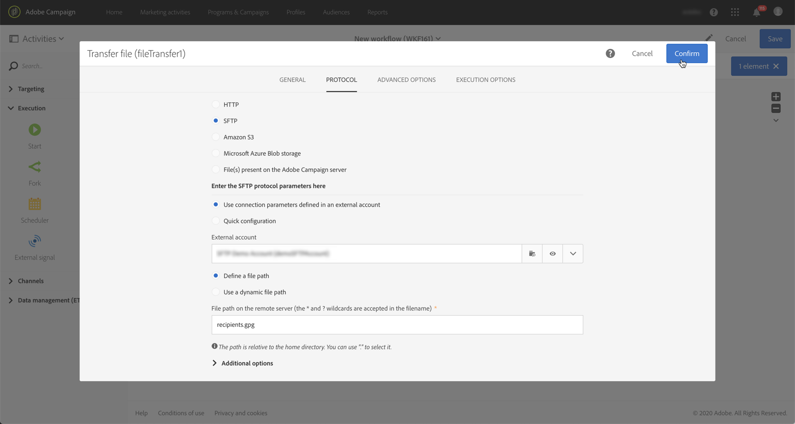

# 管理加密数据 {#managing-encrypted-data}

## 关于预处理阶段 {#about-preprocessing-stages}

在某些情况下，您要导入活动服务器的数据可能需要加密，例如，如果它包含PII数据。

要能够加密传出数据或解密传入数据，您需要使用控制面板管理GPG [密钥](https://docs.adobe.com/content/help/zh-Hans/control-panel/using/instances-settings/gpg-keys-management.html)。

>[!NOTE]
>
>控制面板适用于在AWS上托管的所有客户（预先托管其营销实例的客户除外）。

如果您没有资格使用控制面板，您需要联系Adobe客户服务中心，以便他们为您的实例提供所需的加密／解密命令。 为此，请提交一个请求，其中指明：

* 将 **在活动** 界面中显示的标签以使用该命令。 例如“加密文件”。
* 在 **实例** 上安装的命令。

一旦请求得到处理，加密／解密命令将在字段中 **[!UICONTROL Pre-processing stage]** 和活动 **[!UICONTROL Load file]** 中可用 **[!UICONTROL Extract file]** 。 您可以使用它们解密或加密要导入或导出的文件。

**相关主题：**

* [加载文件](../../automating/using/load-file.md)
* [提取文件](../../automating/using/extract-file.md)

## 用例：导入使用控制面板生成的密钥加密的数据 {#use-case-gpg-decrypt}

在此用例中，我们将构建一个工作流，以便使用在控制面板中生成的密钥导入外部系统中已加密的数据。

本节还提供了一个教程视频，其中显示了如何使用GPG密钥解密 [数据](https://docs.adobe.com/content/help/en/campaign-standard-learn/tutorials/administrating/control-panel/gpg-key-management/decrypting-data.html)。

执行此用例的步骤如下：

1. 使用控制面板生成密钥对（公共／私有）。 控制面板文档中提供了详 [细步骤](https://docs.adobe.com/content/help/en/control-panel/using/instances-settings/gpg-keys-management.html#decrypting-data)。

   * 公钥将与外部系统共享，外部系统将使用公钥加密要发送给活动的数据。
   * 活动将使用私钥解密传入的加密数据。

   

1. 在外部系统中，使用从控制面板下载的公钥加密要导入到Campaign Standard的数据。

1. 在Campaign Standard中，构建一个工作流以导入加密数据，并使用通过控制面板安装的私钥对其进行解密。 为此，我们将按如下方式构建工作流：

   

   * **[!UICONTROL Transfer file]** 活动:将文件从外部源传输到活动。 在此示例中，我们希望从SFTP服务器传输文件。
   * **[!UICONTROL Load file]** 活动:将文件中的数据加载到控制面板库，然后使用在数据库中生成的私钥进行解密。

1. 打开 **[!UICONTROL Transfer file]** 活动，然后根据需要配置它。 有关如何配置活动的全局概念，请参 [阅本节](../../automating/using/load-file.md)。

   在选项 **[!UICONTROL Protocol]** 卡中，指定有关要传输的sftp服务器和已加密。gpg文件的详细信息。

   

1. 打开 **[!UICONTROL Load file]** 活动，然后根据需要配置它。 有关如何配置活动的全局概念，请参 [阅本节](../../automating/using/load-file.md)。

   为活动添加预处理阶段，以解密传入数据。 为此，请从列表 **[!UICONTROL Decryption GPG]** 中选择选项。

   >[!NOTE]
   >
   >请注意，您无需指定用于解密数据的私钥。 私钥存储在控制面板中，它将自动检测用于解密文件的密钥。

   

1. 单击 **[!UICONTROL OK]** 以确认活动配置。

1. 您现在可以运行工作流。

## 用例：使用控制面板上安装的密钥加密和导出数据 {#use-case-gpg-encrypt}

在此用例中，我们将构建一个工作流，以便使用控制面板上安装的密钥加密和导出数据。

本节还提供了一个教程视频，其中显示了如何使用GPG密钥加密 [数据](https://docs.adobe.com/content/help/en/campaign-standard-learn/tutorials/administrating/control-panel/gpg-key-management/using-a-gpg-key-to-encrypt-data.html)。

执行此用例的步骤如下：

1. 使用GPG实用程序生成GPG密钥对（公共／私有），然后将公钥安装到控制面板上。 控制面板文档中提供了详 [细步骤](https://docs.adobe.com/content/help/en/control-panel/using/instances-settings/gpg-keys-management.html#encrypting-data)。

   

1. 在Campaign Standard中，构建一个工作流以导出数据，并使用通过控制面板安装的私钥对其加密。 为此，我们将按如下方式构建工作流：

   

   * **[!UICONTROL Query]** 活动:在此示例中，我们要执行一个查询来目标要导出的数据库中的数据。
   * **[!UICONTROL Extract file]** 活动:加密数据并将其提取到文件中。
   * **[!UICONTROL Transfer file]** 活动:将包含加密数据的文件传输到SFTP服务器。

1. 配置活动 **[!UICONTROL Query]** 以从库目标所需数据。 如需详细信息，请参阅[此部分](../../automating/using/query.md)。

1. 打开 **[!UICONTROL Extract file]** 活动，然后根据您的需要（输出文件、列、格式等）配置它。 有关如何配置活动的全局概念，请参 [阅本节](../../automating/using/extract-file.md)。

   为活动添加预处理阶段，以加密要提取的数据。 为此，请选择用于加密数据的加密GPG密钥。

   

   >[!NOTE]
   >
   >括号中的值是您 **在使用** GPG加密工具生成密钥对时定义的注释。 请确保选择正确的匹配密钥，否则收件人将无法解密文件。

1. 打开 **[!UICONTROL Transfer file]** 活动，然后指定要将文件发送到的SFTP服务器。 有关如何配置活动的全局概念，请参 [阅本节](../../automating/using/transfer-file.md)。

   

1. 您现在可以运行工作流。 执行目标后，查询的数据将导出到SFTP服务器中，生成加密的。gpg文件。
