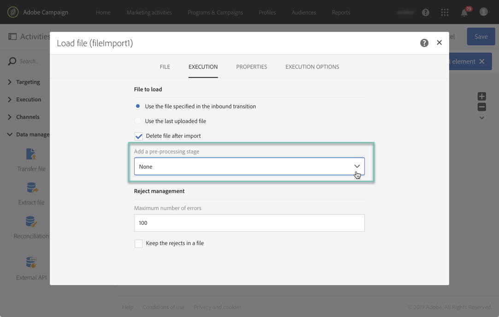

# 管理加密数据 {#managing-encrypted-data}

在某些情况下，您要导入活动服务器的数据可能需要加密，例如，如果它包含PII数据。

要能够导入或导出加密文件，您首先需要联系Adobe客户服务部，以便他们为您的实例提供所需的加密／解密命令。

为此，请提交一个请求，其中指明：

* 将 **在活动** 界面中显示的标签以使用该命令。 例如“加密文件”。
* 在 **实例** 上安装的命令。
例如，要使用PGP解密文件，该命令将为：

   ```
   <path-to_pgp_if-not_global_or_server/>pgp.exe --decrypt --input nl6/var/vp/import/filename.pgp --passphrase "your password" --recipient recipient @email.com --verbose --output nl6/var/vp/import/filename
   ```

一旦请求得到处理，加密／解密命令将在字段中 **[!UICONTROL Pre-processing stage]** 和活动 **[!UICONTROL Load file]** 中可用 **[!UICONTROL Extract file]** 。 您可以使用它们解密或加密要导入或导出的文件。



**相关主题：**

* [加载文件](../../automating/using/load-file.md)
* [提取文件](../../automating/using/extract-file.md)
