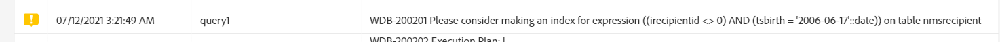

# 管理执行选项 {#managing-execution-options}

要修改工作流的执行选项，请使用按钮访问工作流属性并选择&#x200B;**[!UICONTROL Execution]**&#x200B;部分。

可能的选项为：

* **[!UICONTROL Default affinity]**：此字段允许您强制在特定计算机上执行工作流或工作流活动。

* **[!UICONTROL History in days]**：指定必须清除历史记录的天数。 历史记录包含与工作流相关的元素：日志、任务、事件（链接到工作流操作的技术对象）以及由&#x200B;**[!UICONTROL Transfer file]**&#x200B;活动下载的文件。 现成的工作流模板的默认值为 30 天。

  清除历史记录由数据库清理技术工作流执行，默认每天执行（请参阅[技术工作流列表](../../administration/using/technical-workflows.md)）。

  >[!IMPORTANT]
  >
  >如果&#x200B;**[!UICONTROL History in days]**&#x200B;字段留空，则其值将被视为“1”，这意味着历史记录将在1天后清除。

* **[!UICONTROL Save SQL queries in the log]**：允许您将SQL查询从工作流保存到日志中。

* **[!UICONTROL Diagnostic mode (Log execution plan of long running queries and give recommendations)]**：如果您希望记录整个执行计划，请选中此选项。 默认情况下处于禁用状态。

  有关此选项的详细信息，请参阅此[部分](#diagnostic-mode)。

* **[!UICONTROL Keep interim results]**：如果您希望能够查看过渡的详细信息，请选中此选项。

  >[!CAUTION]
  >
  >使用此选项会占用大量磁盘空间，其目的在于帮助您构建工作流并确保配置和行为正确。在制作实例中，请不要勾选该选项。

* **[!UICONTROL Execute in the engine (do not use in production)]**：允许您在本地执行工作流，以用于开发环境测试。

* **[!UICONTROL Severity]**：允许您指定在Adobe Campaign实例中执行工作流的优先级级别。 此字段仅供Adobe团队用于监控目的。

**[!UICONTROL Error management]**&#x200B;部分提供了其他选项，可让您管理工作流在出现错误时的行为。 [错误管理](../../automating/using/monitoring-workflow-execution.md#error-management)部分中详细介绍了这些选项。

## 诊断模式 {#diagnostic-mode}

>[!CAUTION]
>
>此选项会显着影响工作流性能，应谨慎使用。

启用后，如果查询花费超过一分钟时间，则工作流属性&#x200B;**[!UICONTROL Execution]**&#x200B;部分中的&#x200B;**[!UICONTROL Diagnostic mode (Log execution plan of long running queries and give recommendations)]**&#x200B;选项将记录整个执行计划。

在启用此选项并启动工作流后，如果您的查询需要超过一分钟，则将记录执行计划。 然后，可以使用EXPLAIN ANALYZE检索执行计划。

有关此内容的详细信息，请参阅[PostgreSQL文档](https://www.postgresql.org/docs/9.4/using-explain.html)。

如果在此查询中进行序列扫描，**[!UICONTROL Diagnostic mode]**&#x200B;还将提供建议以帮助筛选器表达式创建索引。

>[!NOTE]
>
> 这些建议仅供参考，应根据您的用例仔细使用。

在执行工作流时必须满足以下两个条件才能触发推荐：

* 序列扫描占用的查询时间超过40%。

* 序列扫描后生成的行数少于表中总行数的1%。

您可以通过选择&#x200B;**[!UICONTROL Administration]** > **[!UICONTROL Application settings]** > **[!UICONTROL Options]**&#x200B;从高级菜单中管理该选项：

* **[!UICONTROL Time of query execution (in milliseconds)(DiagnosticModeQueryTime)]**：从&#x200B;**[!UICONTROL Value]**&#x200B;字段中，可为查询执行设置新时间。 如果查询执行超过此值，将记录执行计划。

  

* **[!UICONTROL Percentage of seq scan time (DiagnosticModeSeqScanPercentage)]**：从&#x200B;**[!UICONTROL Value]**&#x200B;字段中，您可以更改序列扫描生成推荐所必须花费的查询时间百分比。

  
