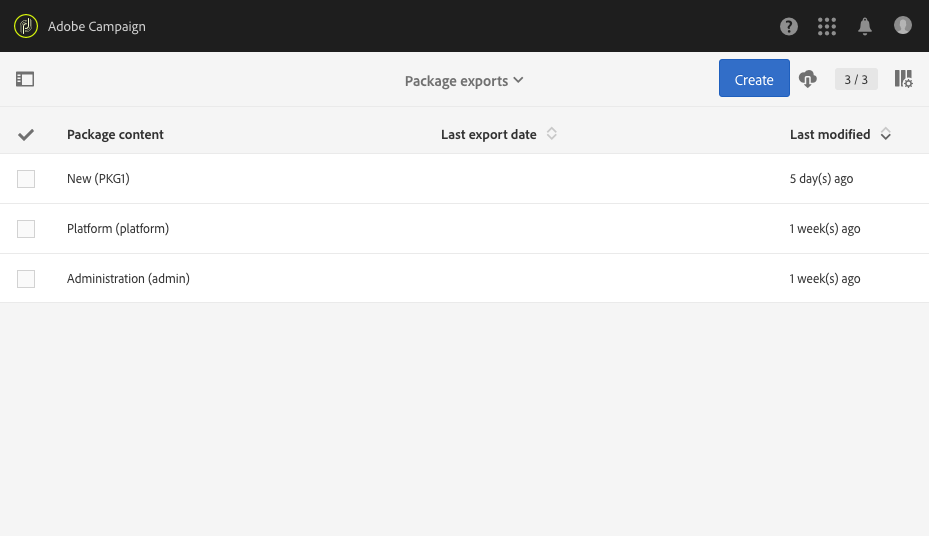
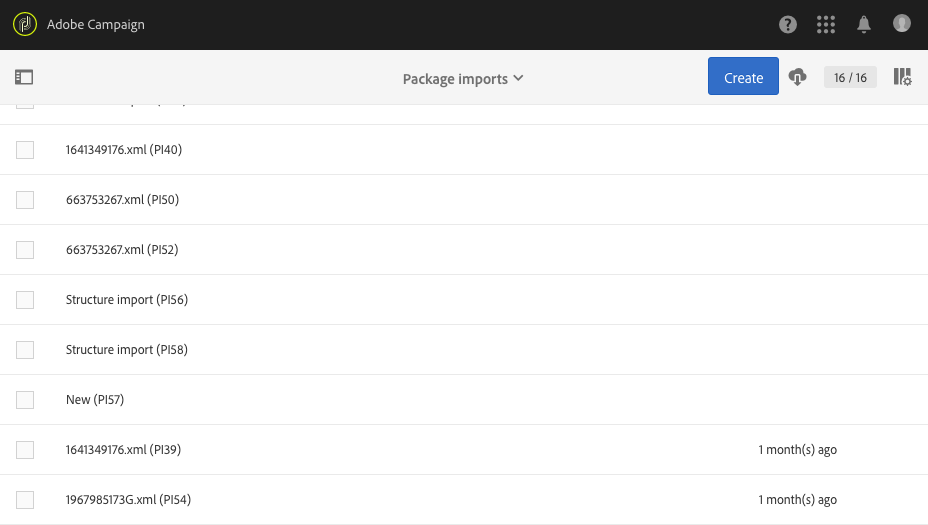

# 管理资源包{#managing-packages}

管理员可以定义资源包，以通过结构化 XML 文件在不同的 Adobe Campaign 实例之间交换资源。资源包可以是配置参数或数据。

资源包适合用于从一台服务器向另一台服务器传输数据或复制实例的配置。

通过 **[!UICONTROL Administration]** > **[!UICONTROL Deployment]** > **[!UICONTROL Package exports]** 或 **[!UICONTROL Package imports]** 菜单，可使用资源包。这两个菜单的功能很相似。

默认情况下，每个列表的元素会根据其修改或安装日期（从最近到最早）显示。

要显示和修改元素的内容，请单击其标签。请参阅[导出资源包](#exporting-a-package)和[导入资源包](#importing-a-package)章节。

## 资源包导出{#package-exports}

### 标准资源包{#standard-packages}

**[!UICONTROL Platform]** 和 **[!UICONTROL Administration]** 是两个内置资源包，每个资源包都包含要导出的预定义资源列表。这两个资源包能够以只读模式打开，且仅适用于导出。

>[!IMPORTANT]
>
>如果导出的资源具有默认 ID，则不会授权导出资源包。因此，必须将可导出资源的 ID 更改为与 Adobe Campaign Standard 标准模板不同的名称。例如，要导出测试用户档案，则不得使用包含“SDM”或“sdm”值的 ID。
>
>在尝试导出包含默认 ID 的资源包时，会显示以下错误：“‘品牌（品牌策略）’实体类型使用了默认 ID (“BRD1”)，导入资源包时可能会造成冲突。请更改此名称并重复此操作。”

有关资源包导出的步骤，请参阅[导出资源包](#exporting-a-package)一节。

* **[!UICONTROL Platform]** 资源包可重组在技术配置期间添加的所有资源：自定义资源、自定义资源集、触发器和具有 **[!UICONTROL System]** 类型的应用程序选项。
* **[!UICONTROL Administration]** 资源包可重组在业务配置期间添加的所有对象，例如：营销策划模板、内容模板、投放模板、登陆页面模板、项目模板和工作流模板。

   其中还包括以下对象：内容块、目标映射、外部帐户、组织单位、具有 **[!UICONTROL User]** 类型的应用程序选项、角色、分类、分类规则和用户。

>[!NOTE]
>
>这两个资源包的内容无法修改。相反，这些资源包始终包含最新的可用数据。您可以[创建自己的资源包](#creating-a-package)，以导出特定元素。

### 创建资源包{#creating-a-package}

如果需要导出特定数据集，您需要创建资源包。

要创建资源包，您需要管理权限。

1. 从 **[!UICONTROL Administration]** > **[!UICONTROL Deployment]** > **[!UICONTROL Package exports]**，单击资源包内容列表中的 **[!UICONTROL Create]** 按钮。

   随即会立即生成元素。要取消创建元素，可返回列表并选中相应的方框以将其删除。

1. 在资源包内容屏幕中，指定名称和 ID。
1. 如果要添加描述并限制对特定用户的访问，请单击 **[!UICONTROL Edit properties]** 按钮。

   

1. 使用 **[!UICONTROL Export content]** 选项卡中的 **[!UICONTROL Create element]** 的按钮可选择要导出的资源。

   

1. 资源按字母顺序显示，并可按名称筛选。其技术名称显示在括号中。从列表中选择元素并确认。

   

1. 资源名称显示在 **[!UICONTROL Export content]** 选项卡中。要修改资源，请勾选对应的方框并使用 **[!UICONTROL Show detail of the element selected]** 按钮。

   

1. 使用查询编辑器，可筛选要导出的元素。有关更多信息，请参阅[编辑查询](../../automating/using/editing-queries.md#creating-queries)一节。

   

   >[!NOTE]
   >
   >每个资源最多可导出 5000 个对象。

1. 指定所有要导出的资源后，请保存您的选择。

您的资源包现已创建完成，可供导出。

### 导出资源包{#exporting-a-package}

利用导出资源包，可保存资源的特定状态，以便未来将其重新导入其他实例或同样的实例中。

>[!CAUTION]
>
>如果导出的资源具有现成的 ID，则不会授权导出资源包。因此，必须将可导出资源的 ID 更改为与 Adobe Campaign Standard 标准模板不同的名称。例如，要导出测试用户档案，则不得使用包含“SDM”或“sdm”值的 ID。

1. 从 **[!UICONTROL Administration]** > **[!UICONTROL Deployment]** > **[!UICONTROL Package exports]**，选择资源包以访问其详细信息。
1. 检查该资源包是否包含您需要的数据。
1. 单击 **[!UICONTROL Start export]** 按钮。

导出的文件会存储在现用浏览器的下载文件夹中。导出的文件会自动命名为“package_xxx.xml”，其中的“xxx”对应于资源包的 ID。

操作完成后，会显示多个部分：

* **[!UICONTROL Export status]**：此部分显示操作是否正确执行。

   

* 您可以通过 **[!UICONTROL Log]** 选项卡查看导出的各个步骤。其中包含所有以前导出的状态。

   

>[!NOTE]
>
>从已导出的资源包内容列表中选择元素时，仍可使用 **[!UICONTROL Log]** 和 **[!UICONTROL Last export]** 选项卡。

## 资源包导入{#package-imports}

### 系统更新{#system-updates}

任何内容上方的资源包导入列表，都包含链接到 Adobe 执行更新的自动导入。

**[!UICONTROL Execution logs]** 选项卡存储了所有导入步骤。侧面板可显示常规信息。

>[!NOTE]
>
>可在只读模式下访问这些元素。

### 导入资源包{#importing-a-package}

管理员可以手动导入先前从 Adobe Campaign 实例导出的资源包。有关更多信息，请参阅[资源包导出](#package-exports)一节。

手动资源包导入包括两个步骤：首先，您必须上传文件，然后才能导入其内容。

1. 从 **[!UICONTROL Administration]** > **[!UICONTROL Deployment]** > **[!UICONTROL Package imports]**，单击资源包导入列表中的 **[!UICONTROL Create]** 按钮。

   随即会立即生成元素。要取消创建元素，可返回列表并选中相应的方框以将其删除。

1. 指定新导入的名称和 ID。
1. 通过拖放文件或单击 **[!UICONTROL Select from folder]** 链接选择要上传的文件。

   导入的文件必须采用 XML 或 ZIP（包含 XML 文件）格式。

   

   >[!NOTE]
   >
   >要替换已上传的文档，请先通过名称右侧的 X 图标删除文件，然后重复此操作。

1. 上传文件后，使用 **[!UICONTROL Start import]** 按钮将其内容导入数据库。

   

操作完成后，会显示多个部分：

* **[!UICONTROL Import status]**：此部分显示操作是否正确执行。
* 您可以通过 **[!UICONTROL Execution logs]** 选项卡查看导入的各个步骤。这非常适合用于找出错误。

   

导入某个资源包后，无法从同一元素重新导入该资源包。您只能修改其标签和 ID。

要重新导入同一资源包，您必须返回至资源包导入列表，创建一个元素，然后再次上传选定的文件。
