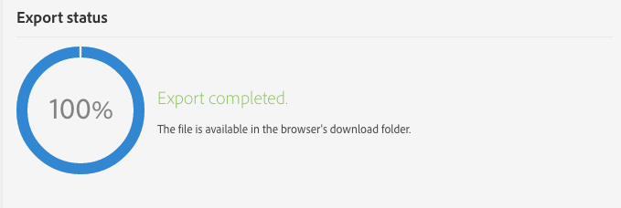

# Managing packages{#managing-packages}

管理员可以定义包，通过结构化XML文件在不同的Adobe Campaign实例之间交换资源。这些参数可以是配置参数或数据。

这对于将数据从一台服务器传输到另一台服务器或复制实例的配置很有用。

Packages are available under the **[!UICONTROL Administration]** &gt; **[!UICONTROL Deployment]** &gt; **[!UICONTROL Package exports]** or **[!UICONTROL Package imports]** menus. 两个菜单的功能类似。

每个列表的元素将根据其修改或安装日期(从最近到最近最少)显示。

要显示和修改元素的内容，请单击其标签。Refer to the [Exporting a package](../../automating/using/managing-packages.md#exporting-a-package) and [Importing a package](../../automating/using/managing-packages.md#importing-a-package) sections.

## Package exports {#package-exports}

### Standard packages {#standard-packages}

**[!UICONTROL Platform]** 并且 **[!UICONTROL Administration]** 是两个内置包，每个包都包含要导出的预定义资源列表。它们可在只读模式下打开，并且仅适用于导出。

>[!CAUTION]
>
>如果导出的资源具有默认ID，则不授权导出包。因此，必须使用名称不同于Adobe Campaign Standard标准提供的模板的名称更改可导出资源的ID。例如，要导出测试配置文件，则不能使用包含值“SDM”或“sDM”的ID。当尝试导出包含默认ID的包时，您可以看到以下错误：“'品牌(品牌)'实体类型使用默认ID('BRD1')，这会在导入包时产生冲突。更改此名称并重复操作”。

[导出包](../../automating/using/managing-packages.md#exporting-a-package) 部分介绍了包导出步骤。

* **[!UICONTROL Platform]** 该包将重组在技术配置期间添加的所有资源：自定义资源、自定义资源集、触发器和应用 **[!UICONTROL System]** 程序选项。
* **[!UICONTROL Administration]** 该包将重组在业务配置过程中添加的所有对象，如：营销活动模板、内容模板、交付模板、登陆页面模板、计划模板和工作流程模板。

   It also includes the following objects: content blocks, target mappings, external accounts, organizational units, application options with the **[!UICONTROL User]** type, roles, typologies, typology rules and users.

>[!NOTE]
>
>这两个包的内容无法修改。相反，这些包始终包含最新可用的数据。You can [create your own packages](../../automating/using/managing-packages.md#creating-a-package) to export specific elements.

### Creating a package {#creating-a-package}

如果需要导出特定数据集，则需要创建包。

要创建包，您需要管理权限。

1. From **[!UICONTROL Administration]** &gt; **[!UICONTROL Deployment]** &gt; **[!UICONTROL Package exports]**, click the **[!UICONTROL Create]** button in the list of package contents.

   将立即创建元素。要取消创建，请返回列表并选中相应的框以将其删除。

1. 在包内容屏幕中，指定名称和ID。
1. Click the **[!UICONTROL Edit properties]** button if you would like to add a description and restrict access to certain users.

   

1. Use the **[!UICONTROL Create element]** button in the **[!UICONTROL Export content]** tab to select the resources you wish to export.

   

1. 资源以字母顺序显示，并且可以按名称筛选。他们的技术名称将显示在括号中。从列表中选择一个元素并进行确认。

   

1. The resource name is displayed in the **[!UICONTROL Export content]** tab. To modify a resource, check the corresponding box and use the **[!UICONTROL Show detail of the element selected]** button.

   

1. 使用查询编辑器可过滤要导出的元素。For more on this, refer to the [Editing queries](../../automating/using/editing-queries.md#creating-queries) section.

   

   >[!NOTE]
   >
   >每个资源最多可导出5000个对象。

1. 指定要导出的所有资源后，请保存您的选择。

您的包现已创建，可导出。

### Exporting a package {#exporting-a-package}

导出包允许您保存资源的特定状态，以便能够在同一实例上的其他实例或稍后重新导入。

>[!CAUTION]
>
>如果导出的资源包含现成ID，则导出包不会授权。因此，必须使用名称不同于Adobe Campaign Standard标准提供的模板的名称更改可导出资源的ID。例如，要导出测试配置文件，则不能使用包含值“SDM”或“sDM”的ID。

1. From **[!UICONTROL Administration]** &gt; **[!UICONTROL Deployment]** &gt; **[!UICONTROL Package exports]**, select a package to access its detail.
1. 检查包中是否包含所需的数据。
1. Click the **[!UICONTROL Start export]** button.

导出的文件存储在浏览器的下载文件夹中。它会自动命名为“package_xxx.xml”，因此“xxx”对应于包ID。

操作完成后，将显示几个部分：

* **[!UICONTROL Export status]**：此部分显示操作是否已正确执行。

   

* You can consult the different steps of the export via the **[!UICONTROL Log]** tab. 其中包含所有以前导出的状态。

   

>[!NOTE]
>
>When selecting an element from the package content list that has already been exported, the **[!UICONTROL Log]** and **[!UICONTROL Last export]** tabs are still available.

## Package imports {#package-imports}

### System updates {#system-updates}

上面的包导入列表包含链接到Adobe执行的更新的自动导入。

**[!UICONTROL Execution logs]** 选项卡存储所有导入步骤。侧面板显示常规信息。

>[!NOTE]
>
>这些元素可在只读模式下访问。

### Importing a package {#importing-a-package}

管理员可以手动导入源自Adobe Campaign实例之前执行的导出的包。For more on this, refer to the [Package exports](../../automating/using/managing-packages.md#package-exports) section.

手动包导入包含两个步骤：首先，您必须上传文件，然后才能导入其内容。

1. From **[!UICONTROL Administration]** &gt; **[!UICONTROL Deployment]** &gt; **[!UICONTROL Package imports]**, click the **[!UICONTROL Create]** button in the package import list.

   将立即创建元素。要取消创建，请返回列表并选中相应的框以将其删除。

1. 指定新导入的名称和ID。
1. Select the file you wish to upload by dragging and dropping it, or by clicking the **[!UICONTROL Select from folder]** link.

   导入的文件必须是XML或ZIP(包含XML文件)格式。

   

   >[!NOTE]
   >
   >要替换已上传的文档，请首先通过在其名称右侧的X图标删除文件，然后重复操作。

1. Once the file is uploaded, import its content into the database by using the **[!UICONTROL Start import]** button.

   

操作完成后，将显示几个部分：

* **[!UICONTROL Import status]**：此部分显示操作是否已正确执行。
* You can consult the different steps of the import via the **[!UICONTROL Execution logs]** tab. 这对于查看错误尤为重要。

   

导入包后，您无法从同一元素重新导入该包。您只能修改其标签和ID。

要重新导入同一个包，您必须返回到包导入列表，创建一个元素，然后再次上传选定的文件。
