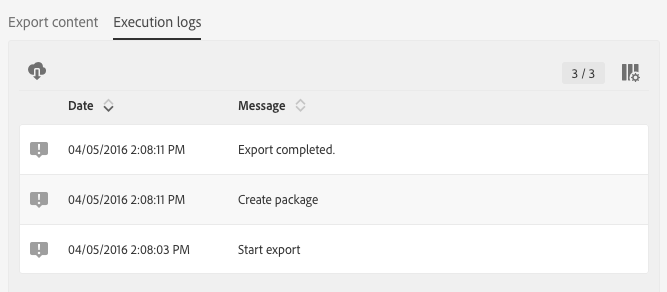
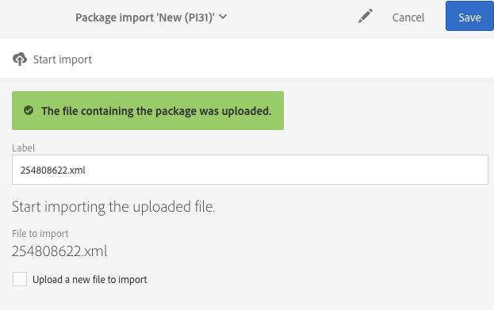

# 管理包{#managing-packages}

管理员可以定义包，以便通过结构化XML文件在不同的Adobe Campaign实例之间交换资源。 这些参数可以是配置参数或数据。

这对于从一台服务器向另一台服务器传输数据或复制实例的配置可能非常有用。

包位于 **[!UICONTROL Administration]** &gt; **[!UICONTROL Deployment]** &gt;或 **[!UICONTROL Package exports]** 菜单 **[!UICONTROL Package imports]** 下。 两个菜单的功能类似。

默认情况下，每个列表的元素会根据其修改或安装日期（从最近到最近）显示。

要显示和修改元素的内容，请单击其标签。 请参阅导 [出包和导入](#exporting-a-package)[包部分](#importing-a-package) 。

## 包导出 {#package-exports}

### 标准包 {#standard-packages}

**[!UICONTROL Platform]** 和 **[!UICONTROL Administration]** 是两个内置包，每个包含要导出的预定义资源列表。 它们可以以只读模式打开，并且仅适于导出。

>[!CAUTION]
>
>如果导出的资源具有默认ID，则导出包不授权。 因此，必须使用与Adobe Campaign standard提供的标准模板不同的名称来更改可导出资源的ID。 例如，要导出测试配置文件，不得使用包含值“SDM”或“sdm”的ID。 在尝试导出包含默认ID的包时，您会看到以下错误：“‘品牌（品牌）’实体类型使用默认ID(‘BRD1’)，在导入包时，该ID可能会造成冲突。 更改此名称并重复此操作。”

“导出包”部分介绍了包 [导出步骤](#exporting-a-package) 。

* 该包 **[!UICONTROL Platform]** 重新分组在技术配置过程中添加的所有资源：自定义资源、自定义资源集、触发器和类型的应用程序 **[!UICONTROL System]** 选项。
* 该包 **[!UICONTROL Administration]** 重新分组在业务配置过程中添加的所有对象，例如：营销活动模板、内容模板、投放模板、登陆页面模板、计划模板和工作流模板。

   它还包括以下对象：内容块、目标映射、外部帐户、组织单元、具有类型、角色、类型、 **[!UICONTROL User]** 类型规则和用户的应用程序选项。

>[!NOTE]
>
>这两个包的内容无法修改。 相反，这些包始终包含最新可用的数据。 您可以创 [建自己的包](#creating-a-package) ，以导出特定元素。

### 创建包 {#creating-a-package}

如果需要导出特定的数据集，您需要创建包。

要创建包，您需要管理权限。

1. 从 **[!UICONTROL Administration]** &gt; **[!UICONTROL Deployment]** &gt; **[!UICONTROL Package exports]**，单击包内 **[!UICONTROL Create]** 容列表中的按钮。

   元素会立即创建。 要取消创建它，请返回列表并选中相应的框以将其删除。

1. 在包内容屏幕中，指定名称和ID。
1. 如果要 **[!UICONTROL Edit properties]** 添加说明并限制对某些用户的访问，请单击该按钮。

   

1. 使用选 **[!UICONTROL Create element]** 项卡中的 **[!UICONTROL Export content]** 按钮选择要导出的资源。

   

1. 资源按字母顺序显示，并可按名称筛选。 他们的技术名称显示在括号中。 从列表中选择一个元素并进行确认。

   

1. 资源名称显示在选项卡 **[!UICONTROL Export content]** 中。 要修改资源，请选中相应的框，然后使用按 **[!UICONTROL Show detail of the element selected]** 钮。

   

1. 使用查询编辑器可以过滤要导出的元素。 有关详细信息，请参阅编辑查 [询部分](../../automating/using/editing-queries.md#creating-queries) 。

   

   >[!NOTE]
   >
   >每个资源最多可导出5000个对象。

1. 指定所有要导出的资源后，请保存您的选择。

您的包现已创建，可以导出。

### 导出包 {#exporting-a-package}

导出包允许您保存资源的特定状态，您可以在同一实例的其他实例上或更高版本上重新导入该状态。

>[!CAUTION]
>
>如果导出的资源具有现成的ID，则导出包将不授权。 因此，必须使用与Adobe Campaign standard提供的标准模板不同的名称来更改可导出资源的ID。 例如，要导出测试配置文件，不得使用包含值“SDM”或“sdm”的ID。

1. 从 **[!UICONTROL Administration]** &gt; **[!UICONTROL Deployment]** &gt; **[!UICONTROL Package exports]**&#x200B;中，选择一个包以访问其详细信息。
1. 检查包中是否包含您需要的数据。
1. Click the **[!UICONTROL Start export]** button.

导出的文件存储在所使用的浏览器的下载文件夹中。 它自动命名为“package_xxx.xml”，其中“xxx”对应于包ID。

操作完成后，将显示几个部分：

* **[!UICONTROL Export status]**:此部分显示操作是否正确执行。

   

* 您可以通过选项卡查阅导出的不同步 **[!UICONTROL Log]** 骤。 它包含所有前期导出的状态。

   

>[!NOTE]
>
>从已导出的包内容列表中选择元素时，仍可使 **[!UICONTROL Log]** 用和 **[!UICONTROL Last export]** 选项卡。

## 包导入 {#package-imports}

### 系统更新 {#system-updates}

任何内容上方的包导入列表都包含链接到Adobe执行的更新的自动导入。

该选 **[!UICONTROL Execution logs]** 项卡存储所有导入步骤。 侧面板显示常规信息。

>[!NOTE]
>
>这些元素可在只读模式下访问。

### 导入包 {#importing-a-package}

管理员可以手动导入源自先前从Adobe Campaign实例执行的导出的包。 有关详细信息，请参阅“包导 [出”部分](#package-exports) 。

手动包导入包括两个步骤：首先，您必须上传文件，然后才能导入其内容。

1. 从 **[!UICONTROL Administration]** &gt; **[!UICONTROL Deployment]** &gt; **[!UICONTROL Package imports]**，单击包导 **[!UICONTROL Create]** 入列表中的按钮。

   元素会立即创建。 要取消创建它，请返回列表并选中相应的框以将其删除。

1. 指定新导入的名称和ID。
1. 通过拖放文件或单击链接选择要上传的文 **[!UICONTROL Select from folder]** 件。

   导入的文件必须是XML或ZIP（包含XML文件）格式。

   

   >[!NOTE]
   >
   >要替换已上载的文档，请首先通过文件名称右侧的X图标删除该文件，然后重复该操作。

1. 上传文件后，使用按钮将其内容导入数据 **[!UICONTROL Start import]** 库。

   

操作完成后，将显示几个部分：

* **[!UICONTROL Import status]**:此部分显示操作是否正确执行。
* 您可以通过选项卡查阅导入的不同步 **[!UICONTROL Execution logs]** 骤。 这对于查看错误尤为重要。

   

导入包后，便无法从同一元素重新导入它。 您只能修改其标签和ID。

要重新导入同一包，您必须返回至包导入列表，创建元素，然后再次上传选定的文件。
