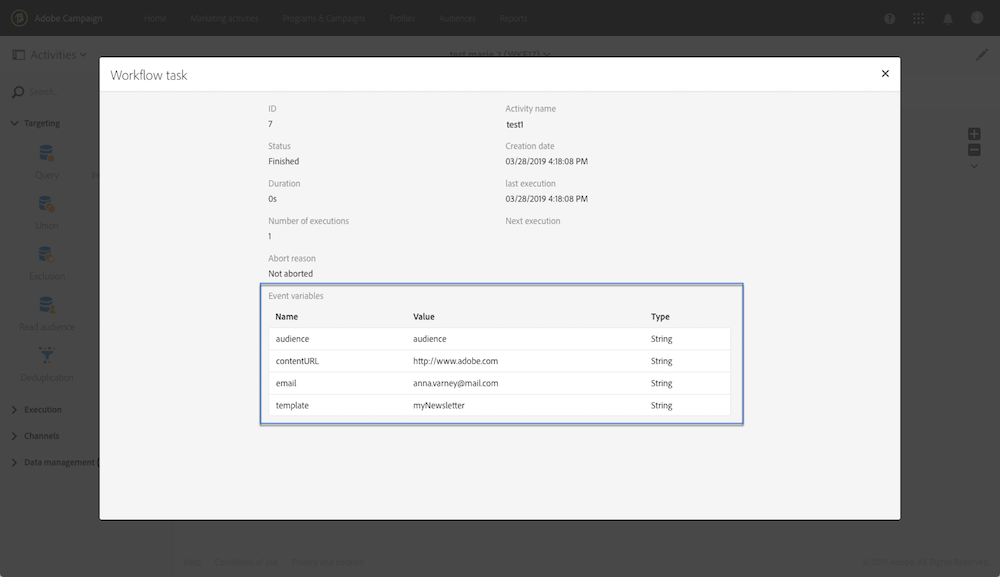

# 监视事件变量 {#monitoring-the-events-variables}

可以监视工作流中可用的事件变量，包括声明的外部参数。 为此请执行以下操作步骤：

1. 选择&#x200B;**[!UICONTROL External signal]**&#x200B;活动后的活动，然后单击&#x200B;**[!UICONTROL Log and tasks]**&#x200B;按钮。
1. 在&#x200B;**[!UICONTROL Tasks]**&#x200B;选项卡中，单击按钮。

   

1. 此时会显示任务的执行上下文（ID、状态、持续时间等），其中包括工作流中现在可以使用的所有事件变量。

   
