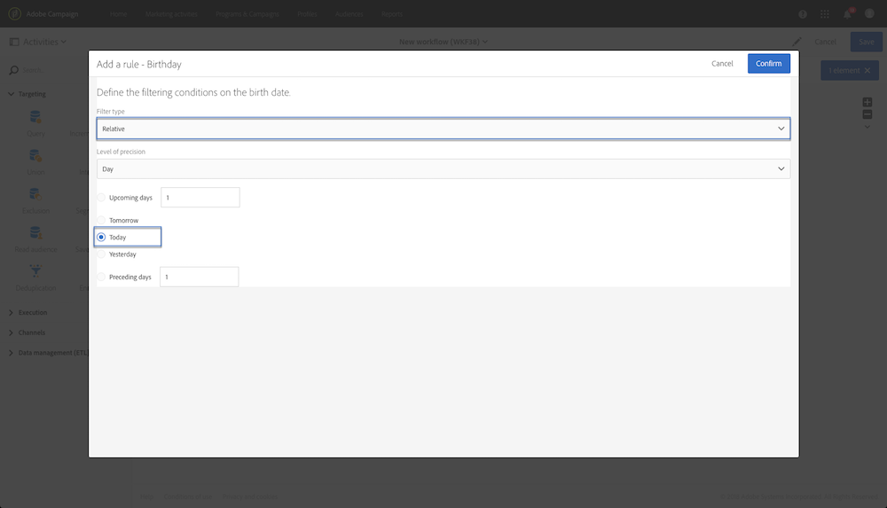

# 查询样例 {#query-samples}

本节介绍使用时的用例 **[!UICONTROL Query]** 活动。 有关如何使用 **[!UICONTROL Query]** 活动，请参阅 [本节](../../automating/using/query.md).

## 基于简单用户档案属性定向 {#targeting-on-simple-profile-attributes}

下方的示例展示了一个查询活动，该活动配置为定向居住在伦敦的 18 至 30 岁的男子。

## 基于电子邮件属性定向 {#targeting-on-email-attributes}

下方的示例显示了一个查询活动，该活动配置为定向电子邮件地址域为“orange.co.uk”的用户档案。

下方的示例显示了一个查询活动，该活动配置为定向已提供电子邮件地址的用户档案。

## 定向生日为今天的用户档案 {#targeting-profiles-whose-birthday-is-today}

以下示例显示了一个查询活动，该活动配置为定向生日为今天的用户档案。

1. 将 **[!UICONTROL Birthday]** 过滤器拖动到查询中。

   

1. 将 **[!UICONTROL Filter type]** 设置为 **[!UICONTROL Relative]** 并选择 **[!UICONTROL Today]**。

   

## 定向打开了特定投放的用户档案 {#targeting-profiles-who-opened-a-specific-delivery}

以下示例显示了一个查询活动，该活动配置为筛选打开了标签为“Summer Time”之投放的用户档案。

1. 将 **[!UICONTROL Opened]** 过滤器拖动到查询中。

   

1. 选择投放，然后单击 **[!UICONTROL Confirm]**。

   

## 定向因特定原因投放失败的用户档案 {#targeting-profiles-for-whom-deliveries-failed-for-a-specific-reason}

以下示例显示了一个查询活动，该活动配置为筛选因其邮箱已满而导致投放失败的用户档案。此查询仅适用于具有管理权限且归属于 **[!UICONTROL All (all)]** 组织单位的用户（请参阅[此章节](../../administration/using/organizational-units.md)）。

1. 选择 **[!UICONTROL Delivery logs]** 资源，以便直接在投放日志表中进行筛选（请参阅[使用与定向维度不同的资源](../../automating/using/using-resources-different-from-targeting-dimensions.md)）。

   

1. 将 **[!UICONTROL Nature of failure]** 过滤器拖动到查询中。

   

1. 选择要定向的失败类型。以 **[!UICONTROL Mailbox full]** 为例。

   

## 定向过去 7 天内未联系的用户档案 {#targeting-profiles-not-contacted-during-the-last-7-days}

以下示例显示了一个查询活动，该活动配置为筛选过去 7 天内未联系的用户档案。

1. 将 **[!UICONTROL Delivery logs (logs)]** 过滤器拖动到查询中。

   

   在下拉列表中选择 **[!UICONTROL Does not exist]**，然后拖动 **[!UICONTROL Delivery]** 过滤器。

   

1. 按照下方所示，配置过滤器。

   

## 定向单击了特定链接的用户档案 {#targeting-profiles-who-clicked-a-specific-link-}

1. 将 **[!UICONTROL Tracking logs (tracking)]** 过滤器拖动到查询中。

   

1. 拖动 **[!UICONTROL Label (urlLabel)]** 过滤器。

   

1. 在 **[!UICONTROL Value]** 字段中，键入在投放中插入链接时定义的标签，然后进行确认。

   
