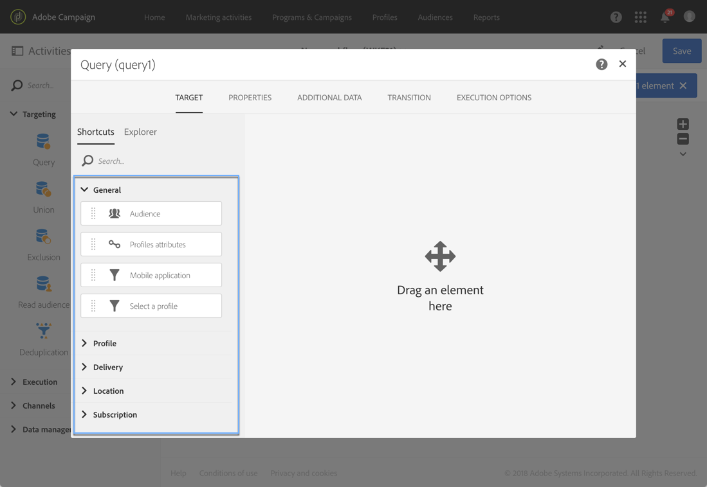
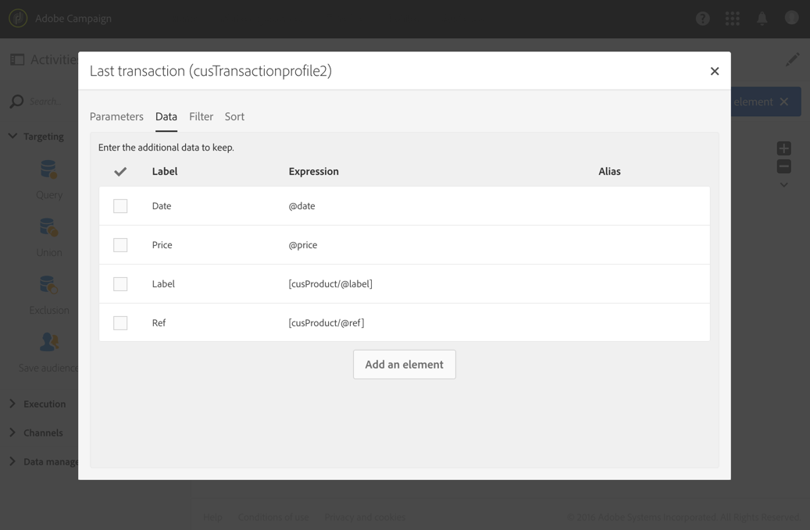

# 查询{#query}

## 说明 {#description}

利用 **[!UICONTROL Query]** 活动，可筛选和提取 Adobe Campaign 数据库中的元素群体。您可以通过专用选项卡定义针对定向群体的 **[!UICONTROL Additional data]**。此数据存储在附加的列中，并且只能用于正在进行的工作流。

此活动可使用查询编辑器工具。有关该工具的详情，可参见[专述章节](../../automating/using/editing-queries.md#about-query-editor)。

**相关主题：**

* [查询示例](../../automating/using/query-samples.md)
* [使用案例：重定向工作流 — 向未打开者发送新投放](../../automating/using/workflow-cross-channel-retargeting.md)

## 使用环境 {#context-of-use}

**[!UICONTROL Query]** 活动可用于各种类型的应用：

* 对个体进行分段以定义消息的目标、受众等。
* 扩充整个 Adobe Campaign 数据库表格的数据。
* 导出数据。

## 配置 {#configuration}

1. 将 **[!UICONTROL Query]** 活动拖放到工作流中。
1. 选择活动，然后使用所显示快速操作中的  按钮将其打开。默认情况下，该活动预配置为搜索用户档案。
1. 如果要在非用户档案资源上运行查询，请转至该活动的 **[!UICONTROL Properties]** 选项卡，然后选择 **[!UICONTROL Resource]** 和 **[!UICONTROL Targeting dimension]**。

   利用 **[!UICONTROL Resource]** 可微调面板中显示的过滤器，包括 **[!UICONTROL Targeting dimension]**、对应于所选资源的上下文、对应于您要获取的群体类型（已识别的用户档案、投放、链接到所选资源的数据等）。

   有关更多信息，请参阅[定向维度和资源](#targeting-dimensions-and-resources)。

1. 在 **[!UICONTROL Target]** 选项卡中，可通过定义和组合规则来运行查询。

   >[!NOTE]
   >
   >定位受众时，请注意，未引用受众的定义，但 **已复制** 到查询中。 如果在查询中定位受众后对该受众进行了任何更改，请确保再次配置查询以将新定义考虑在内。

1. 您可以通过专用选项卡定义针对定向群体的 **[!UICONTROL Additional data]**。此数据存储在附加的列中，并且只能用于正在进行的工作流。而且，您还可以从链接到查询定向维度的 Adobe Campaign 查询数据库表格添加数据。请参阅[扩充数据](#enriching-data)一节。

   >[!NOTE]
   >
   >查询的 **[!UICONTROL Advanced options]** 选项卡中的 **[!UICONTROL Additional data]** 默认勾选 **[!UICONTROL Remove duplicate rows (DISTINCT)]** 选项。出于性能上的考虑，如果 **[!UICONTROL Query]** 活动包含大量（100 以上）已定义的附加数据，则建议取消勾选此选项。请注意，取消勾选此选项可能会导致获取重复项，具体情况取决于查询的数据。

1. 在 **[!UICONTROL Transition]** 选项卡中，使用 **[!UICONTROL Enable an outbound transition]** 选项可在查询活动后添加叫客过渡，即使查询未检索到任何数据。

   叫客过渡的段码可以使用标准表达式和事件变量进行个性化(请参阅 [此页面](../../automating/using/customizing-workflow-external-parameters.md))。

1. 确认活动的配置并保存工作流。

## 定向维度和资源 {#targeting-dimensions-and-resources}

利用定向维度和资源，可定义查询基于哪些元素来确定投放的目标。

它们在中进行配置 [目标映射](../../administration/using/target-mappings-in-campaign.md)、和在创建工作流时定义的 **[!UICONTROL Properties]** “查询”活动的选项卡。

>[!NOTE]
>
>也可在创建受众时定义定向维度（请参阅[此章节](../../audiences/using/creating-audiences.md)）。

定向维度和资源之间存在关联。因此，可用的定向维度取决于所选的资源。

例如，对于资源 **[!UICONTROL Profiles (profile)]**，可用的定向维度如下所示：

而对于 **[!UICONTROL Deliveries (delivery)]**，列表将包含以下定向维度：

指定定向维度和资源后，查询中会提供不同的过滤器。

**[!UICONTROL Profiles (profile)]** 资源可用的过滤器示例：

**[!UICONTROL Deliveries (delivery)]** 资源可用的过滤器示例：

默认情况下，会设置定向维度和资源以定向用户档案。 但是，如果要在远程表格查找特定记录，则使用与定向维度不同的资源可能比较有效。

有关更多信息，请参阅此用例： [使用与定向维度不同的资源](../../automating/using/using-resources-different-from-targeting-dimensions.md)

## 丰富数据 {#enriching-data}

通过 **[!UICONTROL Query]** 的 **[!UICONTROL Additional data]** 选项卡，利用 **[!UICONTROL Incremental query]** 和 **[!UICONTROL Enrichment]** 活动可扩充定向的数据，并将这些数据传输到后续的工作流中，以便我们使用。其中，您可以添加：

* 简单数据
* 聚合
* 集合

对于聚合和集合，会自动定义 **[!UICONTROL Alias]** 从而给复杂的表达式赋予技术 ID。此别名必须具有唯一性，这样未来就可轻松查找聚合和集合。您可以修改别名，为它提供易于识别的名称。

>[!NOTE]
>
>别名必须遵循以下语法规则：只能使用字母数字字符和“_”字符。别名区分大小写字母。别名的开头必须为“@”字符。“@”后面的第一个字符不能是数字。例如：@myAlias_1 和 @_1Alias 是正确的；而 @myAlias#1 和 @1Alias 不正确。

添加任何附加数据后，您可以通过根据定义的附加数据创建的条件，将附加筛选级别应用到最初定向的数据。

>[!NOTE]
>
>查询的 **[!UICONTROL Advanced options]** 选项卡中的 **[!UICONTROL Additional data]** 默认勾选 **[!UICONTROL Remove duplicate rows (DISTINCT)]** 选项。出于性能上的考虑，如果 **[!UICONTROL Query]** 活动包含大量（100 以上）已定义的附加数据，则建议取消勾选此选项。请注意，取消勾选此选项可能会导致获取重复项，具体情况取决于查询的数据。

有关如何使用附加数据个性化电子邮件的用例，请参见 [本节](../../automating/using/personalizing-email-with-additional-data.md).

### 添加简单字段 {#adding-a-simple-field}

通过添加简单字段作为附加数据，该字段将直接显示在活动的叫客过渡中。这样可让用户核实，来自查询的数据是否为所需数据之类的情况。

1. 在 **[!UICONTROL Additional data]** 选项卡中，添加新元素。
1. 在打开的窗口中，通过 **[!UICONTROL Expression]** 字段，直接从定向维度或某个链接维度中选择可用的字段之一。您可以编辑表达式，并使用维度字段中的函数或简单计算式（聚合除外）。

   如果您编辑的表达式不是简单的 XPATH 路径（例如：“Year(&lt;@birthDate>)”），则会自动创建 **[!UICONTROL Alias]**。您可以根据自己的喜好对其进行修改。如果只选择一个字段（例如：“@age”），则无需定义 **[!UICONTROL Alias]**。

1. 选择 **[!UICONTROL Add]** 以确认添加字段用于附加数据。执行查询时，活动的叫客过渡中将显示对应于所添加字段的附加列。

### 添加聚合 {#adding-an-aggregate}

利用聚合，可根据定向维度的字段或与链接到定向维度之维度的字段计算值。例如：用户档案购买的平均金额。
将聚合与查询结合使用时，其函数可返回零，而零值会被视作“NULL”。使用查询的 **[!UICONTROL Output filtering]** 选项卡可筛选聚合的值：

* 如果您希望获得零值，则应筛选 **[!UICONTROL is null]**。
* 如果您不希望获得零值，则应筛选 **[!UICONTROL is not null]**。

请注意，如果您需要对聚合应用排序，则应筛选掉零值，否则最大数将显示为 NULL 值。

1. 在 **[!UICONTROL Additional data]** 选项卡中，添加新元素。
1. 在打开的窗口中，选择要在 **[!UICONTROL Expression]** 字段中创建聚合的集合。

   随即会自动创建 **[!UICONTROL Alias]**。需要时也可返回查询的 **[!UICONTROL Additional data]** 选项卡以对其进行修改。

   随即会打开聚合定义窗口。

1. 从 **[!UICONTROL Data]** 选项卡定义聚合。根据所选聚合的类型，**[!UICONTROL Expression]** 字段中只会提供其数据兼容的元素。例如，总和只能使用数值数据进行计算。

   

   您可以为所选集合的字段添加多个聚合。确保定义明确的标签，以区分活动叫客数据详情中各个不同的列。

   您还可以对各个聚合自动定义的别名进行修改。

   

1. 需要时，您可以添加过滤器以限制纳入考虑的数据。

   请参阅[筛选添加的数据](#filtering-added-data)一节。

1. 选择 **[!UICONTROL Confirm]** 以添加聚合。

>[!NOTE]
>
>不能直接从 **[!UICONTROL New additional data]** 窗口的 **[!UICONTROL Expression]** 字段创建包含聚合的表达式。

### 添加集合 {#adding-a-collection}

1. 在 **[!UICONTROL Additional data]** 选项卡中，添加新元素。
1. 在打开的窗口中，选择要在 **[!UICONTROL Expression]** 字段中添加的集合。随即会自动创建 **[!UICONTROL Alias]**。需要时也可返回查询的 **[!UICONTROL Additional data]** 选项卡以对其进行修改。
1. 选择 **[!UICONTROL Add]**。随即会打开一个新窗口，用于调整您要显示的集合数据。
1. 在 **[!UICONTROL Parameters]** 选项卡中，选择 **[!UICONTROL Collection]** 并定义要添加集合的行数。例如，如果要获取每个用户档案执行最近三次购买，请在 **[!UICONTROL Number of lines to return]** 字段中输入“3”。

   >[!NOTE]
   >
   >输入的数字必须大于或等于 1。

1. 在 **[!UICONTROL Data]** 选项卡中，定义您想要为各行显示的集合字段。

   

1. 需要时，您可以添加过滤器以限制纳入考虑的集合行。

   请参阅[筛选添加的数据](#filtering-added-data)一节。

1. 需要时您可以定义数据排序。

   例如，如果您在 **[!UICONTROL Parameters]** 选项卡中选择了返回 3 行，且想要确定最近的三次购买，则可以为与交易处理对应之集合的“日期”字段定义降序排序。

1. 请参阅[为附加数据排序](#sorting-additional-data)一节。
1. 选择 **[!UICONTROL Confirm]** 以添加集合。

### 筛选添加的数据 {#filtering-added-data}

添加聚合或集合时，可指定附加过滤器以限制要显示的数据。

例如，如要仅处理金额不少于 50 美元的交易处理集合行，您可以在 **[!UICONTROL Filter]** 选项卡中为对应于交易金额的字段添加一个条件。

### 为附加数据排序 {#sorting-additional-data}

向查询的数据添加聚合或集合时，您可以根据定义的字段值或表达式，指定是否要应用排序（无论升序还是降序）。

例如，如要仅保存最近由用户档案执行的交易，请在 **[!UICONTROL Parameters]** 选项卡的 **[!UICONTROL Number of lines to return]** 字段中输入“1”，并通过 **[!UICONTROL Sort]** 选项卡为对应于交易日期的字段应用降序排序。

### 根据附加数据筛选定向数据 {#filtering-the-targeted-data-according-to-additional-data}

添加附加数据后，会在 **[!UICONTROL Query]** 中显示一个新的 **[!UICONTROL Output filtering]** 选项卡。利用此选项卡，可通过考虑添加的数据，对 **[!UICONTROL Target]** 选项卡中的初始定向数据应用附加过滤器。

例如，如果您已经定向执行了至少一次交易的所有用户档案，并且已经为 **[!UICONTROL Additional data]** 添加了计算每个用户档案平均交易金额的聚合，则可以使用此平均值调整最初计算的群体。

要实现此目的，只需在 **[!UICONTROL Output filtering]** 选项卡中为此附加数据添加一个条件即可。

