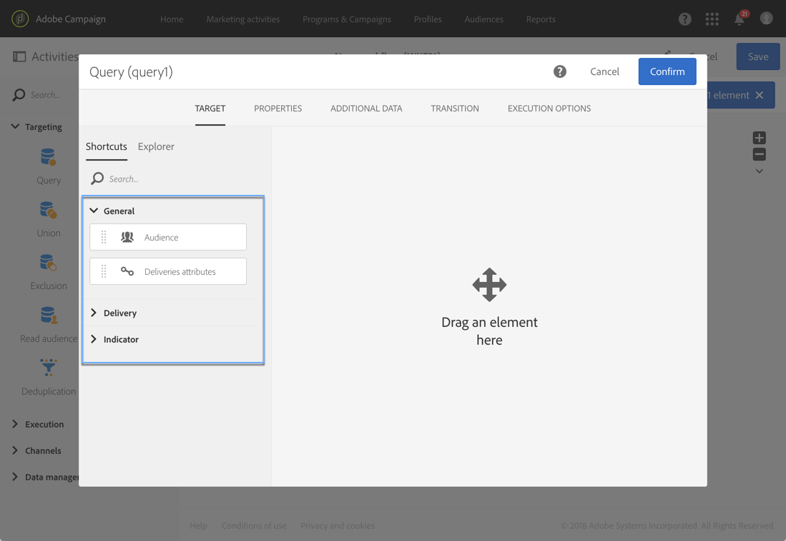
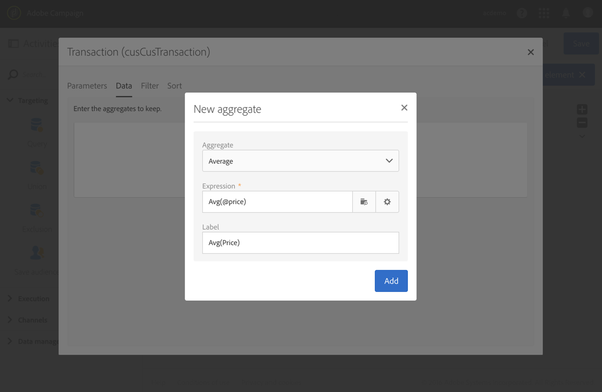

# 查询{#query}

## 说明 {#description}

活动 **[!UICONTROL Query]** 允许您过滤和提取Adobe Campaign数据库中的元素集合。 您可以通过 **[!UICONTROL Additional data]** 专用选项卡为目标人群定义。 此数据存储在其他列中，并且只能用于进行中的工作流。

活动使用查询编辑器工具。 此工具在专用部分 [中详述](../../automating/using/editing-queries.md#about-query-editor)。

**相关主题：**

* [查询范例](../../automating/using/query-samples.md)
* [用例： 重定向工作流向非打开者发送新投放](../../automating/using/workflow-cross-channel-retargeting.md)

## 使用环境 {#context-of-use}

该 **[!UICONTROL Query]** 活动可用于各种类型的使用：

* 对个人进行细分以定义消息的目标、受众等。
* 丰富整个Adobe Campaign库表的数据。
* 导出数据.

## Configuration {#configuration}

1. 将活动拖放 **[!UICONTROL Query]** 到工作流中。
1. 选择活动，然后使用显示的快  速操作中的按钮打开它。 默认情况下，活动已预配置为搜索用户档案。
1. 如果要在查询资源以外的资源上运行用户档案，请转到活动的选项卡， **[!UICONTROL Properties]** 然后选择 **[!UICONTROL Resource]** 一个和 **[!UICONTROL Targeting dimension]**。

   该 **[!UICONTROL Resource]** 选项允许您细化调色板中显示的过滤器，而与所选资源相关的 **[!UICONTROL Targeting dimension]**&#x200B;上下文选项与您要获取的人口类型(标识的用户档案、投放、链接到所选资源的数据等)相对应。

   有关此内容的详细信息，请参 [阅定位维度和资源](#targeting-dimensions-and-resources)。

1. 在选项卡 **[!UICONTROL Target]** 中，通过定义和组合规则来运行查询。
1. 您可以通过 **[!UICONTROL Additional data]** 专用选项卡为目标人群定义。 此数据存储在其他列中，并且只能用于进行中的工作流。 特别是，您可以从链接到Adobe Campaign定位维度的查询数据库表中添加数据。 请参阅 [丰富数据](#enriching-data) 部分。

   >[!NOTE]
   >
   >默认情况下， **[!UICONTROL Remove duplicate rows (DISTINCT)]** 选项会选中查询 **[!UICONTROL Advanced options]** 的选 **[!UICONTROL Additional data]** 项卡中的选项。 如果活动 **[!UICONTROL Query]** 包含许多（从100个）已定义的附加数据，则建议取消选中此选项，因为性能原因。 请注意，取消选中此选项可能会导致获取重复，具体取决于查询的数据。

1. 在选项卡 **[!UICONTROL Transition]** 中，选 **[!UICONTROL Enable an outbound transition]** 项允许您在过渡活动后添加出站查询，即使它未检索任何数据也是如此。

   出站过渡的段代码可以使用标准表达式和事件变量进行个性化(请参 [阅使用事件变量自定义活动](../../automating/using/calling-a-workflow-with-external-parameters.md#customizing-activities-with-events-variables))。

1. 确认活动的配置并保存工作流。

## 定位维度和资源 {#targeting-dimensions-and-resources}

定位维度和资源允许您定义查询将基于哪些元素来确定投放的目标。

定位维度在目标映射中定义。 如需详细信息，请参阅[此部分](../../administration/using/target-mappings-in-campaign.md)。

定位维度和资源是在创建工作流时在查询 **[!UICONTROL Properties]** 活动的选项卡中定义的。

>[!NOTE]
>
>创建定位维度时也可以定义受众(请参 [阅本节](../../audiences/using/creating-audiences.md))。

定位维度和资源是链接的。 因此，可用定位维度取决于所选资源。

例如，对于资源， **[!UICONTROL Profiles (profile)]**&#x200B;将提供以下定位维度:

对于 **[!UICONTROL Deliveries (delivery)]**,列表将包含以下定位维度:

指定定位维度和资源后，过滤器中会提供不同的查询。

资源的可用过滤器 **[!UICONTROL Profiles (profile)]** 示例：

资源的可用过滤器 **[!UICONTROL Deliveries (delivery)]** 示例：

默认情况下，定位维度和资源按目标用户档案的顺序设置。 但是，如果要在远程表中查找特定记录，则使用与定位维度不同的资源可能会很有用。

有关此的详细信息，请参阅此用例： [使用不同于定位维度的资源](../../automating/using/using-resources-different-from-targeting-dimensions.md)

## 丰富数据 {#enriching-data}

通过 **[!UICONTROL Additional data]** 的选项卡和 **[!UICONTROL Query]**&#x200B;活动 **[!UICONTROL Incremental query]****[!UICONTROL Enrichment]** ，您可以丰富目标活动，并将这些数据传输到以下工作流，以便在这些中加以利用。 特别是，您可以添加：

* 简单数据
* 聚合
* 集合

对于聚合和集合， **[!UICONTROL Alias]** 会自动定义一个技术ID给复杂表达式。 此别名必须唯一，它允许在之后轻松找到聚合和集合。 您可以修改它，为它提供一个易于识别的名称。

>[!NOTE]
>
>别名必须遵循以下语法规则： 仅授权字母数字字符和“_”字符。 别名区分大小写。 别名必须开始为“@”字符。 “@”后面的字符不能为数字。 例如： @myAlias_1和@_1Alias正确； 而@myAlias#1和@1Alias不正确。

添加任何附加数据后，您可以根据定义的附加数据创建条件，将附加的筛选器级别应用到最初定位的数据。

>[!NOTE]
>
>默认情况下， **[!UICONTROL Remove duplicate rows (DISTINCT)]** 选项会选中查询 **[!UICONTROL Advanced options]** 的选 **[!UICONTROL Additional data]** 项卡中的选项。 如果活动 **[!UICONTROL Query]** 包含许多（从100个）已定义的附加数据，则建议取消选中此选项，因为性能原因。 请注意，取消选中此选项可能会导致获取重复，具体取决于查询的数据。

本节将介绍如何使用其他数据个性化电子邮件 [的用例](../../automating/using/personalizing-email-with-additional-data.md)。

### 添加简单字段 {#adding-a-simple-field}

通过将简单字段添加为附加过渡，该字段在活动的出站数据中将直接可见。 这允许用户检查，例如，来自查询的数据是否是所需数据。

1. 在选项卡 **[!UICONTROL Additional data]** 中，添加新元素。
1. 在打开的窗口中，在字 **[!UICONTROL Expression]** 段中，选择定位维度中或某个链接维中直接可用的字段之一。 您可以编辑表达式，并使用维字段中的函数或简单计算(聚合除外)。

   如果 **[!UICONTROL Alias]** 您编辑的表达式不是简单的XPATH路径，则会自动创建一个路径(例如： &quot;Year(&lt;@birdDate>)&quot;)。 如果您喜欢，可以修改它。 如果只选择一个字段(例如： &quot;@age&quot;)，您无需定义 **[!UICONTROL Alias]**。

1. 选择 **[!UICONTROL Add]** 以确认将字段添加到其他数据。 执行查询时，与添加的字段对应的附加列将出现在活动的出站过渡中。

### 添加聚合 {#adding-an-aggregate}

聚合允许从定位维度的字段或链接到定位维度的维的字段中计算值。 例如： 用户档案购买的平均金额。
当将聚合与查询一起使用时，其函数可返回零，然后被视为NULL。 使用查询 **[!UICONTROL Output filtering]** 的选项卡来筛选聚集的值：

* 如果您希望零值，则应进行筛选 **[!UICONTROL is null]**。
* 如果您不希望对零值进行筛选 **[!UICONTROL is not null]**。

请注意，如果您需要对聚合应用排序，您应过滤掉零值，否则NULL值将显示为最大数。

1. 在选项卡 **[!UICONTROL Additional data]** 中，添加新元素。
1. 在打开的窗口中，选择要在字段中创建聚合的集 **[!UICONTROL Expression]** 合。

   将自 **[!UICONTROL Alias]** 动创建。 如果您喜欢，可以返回查询选项卡来修改该 **[!UICONTROL Additional data]** 选项卡。

   聚合定义窗口将打开。

1. 从选项卡中定义 **[!UICONTROL Data]** 聚合。 根据所选聚合的类型，字段中仅提供数据兼容的元 **[!UICONTROL Expression]** 素。 例如，总和只能用数值数据计算。

   

   您可以为所选集合的字段添加多个聚合。 确保定义显式标签以区分活动出站数据详细信息中的不同列。

   您还可以更改为每个聚合自动定义的别名。

   

1. 如果需要，您可以添加过滤器以限制已考虑的数据。

   请参阅筛选 [添加的数据](#filtering-added-data) 。

1. 选择 **[!UICONTROL Confirm]** 以添加聚合。

>[!NOTE]
>
>不能直接从窗口的字段创建包含 **[!UICONTROL Expression]** 表达式的 **[!UICONTROL New additional data]** 聚合。

### 添加集合 {#adding-a-collection}

1. 在选项卡 **[!UICONTROL Additional data]** 中，添加新元素。
1. 在打开的窗口中，选择要在字段中添加的集 **[!UICONTROL Expression]** 合。 将自 **[!UICONTROL Alias]** 动创建。 如果您喜欢，可以返回查询选项卡来修改该 **[!UICONTROL Additional data]** 选项卡。
1. Select **[!UICONTROL Add]**. 此时将打开一个新窗口，允许您调整要显示的收集数据。
1. 在标 **[!UICONTROL Parameters]** 签中， **[!UICONTROL Collection]** 选择并定义要添加的集合行数。 例如，如果要使每个用户档案执行的三个最近购买，请在字段中输入“ **[!UICONTROL Number of lines to return]** 3”。

   >[!NOTE]
   >
   >必须输入大于或等于1的数字。

1. 在标 **[!UICONTROL Data]** 签中，定义要为每行显示的集合字段。

   

1. 如果需要，可添加过滤器以限制已考虑的收集行。

   请参阅筛选 [添加的数据](#filtering-added-data) 。

1. 如果您愿意，可以定义数据排序。

   例如，如果您在标签中选择了3行要返回，并且要确定最近购买的3 **[!UICONTROL Parameters]** 个，则可以在与事务处理对应的集合的“日期”字段中定义降序排序。

1. 请参阅对其 [他数据进行排序](#sorting-additional-data) 。
1. 选择 **[!UICONTROL Confirm]** 以添加集合。

### 筛选添加的数据 {#filtering-added-data}

添加聚合或集合时，可指定其他筛选器以限制要显示的数据。

例如，如果要仅处理金额为50美元及以上的事务处理的收集行，您可以在标签中为与事务处理金额对应的字段添加一个 **[!UICONTROL Filter]** 条件。

### 对其他数据排序 {#sorting-additional-data}

在向聚合的数据中添加查询或集合时，您可以根据字段值或定义的表达式指定是否要应用排序（无论排序是升序还是降序）。

例如，如果要仅保存最近由用户档案执行的事务，请在选项卡的字段中输入 **[!UICONTROL Number of lines to return]** “1 **[!UICONTROL Parameters]** ”，并通过选项卡对与事务日期对应的字段应用降序排 **[!UICONTROL Sort]** 序。

### 根据其他数据过滤目标数据 {#filtering-the-targeted-data-according-to-additional-data}

添加其他数据后，会在中显 **[!UICONTROL Output filtering]** 示一个新选项卡 **[!UICONTROL Query]**。 此选项卡允许您通过考虑添加的数据，对选项卡中最初 **[!UICONTROL Target]** 定位的数据应用附加筛选器。

例如，如果您已将执行至少一个事务处理的所有用户档案作为目标，并且计算每个用户档案执行的平均事务处理金额的聚合已添加到该中，则您可以调整最初使用此平均值计算的人口。 **[!UICONTROL Additional data]**

为此，只需在选项卡 **[!UICONTROL Output filtering]** 中为此附加数据添加一个条件。

