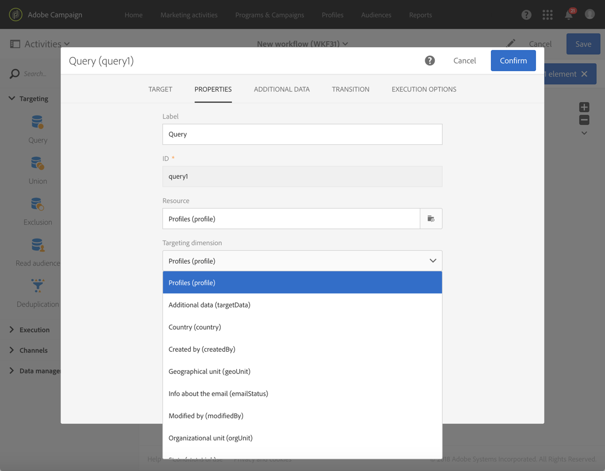
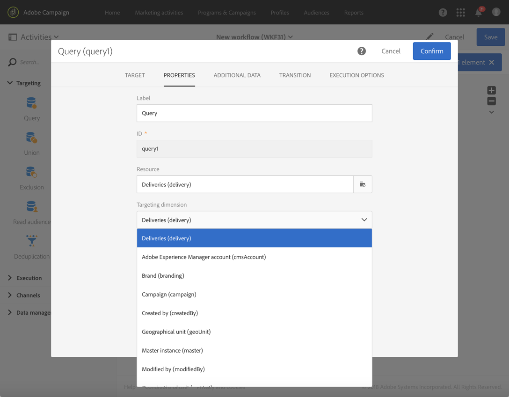

# Query{#query}

## Description {#description}

**[!UICONTROL Query]** 活动允许您过滤和提取Adobe Campaign数据库中的大量元素。You can define **[!UICONTROL Additional data]** for the targeted population via a dedicated tab. 此数据存储在其他列中，只能用于进行中的工作流。

活动使用查询编辑器工具。This tool is detailed in a [dedicated section](../../automating/using/editing-queries.md#about-query-editor).

## Context of use {#context-of-use}

**[!UICONTROL Query]** 该活动可用于各种类型的用途：

* 将个人细分为定义消息、受众等目标。
* 丰富整个Adobe Campaign数据库表的数据。
* 导出数据。

## Configuration {#configuration}

1. Drag and drop a **[!UICONTROL Query]** activity into your workflow.
1. Select the activity, then open it using the  button from the quick actions that appear. 默认情况下，将活动预配置为搜索配置文件。
1. If you would like to run a query on a resource other than the profile resource, go to the activity's **[!UICONTROL Properties]** tab and select a **[!UICONTROL Resource]** and a **[!UICONTROL Targeting dimension]**.

   The **[!UICONTROL Resource]** allows you to refine the filters displayed in the palette whereas the **[!UICONTROL Targeting dimension]**, contextual with regard to the resource selected, corresponds to the type of population that you would like to obtain (identified profiles, deliveries, data linked to the selected resource, etc.).

   For more on this, refer to [Targeting dimensions and resources](../../automating/using/query.md#targeting-dimensions-and-resources)

1. **[!UICONTROL Target]** 在选项卡中，通过定义和合并规则来运行查询。
1. You can define **[!UICONTROL Additional data]** for the targeted population via a dedicated tab. 此数据存储在其他列中，只能用于进行中的工作流。特别是，您可以从链接到查询定位维度的Adobe Campaign数据库表中添加数据。Consult the [Enriching data](../../automating/using/query.md#enriching-data) section.

   >[!NOTE]
   >
   >By default, the **[!UICONTROL Remove duplicate rows (DISTINCT)]** option is checked in the **[!UICONTROL Advanced options]** of the **[!UICONTROL Additional data]** tab of the query. If the **[!UICONTROL Query]** activity contains many (from 100) additional data defined, it is recommended to uncheck this option, for performance reasons. 请小心，取消选中此选项可能会导致复制副本，具体取决于查询的数据。

1. **[!UICONTROL Transition]** 在选项卡中，该 **[!UICONTROL Enable an outbound transition]** 选项允许您在查询活动后添加出站过渡，即使它不检索数据也是如此。

   The outbound transition's segment code can be personalized using a standard expression and events variables (see [Customizing activities with events variables](../../automating/using/calling-a-workflow-with-external-parameters.md#customizing-activities-with-events-variables)).

1. 确认活动的配置并保存工作流。

## Targeting dimensions and resources {#targeting-dimensions-and-resources}

定位维度和资源可让您定义查询将基于哪些元素确定交付目标。

定位维度在目标映射中定义。For more on this, refer to [this section](../../administration/using/target-mappings-in-campaign.md).

### Defining the targeting dimension and resource of a query {#defining-the-targeting-dimension-and-resource-of-a-query}

Targeting dimension and resources are defined when creating a workflow, in the **[!UICONTROL Properties]** tab of a Query activity.

>[!NOTE]
>
>The targeting dimension can also be defined when creating an audience (see [this section](../../audiences/using/creating-audiences.md)).

链接维度和资源是链接的。因此，可用的定位维度取决于选定的资源。

For example, for the Resource **[!UICONTROL Profiles (profile)]**, the following targeting dimensions will be available:

While for **[!UICONTROL Deliveries (delivery)]**, the list will contain the following targeting dimensions:

指定定位维度和资源后，查询中便会提供不同的过滤器。

**[!UICONTROL Profiles (profile)]** 资源可用过滤器的示例：

**[!UICONTROL Deliveries (delivery)]** 资源可用过滤器的示例：

### Using resources different from targeting dimensions {#using-resources-different-from-targeting-dimensions}

默认情况下，定位维度和资源设置为目标配置文件。

但是，如果要查找远处的表中的特定记录，使用定位维度中的不同资源可能会很有用。

**示例1：通过标签定位的标识配置文件”欢迎返回！**.

* 在这种情况下，我们需要定位档案。We will set the targeting dimension to **[!UICONTROL Profiles (profile)]**.
* 我们希望根据交付标签过滤选定的配置文件。We will therefore set the resource to **[!UICONTROL Delivery logs]**. 这样，我们将直接在交付日志表中过滤，这将提供更好的性能。

**示例2：识别未通过提供标签定位的配置文件“欢迎返回！”**

在上一个示例中，我们使用了不同于定位维度的资源。This operation is only possible if you want to find a record that **is present** in the distant table (delivery logs in our example).

If we want to find a record that **is not present** in the distant table (for example, profiles who were not targeted by a specific delivery), you must use the same resource and targeting dimension, as the record will not be present in the distant table (delivery logs).

* 在这种情况下，我们需要定位档案。We will set the targeting dimension to **[!UICONTROL Profiles (profile)]**.
* 我们希望根据交付标签过滤选定的配置文件。我们无法在交付日志表格中找到所需记录时直接对交付日志进行筛选。We will therefore set the resource to **[!UICONTROL Profile (profile)]** and build our query on the profiles table.

## Enriching data {#enriching-data}

**[!UICONTROL Additional data]** 通过该选项卡 **[!UICONTROL Query]****[!UICONTROL Incremental query]****[!UICONTROL Enrichment]** ，您可以丰富目标数据，并将此数据转移到以下工作流活动中，以便在其中使用它。特别是，您可以添加：

* 简单数据
* 集合
* 集合

For aggregates and collections, an **[!UICONTROL Alias]** is automatically defined to give a technical ID to a complex expression. 此别名必须是唯一的，之后可方便地查找集合和集合。您可以修改它，为其提供易于识别的名称。

>[!NOTE]
>
>别名必须遵守以下语法规则：只授权字母数字字符和“_”字符。别名区分大小写。别名必须以“@”字符开头。紧跟在“@”之后的字符不能为数字。例如：@ myAlias_1和@_ alias是正确的；而@ MyAlias#和@ Alias不正确。

添加任何其他数据之后，您可以对最初定位的数据应用额外的过滤器级别，以根据定义的附加数据创建条件。

>[!NOTE]
>
>By default, the **[!UICONTROL Remove duplicate rows (DISTINCT)]** option is checked in the **[!UICONTROL Advanced options]** of the **[!UICONTROL Additional data]** tab of the query. If the **[!UICONTROL Query]** activity contains many (from 100) additional data defined, it is recommended to uncheck this option, for performance reasons. 请小心，取消选中此选项可能会导致复制副本，具体取决于查询的数据。

### Adding a simple field {#adding-a-simple-field}

通过添加一个简单字段作为额外的数据，该字段在活动的出站过渡中直接可见。这允许用户检查，例如，查询中的数据是所需的数据。

1. From the **[!UICONTROL Additional data]** tab, add a new element.
1. In the window that opens, in the **[!UICONTROL Expression]** field, select one of the fields available directly in the targeting dimension or in one of the linked dimensions. 您可以从维度字段中编辑表达式和使用函数或简单计算(集合除外)。

   An **[!UICONTROL Alias]** is automatically created if you edit an expression that is not a simple XPATH path (for example: "Year(&lt;@birthDate&gt;)"). 如果您喜欢，可以修改它。If you only select one field (for example: "@age"), you do not need to define an **[!UICONTROL Alias]**.

1. Select **[!UICONTROL Add]** to confirm adding the field to the additional data. 执行查询时，活动的出站过渡中将显示与添加的字段对应的其他列。

### Adding an aggregate {#adding-an-aggregate}

分配允许从定位维度的字段或链接到定位维度的维度字段计算值。例如：配置文件购买的平均金额。

1. From the **[!UICONTROL Additional data]** tab, add a new element.
1. In the window that opens, select the collection that you want to use to create your aggregate in the **[!UICONTROL Expression]** field.

   An **[!UICONTROL Alias]** is created automatically. If you like, you can modify it by going back to the query's **[!UICONTROL Additional data]** tab.

   此时将打开聚合定义窗口。

1. Define an aggregate from the **[!UICONTROL Data]** tab. Depending on the type of aggregate selected, only the elements whose data is compatible are available in the **[!UICONTROL Expression]** field. 例如，只能使用数字数据计算总和。

   

   您可以为所选集合的字段添加多个集合。确保定义显式标签以区分活动的出站数据详细信息中不同的列。

   您还可以更改为每个聚合自动定义的别名。

   

1. 如果需要，您可以添加过滤器以限制考虑的数据。

   Refer to the [Filtering added data](../../automating/using/query.md#filtering-added-data) section.

1. Select **[!UICONTROL Confirm]** to add aggregates.

>[!NOTE]
>
>You cannot create an expression containing an aggregate directly from the **[!UICONTROL Expression]** field of the **[!UICONTROL New additional data]** window.

### Adding a collection {#adding-a-collection}

1. From the **[!UICONTROL Additional data]** tab, add a new element.
1. In the window that opens, select the collection that you want to add in the **[!UICONTROL Expression]** field. An **[!UICONTROL Alias]** is created automatically. If you like, you can modify it by going back to the query's **[!UICONTROL Additional data]** tab.
1. Select **[!UICONTROL Add]**. 此时将打开一个新窗口，允许您调整要显示的集合数据。
1. In the **[!UICONTROL Parameters]** tab, select **[!UICONTROL Collection]** and define the number of lines of the collection that you want to add. For example, if you want to get the three most recent purchases carried out by each profile, enter "3" in the **[!UICONTROL Number of lines to return]** field.

   >[!NOTE]
   >
   >您必须输入大于或等于1的数字。

1. From the **[!UICONTROL Data]** tab, define the fields of the collection that you want to display for each line.

   

1. 如果您喜欢，可以添加过滤器以限制考虑到的集合线。

   Refer to the [Filtering added data](../../automating/using/query.md#filtering-added-data) section.

1. 如果您喜欢，可以定义数据排序。

   For example, if you have selected 3 lines to return in the **[!UICONTROL Parameters]** tab, and you want to determine the three most recent purchases, you can define a descending sort on the "date" field of the collection that corresponds to the transactions.

1. Refer to the [Sorting additional data](../../automating/using/query.md#sorting-additional-data) section.
1. Select **[!UICONTROL Confirm]** to add the collection.

### Filtering added data {#filtering-added-data}

添加集合或集合时，可指定其他筛选器以限制要显示的数据。

For example, if you want to only process the collection lines of transactions with amounts of 50 dollars and above, you can add a condition on the field corresponding to the transaction amount from the **[!UICONTROL Filter]** tab.

### Sorting additional data {#sorting-additional-data}

当您向查询的数据添加集合或集合时，您可以根据字段的值或定义的表达式指定是否要应用排序(无论是升序还是降序)。

For example, if you want to save only the transaction that was carried out most recently by a profile, enter "1" in the **[!UICONTROL Number of lines to return]** field of the **[!UICONTROL Parameters]** tab, and apply a descending sort on the field corresponding to the transaction date via the **[!UICONTROL Sort]** tab.

### Filtering the targeted data according to additional data {#filtering-the-targeted-data-according-to-additional-data}

Once you have added additional data, a new **[!UICONTROL Output filtering]** tab appears in the **[!UICONTROL Query]**. This tab allows you to apply an additional filter on the data initially targeted in the **[!UICONTROL Target]** tab, by taking into account the added data.

For example, if you have targeted all of the profiles that carried out at least one transaction and an aggregate calculating the average transaction amount carried out for each profile was added to the **[!UICONTROL Additional data]**, you can refine the population initially calculated using this average.

To do this, in the **[!UICONTROL Output filtering]** tab, simply add a condition on this additional data.

### Example: personalizing an email with additional data {#example--personalizing-an-email-with-additional-data}

以下示例演示了在电子邮件中向查询添加不同类型的其他数据，以及它用作个性化字段的用法。

For this example, [custom resources](../../developing/using/data-model-concepts.md) are used:

* **扩展了配置文件** 资源，以添加允许保存每个配置文件的忠诚度点的字段。
* **创建了事务** 处理资源，并识别了由数据库中的配置文件执行的所有购买。每次交易均保存购买的日期、价格和产品。
* A **products** resource was created and references the products available for purchase.

目标是向至少保存了一个事务的配置文件发送电子邮件。通过此电子邮件，客户端将收到上次执行的事务提醒以及其所有事务的概述：购买的产品数量、支出总数，提醒他们已累计的忠诚度积分总数。

此时将显示工作流：

1. Add a **[!UICONTROL Query]** activity, which allows you to target the profiles that have carried out at least one transaction.

   

   From the query's **[!UICONTROL Additional data]** tab, define the different data to be displayed in the final email:

   * The simple field of the **profile** dimension corresponding to the loyalty points. Refer to the [Adding a simple field](../../automating/using/query.md#adding-a-simple-field) section.
   * 两个集合基于事务集合：购买的产品数量和支出的总金额。You can add them from the **[!UICONTROL Data]** tab of the aggregate configuration window, using the **Count** and **Sum** aggregates. Refer to the [Adding an aggregate](../../automating/using/query.md#adding-an-aggregate) section.
   * 返回所花的金额、日期和上次交易的产品的集合。

      To do this, you have to add the different fields that you want to display from the **[!UICONTROL Data]** tab of the collection configuration window.

      To return only the most recent transaction, you have to enter "1" for the **[!UICONTROL Number of lines to return]** and apply a descending sort on the **Date** field of the collection from the **[!UICONTROL Sort]** tab.

      Refer to the [Adding a collection](../../automating/using/query.md#adding-a-collection) and [Sorting additional data](../../automating/using/query.md#sorting-additional-data) sections.
   

   If you would like to check that the data is correctly transferred by the activity's outbound transition, start the workflow for the first time (without the **[!UICONTROL Email delivery]** activity) and open the query's outbound transition.

   

1. Add an **[!UICONTROL Email delivery]** activity. 在电子邮件内容中，插入与查询中计算的数据对应的个性化字段。You can find it via the **[!UICONTROL Additional data (targetData)]** link of the personalization fields explorer.

   

现在可以执行您的工作流。在查询中定位的配置文件将收到一封个性化电子邮件，其中包含通过其事务计算的数据。

## Query samples {#query-samples}

### Targeting on simple profile attributes {#targeting-on-simple-profile-attributes}

以下示例演示了一个查询活动，该活动配置为在18到30岁之间定位男性，住在伦敦。

### Targeting on email attributes {#targeting-on-email-attributes}

以下示例显示了一个配置为目标配置文件的查询活动，该配置文件使用电子邮件地址域“orange.co.uk”。

以下示例显示配置为电子邮件地址的目标配置文件的查询活动。

### Targeting profiles whose birthday is today {#targeting-profiles-whose-birthday-is-today}

以下示例显示了一个配置为目标配置文件的查询活动，其生日为今天。

1. Drag the **[!UICONTROL Birthday]** filter in your query.

   

1. Set the **[!UICONTROL Filter type]** to **[!UICONTROL Relative]** and select **[!UICONTROL Today]**.

   

### Targeting profiles who opened a specific delivery {#targeting-profiles-who-opened-a-specific-delivery}

以下示例显示了一个查询活动，该活动配置为过滤以标签“夏季时间”打开交付的配置文件。

1. Drag the **[!UICONTROL Opened]** filter in your query.

   

1. Select the delivery then click **[!UICONTROL Confirm]**.

   

### Targeting profiles for whom deliveries failed for a specific reason {#targeting-profiles-for-whom-deliveries-failed-for-a-specific-reason}

以下示例显示一个配置为过滤配置文件的查询活动，这些配置文件因其邮箱已满而失败。This query is only available for users with administration rights and belonging to the **[!UICONTROL All (all)]** organizational units (see [this section](../../administration/using/organizational-units.md)).

1. Select the **[!UICONTROL Delivery logs]** resource in order to filter directly in the delivery log table (see [Using resources different from targeting dimensions](../../automating/using/query.md#using-resources-different-from-targeting-dimensions)).

   

1. Drag the **[!UICONTROL Nature of failure]** filter in your query.

   

1. 选择要定位的失败类型。**[!UICONTROL Mailbox full]**&#x200B;在我们的情况下。

   

### Targeting profiles not contacted during the last 7 days {#targeting-profiles-not-contacted-during-the-last-7-days}

以下示例显示了一个配置为过滤配置文件的查询活动，该活动在过去天内未联系在一起。

1. Drag the **[!UICONTROL Delivery logs (logs)]** filter in your query.

   

   Select **[!UICONTROL Does not exist]** in the drop-down list, then drag the **[!UICONTROL Delivery]** filter.

   

1. 如下配置过滤器。

   

### Targeting profiles who clicked a specific link {#targeting-profiles-who-clicked-a-specific-link-}

1. Drag the **[!UICONTROL Tracking logs (tracking)]** filter in your query.

   

1. Drag the **[!UICONTROL Label (urlLabel)]** filter.

   

1. **[!UICONTROL Value]** 在字段中，键入在传送中插入链接时定义的标签，然后确认。

   

