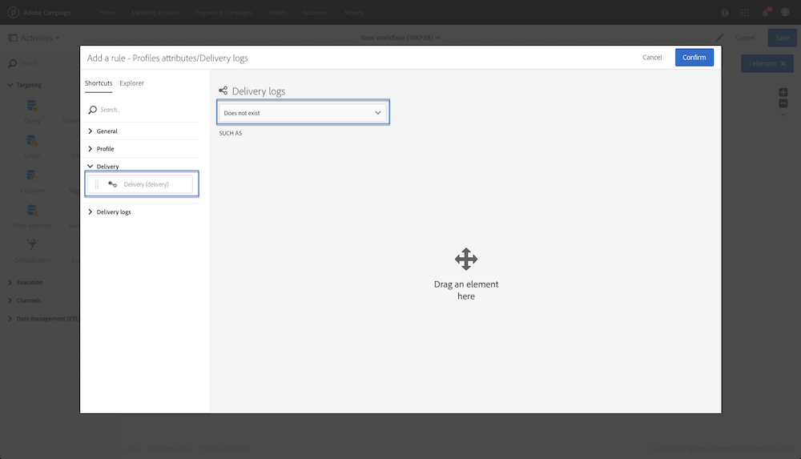

# 查询{#query}

## 说明 {#description}

该活 **[!UICONTROL Query]** 动允许您从Adobe Campaign数据库中过滤和提取大量元素。 您可以通过 **[!UICONTROL Additional data]** 专用选项卡为目标人群定义。 此数据存储在其他列中，并且只能用于进行中的工作流。

活动使用查询编辑器工具。 此工具在专用部分中 [有详细介绍](../../automating/using/editing-queries.md#about-query-editor)。

## 使用环境 {#context-of-use}

活动 **[!UICONTROL Query]** 可用于各种类型的使用：

* 将个人细分以定义消息、受众等的目标
* 丰富整个Adobe Campaign数据库表的数据。
* 导出数据.

## 配置 {#configuration}

1. 将活动拖放 **[!UICONTROL Query]** 到工作流中。
1. 选择活动，然后使用显示的快  速操作中的按钮将其打开。 默认情况下，活动已预配置为搜索配置文件。
1. 如果要对配置文件资源以外的资源运行查询，请转到活动的选项卡，然 **[!UICONTROL Properties]** 后选择 **[!UICONTROL Resource]** 和 **[!UICONTROL Targeting dimension]**。

   该选 **[!UICONTROL Resource]****[!UICONTROL Targeting dimension]**&#x200B;项允许您调整调色板中显示的过滤器，而与所选资源相关的上下文过滤器与您要获取的人群类型（已识别的配置文件、交付、链接到所选资源的数据等）相对应。

   有关详细信息，请参阅定 [位维和资源](#targeting-dimensions-and-resources)。

1. 在选项卡 **[!UICONTROL Target]** 中，通过定义和组合规则来运行查询。
1. 您可以通过 **[!UICONTROL Additional data]** 专用选项卡为目标人群定义。 此数据存储在其他列中，并且只能用于进行中的工作流。 特别是，您可以从链接到查询的定位维的Adobe Campaign数据库表中添加数据。 请参阅丰 [富数据部分](#enriching-data) 。

   >[!NOTE]
   >
   >默认情况下， **[!UICONTROL Remove duplicate rows (DISTINCT)]** 选中该选项后，该选 **[!UICONTROL Advanced options]** 项会 **[!UICONTROL Additional data]** 出现在查询的选项卡中。 如果活 **[!UICONTROL Query]** 动包含许多（从100个）定义的其他数据，则建议取消选中此选项，因为性能原因。 请注意，取消选中此选项可能会导致重复项，具体取决于查询的数据。

1. 在选项 **[!UICONTROL Transition]** 卡中，选 **[!UICONTROL Enable an outbound transition]** 项允许您在查询活动后添加出站过渡，即使它未检索任何数据。

   出站转移的段代码可以使用标准表达式和事件变量进行个性化设置(请参阅使 [用事件变量自定义活动](../../automating/using/calling-a-workflow-with-external-parameters.md#customizing-activities-with-events-variables))。

1. 确认活动的配置并保存工作流。

## 定位维度和资源 {#targeting-dimensions-and-resources}

定位维和资源允许您定义查询将基于哪些元素来确定交付目标。

定位维在目标映射中定义。 如需详细信息，请参阅[此部分](../../administration/using/target-mappings-in-campaign.md)。

### 定义查询的定位维和资源 {#defining-the-targeting-dimension-and-resource-of-a-query}

定位维和资源是在创建工作流时在查询活动的选 **[!UICONTROL Properties]** 项卡中定义的。

>[!NOTE]
>
>在创建受众时，还可以定义定位维度(请参 [阅此部分](../../audiences/using/creating-audiences.md))。

定位维度和资源是链接的。 因此，可用的定位维取决于选定的资源。

例如，对于“资源”, **[!UICONTROL Profiles (profile)]**&#x200B;将提供以下定位维：

对于， **[!UICONTROL Deliveries (delivery)]**&#x200B;该列表将包含以下定位维：

在指定定位维度和资源后，查询中会显示不同的筛选器。

资源的可用过滤器的示 **[!UICONTROL Profiles (profile)]** 例：

资源的可用过滤器的示 **[!UICONTROL Deliveries (delivery)]** 例：

### 使用与定位维不同的资源 {#using-resources-different-from-targeting-dimensions}

默认情况下，定位维度和资源的设置是为定位配置文件而设置的。

但是，如果要在远程表中查找特定记录，则使用与定位维不同的资源可能很有用。

**示例1:标签“欢迎回来！”标识交付所针对的配置文件**。

* 在这种情况下，我们希望定位配置文件。 我们将定位维度设置为 **[!UICONTROL Profiles (profile)]**。
* 我们希望根据传送标签过滤选定的配置文件。 因此，我们将资源设置为 **[!UICONTROL Delivery logs]**。 这样，我们就直接在交付日志表中进行筛选，这将提供更好的性能。

**示例2:标签为“欢迎回来！”，以识别未被分发定位的配置文件**

在上一个示例中，我们使用了与定位维不同的资源。 仅当您要查找位于远程表中的记录( **示例中的交付日志** )时，此操作才可能。

如果我们要查找远程表中不存在的记录 **** （例如，未通过特定交付定位的配置文件），则必须使用相同的资源和定位维，因为该记录将不会出现在远程表（交付日志）中。

* 在这种情况下，我们希望定位配置文件。 我们将定位维度设置为 **[!UICONTROL Profiles (profile)]**。
* 我们希望根据传送标签过滤选定的配置文件。 由于我们正在查找不在交付日志表中的记录，因此无法直接在交付日志中进行筛选。 因此，我们将资源设置为并 **[!UICONTROL Profile (profile)]** 在配置文件表上构建查询。

## 丰富数据 {#enriching-data}

通过 **[!UICONTROL Additional data]** 活动和／或 **[!UICONTROL Query]**&#x200B;活动 **[!UICONTROL Incremental query]****[!UICONTROL Enrichment]** 的选项卡，您可以丰富目标数据，并将这些数据传输到以下工作流活动，以便在这些活动中利用它。 特别是，您可以添加：

* 简单数据
* 聚合
* 集合

对于聚合和集合，会自 **[!UICONTROL Alias]** 动定义一个技术ID以给复杂表达式。 此别名必须唯一，它允许在之后轻松找到聚合和集合。 您可以修改它，为它提供一个易于识别的名称。

>[!NOTE]
>
>别名必须遵循以下语法规则：仅授权字母数字字符和“_”字符。 别名区分大小写。 别名必须以“@”字符开头。 “@”后面的字符不能为数字。 例如：@myAlias_1和@_1Alias正确；而@myAlias#1和@1Alias不正确。

添加任何其他数据后，您可以根据定义的其他数据创建条件，将附加的过滤器级别应用于最初目标的数据。

>[!NOTE]
>
>默认情况下， **[!UICONTROL Remove duplicate rows (DISTINCT)]** 选中该选项后，该选 **[!UICONTROL Advanced options]** 项会 **[!UICONTROL Additional data]** 出现在查询的选项卡中。 如果活 **[!UICONTROL Query]** 动包含许多（从100个）定义的其他数据，则建议取消选中此选项，因为性能原因。 请注意，取消选中此选项可能会导致重复项，具体取决于查询的数据。

### 添加简单字段 {#adding-a-simple-field}

通过将简单字段添加为其他数据，该字段在活动的出站过渡中将直接可见。 这允许用户检查，例如，查询中的数据是否是所需数据。

1. 在选项卡 **[!UICONTROL Additional data]** 中，添加一个新元素。
1. 在打开的窗口中，在字 **[!UICONTROL Expression]** 段中，选择定位维中或某个链接维中直接可用的字段之一。 您可以编辑表达式，并使用维字段中的函数或简单计算（聚合除外）。

   如果 **[!UICONTROL Alias]** 您编辑的表达式不是简单的XPATH路径，则会自动创建一个表达式(例如："Year(&lt;@birthDate&gt;)")。 如果您喜欢，可以修改它。 如果仅选择一个字段(例如："@age")，您无需定义 **[!UICONTROL Alias]**。

1. 选择 **[!UICONTROL Add]** 以确认将字段添加到其他数据。 执行查询时，与添加的字段对应的附加列将显示在活动的出站转换中。

### 添加聚合 {#adding-an-aggregate}

聚合允许从定位维的字段或链接到定位维的维的字段计算值。 例如：配置文件购买的平均金额。

1. 在选项卡 **[!UICONTROL Additional data]** 中，添加一个新元素。
1. 在打开的窗口中，选择要在字段中用于创建聚合的集 **[!UICONTROL Expression]** 合。

   将自 **[!UICONTROL Alias]** 动创建。 如果您愿意，可以返回查询的选项卡来修改该 **[!UICONTROL Additional data]** 选项卡。

   此时会打开聚合定义窗口。

1. 从选项卡中定义聚 **[!UICONTROL Data]** 合。 根据所选聚合的类型，字段中只有数据兼容的元素才可 **[!UICONTROL Expression]** 用。 例如，总和只能用数值数据计算。

   

   您可以为所选集合的字段添加多个聚合。 确保定义显式标签以区分活动出站数据详细信息中的不同列。

   您还可以更改为每个聚合自动定义的别名。

   

1. 如果需要，您可以添加过滤器以限制考虑的数据。

   请参阅筛选已 [添加的数据部分](#filtering-added-data) 。

1. 选择 **[!UICONTROL Confirm]** 以添加聚合。

>[!NOTE]
>
>不能直接从窗口的字段创建包含聚合 **[!UICONTROL Expression]** 的表达式 **[!UICONTROL New additional data]** 。

### 添加集合 {#adding-a-collection}

1. 在选项卡 **[!UICONTROL Additional data]** 中，添加一个新元素。
1. 在打开的窗口中，选择要添加到字段中的集 **[!UICONTROL Expression]** 合。 将自 **[!UICONTROL Alias]** 动创建。 如果您愿意，可以返回查询的选项卡来修改该 **[!UICONTROL Additional data]** 选项卡。
1. Select **[!UICONTROL Add]**. 此时会打开一个新窗口，允许您调整要显示的收集数据。
1. 在标 **[!UICONTROL Parameters]** 签中，选 **[!UICONTROL Collection]** 择并定义要添加的集合行数。 例如，如果您希望每个配置文件执行的三个最近购买，请在字段中输入“3” **[!UICONTROL Number of lines to return]** 。

   >[!NOTE]
   >
   >必须输入大于或等于1的数字。

1. 在标 **[!UICONTROL Data]** 签中，定义要为每行显示的集合字段。

   

1. 如果需要，可添加过滤器以限制已考虑的收集行。

   请参阅筛选已 [添加的数据部分](#filtering-added-data) 。

1. 如果您愿意，可以定义数据排序。

   例如，如果您在标签中选择了3行要返回，并且要确定最近的三次购买，则可以在与事务处理对应的集合的“日期”字段上定义降序排序。 **[!UICONTROL Parameters]**

1. 请参阅对其他 [数据进行排序](#sorting-additional-data) 。
1. 选择 **[!UICONTROL Confirm]** 以添加集合。

### 过滤添加的数据 {#filtering-added-data}

添加聚合或集合时，可指定其他筛选器以限制要显示的数据。

例如，如果您只想处理金额在50美元及以上的事务处理的收集行，则可以在标签中与事务处理金额对应的字段中添加一个条 **[!UICONTROL Filter]** 件。

### 对其他数据进行排序 {#sorting-additional-data}

在向查询数据中添加聚合或集合时，可以根据字段值或定义的表达式指定是否要应用排序（无论是升序还是降序）。

例如，如果您希望仅保存配置文件最近执行的事务，请在选项卡的字段中输入“1”，然后通过选项卡对与事务日期对应的字段应用降序排 **[!UICONTROL Number of lines to return]****[!UICONTROL Parameters]****[!UICONTROL Sort]** 序。

### 根据其他数据筛选目标数据 {#filtering-the-targeted-data-according-to-additional-data}

添加其他数据后，新的选 **[!UICONTROL Output filtering]** 项卡会显示在中 **[!UICONTROL Query]**。 此选项卡允许您通过考虑添加的数据，对选项卡中最初定位的数 **[!UICONTROL Target]** 据应用附加的过滤器。

例如，如果您已将执行至少一个事务的所有配置文件作为目标，并且将计算每个配置文件执行的平均事务处理金额的汇总添加到该配置文件中 **[!UICONTROL Additional data]**，则您可以调整最初使用此平均计算的人口。

为此，只需在选项卡 **[!UICONTROL Output filtering]** 中为此附加数据添加一个条件。

### 示例：使用其他数据个性化电子邮件 {#example--personalizing-an-email-with-additional-data}

以下示例说明了如何向查询添加不同类型的附加数据，以及如何在电子邮件中将其用作个性化字段。

在此示例中，使 [用自定义资](../../developing/using/data-model-concepts.md) 源：

* 扩 **展了配置文件** ，以便添加一个字段，以便保存每个配置文件的忠诚度点。
* 创建 **了事务资源** ，并标识数据库中配置文件执行的所有购买。 每次交易都会保存购买的日期、价格和产品。
* 已创 **建产品** ，并引用了可供购买的产品。

其目的是向至少保存了一个事务的配置文件发送电子邮件。 通过此电子邮件，客户将收到上次执行交易的提醒，以及所有交易的概述：购买的产品数量、总支出，提醒已累积的忠诚度积分总数。

该工作流如下所示：

1. 添加一 **[!UICONTROL Query]** 个活动，该活动允许您定位已执行至少一个事务的配置文件。

   

   从查询的选项卡 **[!UICONTROL Additional data]** 中，定义要在最终电子邮件中显示的不同数据：

   * 与忠诚度点对应的 **配置文件** 维度的简单字段。 请参阅添 [加简单字段部分](#adding-a-simple-field) 。
   * 基于事务收集的两个汇总：购买的产品数量和总支出。 您可以使用计数和总 **[!UICONTROL Data]** 和聚合从聚合配置窗口的选项卡 **添加****它们** 。 请参阅添 [加聚合部分](#adding-an-aggregate) 。
   * 返回已执行上次事务的已用金额、日期和产品的集合。

      为此，您必须添加要从集合配置窗口的选项卡中显示 **[!UICONTROL Data]** 的不同字段。

      要仅返回最近的事务，您必须为输入“1”，并 **[!UICONTROL Number of lines to return]** 从选项卡中对集合的“日期”字段应用降序 ******[!UICONTROL Sort]** 排序。

      请参阅添 [加集合](#adding-a-collection)[和排序其他数据部分](#sorting-additional-data) 。
   

   如果要检查活动的出站转移是否正确传输了数据，请首次启动工作流（不包含活动），然后打开查询的出站转移。 **[!UICONTROL Email delivery]**

   

1. 添加活 **[!UICONTROL Email delivery]** 动。 在电子邮件内容中，插入与查询中计算的数据相对应的个性化字段。 您可以通过个性化字段浏 **[!UICONTROL Additional data (targetData)]** 览器的链接找到它。

   

您的工作流现已准备好执行。 查询中的目标配置文件将收到一封个性化电子邮件，其中包含从其交易中计算的数据。

## 查询范例 {#query-samples}

### 根据简单的配置文件属性进行定位 {#targeting-on-simple-profile-attributes}

以下示例显示了一个查询活动，该活动配置为以居住在伦敦的18至30岁男性为目标。

### 根据电子邮件属性定位 {#targeting-on-email-attributes}

以下示例显示了配置为将电子邮件地址域为“orange.co.uk”的配置文件作为目标的查询活动。

以下示例显示了配置为定位其电子邮件地址已提供的配置文件的查询活动。

### 今天生日的定位配置文件 {#targeting-profiles-whose-birthday-is-today}

以下示例显示了配置为定位生日为今天的配置文件的查询活动。

1. 在查询 **[!UICONTROL Birthday]** 中拖动过滤器。

   

1. 将设置 **[!UICONTROL Filter type]** 为并 **[!UICONTROL Relative]** 选择 **[!UICONTROL Today]**。

   

### 打开特定交付的定位配置文件 {#targeting-profiles-who-opened-a-specific-delivery}

以下示例显示了一个查询活动，该活动配置为过滤打开了分发的配置文件，其标签为“Summer Time”。

1. 在查询 **[!UICONTROL Opened]** 中拖动过滤器。

   

1. 选择传送，然后单击 **[!UICONTROL Confirm]**。

   

### 针对因特定原因而无法提交的定位配置文件 {#targeting-profiles-for-whom-deliveries-failed-for-a-specific-reason}

以下示例显示了一个查询活动，该活动配置为过滤因邮箱已满而无法提交的配置文件。 此查询仅适用于具有管理权限且属于组织单位的用 **[!UICONTROL All (all)]** 户(请参阅 [本节](../../administration/using/organizational-units.md))。

1. 选择资 **[!UICONTROL Delivery logs]** 源，以便直接在交付日志表中进行筛选(请参阅使 [用与定位维不同的资源](#using-resources-different-from-targeting-dimensions))。

   

1. 在查询 **[!UICONTROL Nature of failure]** 中拖动过滤器。

   

1. 选择要定位的失败类型。 就我们而言 **[!UICONTROL Mailbox full]**。

   

### 过去7天内未联系定位配置文件 {#targeting-profiles-not-contacted-during-the-last-7-days}

以下示例显示了一个查询活动，该活动配置为过滤过去7天内未联系过的配置文件。

1. 在查询 **[!UICONTROL Delivery logs (logs)]** 中拖动过滤器。

   

   在下 **[!UICONTROL Does not exist]** 拉列表中选择，然后拖动筛选 **[!UICONTROL Delivery]** 器。

   

1. 配置过滤器，如下所示。

   

### 单击特定链接的定位配置文件 {#targeting-profiles-who-clicked-a-specific-link-}

1. 在查询 **[!UICONTROL Tracking logs (tracking)]** 中拖动过滤器。

   

1. 拖动滤 **[!UICONTROL Label (urlLabel)]** 镜。

   

1. 在字段 **[!UICONTROL Value]** 中，键入在分发中插入链接时定义的标签，然后进行确认。

   

