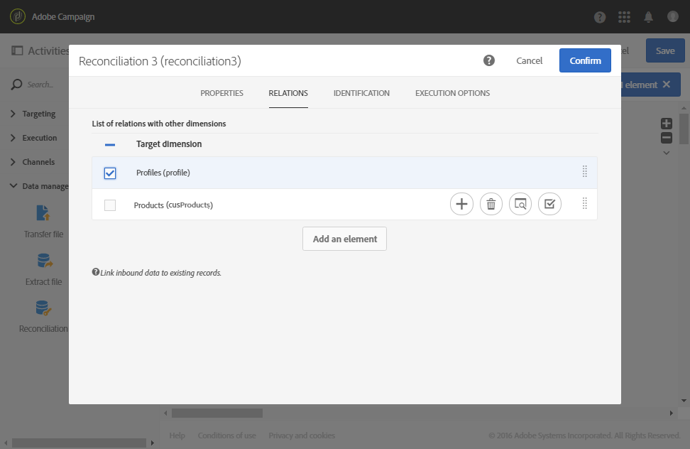

# 调解{#reconciliation}

## 说明 {#description}


该活 **[!UICONTROL Reconciliation]** 动允许您将未识别的数据链接到现有资源。

## 使用环境 {#context-of-use}

该活 **[!UICONTROL Reconciliation]** 动主要用于数据管理目的，并暗示两种不同的用例：

* 添加关系：选项卡 **[!UICONTROL Links]** 允许您在入站数据与多个其他Adobe Campaign数据库维之间添加链接。

   例如，包含购买数据的文件也可能包含用于识别所购买产品和购买者的信息。 因此，文件数据会涉及两个额外的维度( **除了“购买**”的维度):“产 **品** ”和“ **配置** ”维。 然后，需要在这些维和“购买”维之间 **创建关系** （请参阅以下示例）。

   定义关系时，向入站数据添加列以引用链接维的外键。

   >[!NOTE]
   >
   >此操作意味着链接维的数据已在数据库中。 例如，如果导入一个购买文件，其中显示购买了哪个产品、何时购买了哪个客户端等，则数据库中必须已存在该产品和客户端。

* 数据标识：通过 **[!UICONTROL Identification]** 选项卡，您只需将入站数据链接到Adobe Campaign数据库中现有维的列。 在活动之后，数据被标识为属于定义的维。

   例如，您随后可以执行保存的受众、数据库更新等。

例如，可以将 **[!UICONTROL Reconciliation]** 活动放在加载数据活动之后，以便将非标准数据导入数据库。

## 配置 {#configuration}

1. 将活动拖放到您的 **[!UICONTROL Reconciliation]** 工作流中，然后进行包含定位维度不直接来自Adobe Campaign的人群的过渡。 有关详细信息，请参阅定 [位维和资源](../../automating/using/query.md#targeting-dimensions-and-resources)。
1. 选择活动，然后使用显示的快  速操作中的按钮将其打开。
1. 如果要定义入站数据和其他数据库维之间的链接，请转到选 **[!UICONTROL Links]** 项卡。

   添加所需数量的关系。 对于每个关系，首先选择链接的维，然后在链接详细信息中指定相应的字段。

1. 如果您只想标识入站数据，请转到选项卡并 **[!UICONTROL Identification]** 选中该 **[!UICONTROL Identify the document from the working data]** 框。

   选择要协调入站数据的目标维。

   添加对帐条件以将入站过渡记录链接到选定的定位维记录。 如果指定了多个标准，则必须验证所有标准，以使其所有数据之间的链接正常工作。

   选择模 **[!UICONTROL Processing unidentified source lines]** 式：

   * **[!UICONTROL Ignore them]**:只有可识别的数据会保留在活动的出站过渡中。
   * **[!UICONTROL Keep in the outbound population]**:入站过渡中的所有数据都保留在活动的出站过渡中。

1. 确认活动的配置并保存工作流。

## 示例1:关系定义 {#example-1--relation-definition}

以下示例演示了一个使用文件中的购买数据更新数据库的工作流。 采购数据包含引用其他维度元素（如客户电子邮件和产品代码）的数据。

>[!NOTE]
>
>默 **认情况下** ,Adobe Campaign数据库中不存在此示例中使用的Transactions和 **** Products资源。 因此，它们是使用“自定义资源” [功能预先创建](../../developing/using/data-model-concepts.md) 的。 与导入文件中的电子邮件地址以及产品相对应的配置文件会提前加载到数据库中。

该工作流由以下活动组成：


* 一 **[!UICONTROL Load file]** 个活动，它加载并检测要导入的文件的数据。 导入的文件包含以下数据：

   * 交易日期
   * 客户端电子邮件地址
   * 购买的产品代码
   ```
   date;client;product
   2015-05-19 09:00:00;mail1@email.com;ZZ1
   2015-05-19 09:01:00;mail2@email.com;ZZ2
   2015-05-19 09:01:01;mail3@email.com;ZZ2
   2015-05-19 09:01:02;mail4@email.com;ZZ2
   2015-05-19 09:02:00;mail5@email.com;ZZ3
   2015-05-19 09:03:00;mail6@email.com;ZZ4
   2015-05-19 09:04:00;mail7@email.com;ZZ5
   2015-05-19 09:05:00;mail8@email.com;ZZ7
   2015-05-19 09:06:00;mail9@email.com;ZZ6
   ```

* 将购 **[!UICONTROL Reconciliation]** 买数据绑定到数据库配置文件和产品的活动。 因此，有必要定义文件数据与配置文件表以及产品表之间的关系。 此配置在活动的选项卡中执 **[!UICONTROL Relations]** 行：

   * 与配置文件的 **关系**:文件的 **client** （客户端）列链接 **到** Profiles（配置文件）维度的email（电子邮件）字段 **** 。
   * 与产品的 **关系**:文件的 **product** column is linked to the **profiles** dimension of **Profiles** dimension.
   将列添加到入站数据中以引用链接维的外键。

   

* 活动 **[!UICONTROL Update data]** 允许您定义要使用导入的数据进行更新的数据库字段。 由于数据已标识为属于上一活动中的“ **事务** ”维，因此您可以在此使用标识 **[!UICONTROL Directly using the targeting dimension]** 选项。

   通过使用自动检测要更新的字段的选项，将之前活动中配置的链接（指向配置文件和产品）添加到列表中 **[!UICONTROL Fields to update]**。 您还必须确保与事务处理日期对应的字段正确添加到此列表中。

   

   

## 示例2:身份识别 {#example-2--identification}

以下示例演示了一个工作流，该工作流直接从包含新客户端的导入文件创建档案受众。 由下列活动组成：


* 一 **[!UICONTROL Load file]** 个活动，它加载并检测要导入的文件的数据。 导入的文件包含以下数据：

   ```
   lastname;firstname;email;dateofbirth
   jackman;megan;megan.jackman@testmail.com;07/08/1975
   phillips;edward;phillips@testmail.com;09/03/1986
   weaver;justin;justin_w@testmail.com;11/15/1990
   martin;babeth;babeth_martin@testmail.net;11/25/1964
   reese;richard;rreese@testmail.com;02/08/1987
   cage;nathalie;cage.nathalie227@testmail.com;07/03/1989
   xiuxiu;andrea;andrea.xiuxiu@testmail.com;09/12/1992
   grimes;daryl;daryl_890@testmail.com;12/06/1979
   tycoon;tyreese;tyreese_t@testmail.net;10/08/1971
   ```

* 一个 **[!UICONTROL Reconciliation]** 活动，它将加载文件的每列链接到一个配置文件维列。 无法识别的文件记录（缺少数据、数据类型不兼容等）将被忽略，以保持最终受众数据的完整性。

   

* 一项 **[!UICONTROL Save audience]** 活动，可以保存档案的受众。

   

