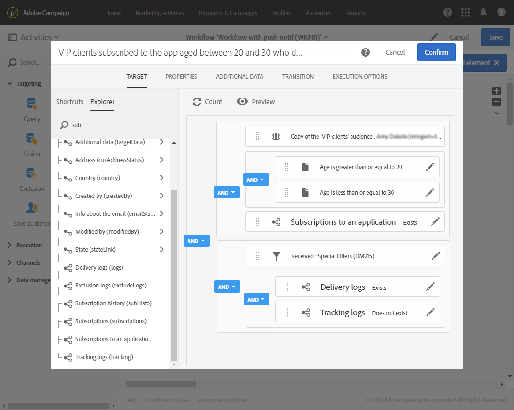

# 使用工作流发送定期推送通知 {#sending-a-recurring-push-notification-with-a-workflow}

在此示例中，每月第一天晚上8点向移动应用程序的订阅者发送个性化的推送通知，具体取决于他们的时区。

要构建工作流，请执行以下步骤：

1. [调度程序](../../automating/using/scheduler.md)活动允许您在投放开始前的天数开始工作流，以便能够在任何给定时区的晚上8点向每个订阅者发送通知：

   * 在&#x200B;**[!UICONTROL Execution frequency]**&#x200B;字段中，选择每月。
   * 在&#x200B;**[!UICONTROL Time]**&#x200B;字段中选择晚上8点。
   * 选择每月发送投放的日期。
   * 为工作流选择开始日期，至少在投放开始前一天。 否则，如果所选时间已经在其时区中过去，某些收件人可能会在一天后收到该消息。
   * 在&#x200B;**[!UICONTROL Execution options]**&#x200B;选项卡的&#x200B;**[!UICONTROL Time zone]**&#x200B;字段中，选择工作流的开始时区。 例如，在此，工作流将在太平洋时间晚上8点（即当月第一天的前一周）开始，以便为所有适用时区创建投放一段时间。

   >[!NOTE]
   >
   >默认情况下，所选时区就是在工作流属性中定义的时区（请参阅[构建工作流](../../automating/using/building-a-workflow.md)）。

   

1. 通过[Query](../../automating/using/query.md)活动，可定向20-30岁、订阅了您移动应用程序且未打开您发送的电子邮件的VIP客户：

   * 选择受众(您的VIP客户)，然后根据其年龄进行过滤。
   * 将&#x200B;**订阅应用程序**&#x200B;元素拖放到工作区中。 选择&#x200B;**存在**，然后选择要使用的移动应用程序。
   * 选择您发送给客户的电子邮件。
   * 将&#x200B;**投放日志(logs)**&#x200B;元素拖放到工作区中，然后选择&#x200B;**存在**&#x200B;以定向收到电子邮件的所有客户。
   * 将&#x200B;**跟踪日志（跟踪）**&#x200B;元素拖放到工作区中，然后选择&#x200B;**不存在**&#x200B;以定向所有未打开电子邮件的客户。

      

1. 通过[推送通知投放](../../automating/using/push-notification-delivery.md)活动，您可以输入消息内容并选择要使用的个性化字段：

   * 选择&#x200B;**[!UICONTROL Recurring notification]**&#x200B;选项。
   * 定义推送通知内容。 有关推送通知内容的更多信息，请参阅此[部分](../../channels/using/preparing-and-sending-a-push-notification.md)。
   * 在&#x200B;**[!UICONTROL Schedule]**&#x200B;块中，选择&#x200B;**[!UICONTROL Messages to be sent automatically on the time zone specified below]**。 在此，我们选择了工作流&#x200B;**[!UICONTROL Scheduler]**&#x200B;中的&#x200B;**[!UICONTROL Time zone of the contact date]**&#x200B;太平洋。
   * 在 **[!UICONTROL Optimize the sending time per recipient]** 字段中，选择 **[!UICONTROL Send at the recipient's time zone]**。

      

1. 单击&#x200B;**[!UICONTROL Start]**&#x200B;按钮以启动定期工作流。

   

您的工作流正在运行。 它将在太平洋时间晚上8点从&#x200B;**[!UICONTROL Scheduler]**&#x200B;的选定开始日期开始，然后会根据客户时区，每月的第一天晚上8点发送定期推送。
