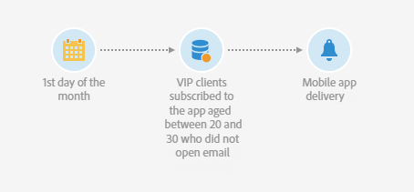

# 使用工作流{#sending-a-recurring-push-notification-with-a-workflow}发送循环推送通知

在此示例中，每月的第一天晚上8点会根据用户的时区，向用户发送个性化的推送通知。

要构建工作流，请按照以下步骤操作：

1. [调度程序](../../automating/using/scheduler.md)活动允许您在投放开始的前几天开始工作流，以便能够在任何给定时区的晚上8点向每个订阅者发送通知：

   * 在&#x200B;**[!UICONTROL Execution frequency]**&#x200B;字段中，选择“每月”。
   * 在&#x200B;**[!UICONTROL Time]**&#x200B;字段中选择晚上8点。
   * 选择每月发送投放的日期。
   * 为工作流选择开始日期，至少在投放开始前一天。 否则，如果所选时间已在其时区中过去，某些收件人可能会在一天后收到该消息。
   * 在&#x200B;**[!UICONTROL Execution options]**&#x200B;选项卡的&#x200B;**[!UICONTROL Time zone]**&#x200B;字段中，选择您的工作流将开始的时区。 例如，此处，工作流将在太平洋时间晚8点（即当月第一天前的一周）开始，以允许为所有适用时区创建投放一段时间。

   >[!NOTE]
   >
   >默认情况下，所选时区就是在工作流属性中定义的时区（请参阅[构建工作流](../../automating/using/building-a-workflow.md)）。

   

1. [查询](../../automating/using/query.md)活动允许您目标年龄在20-30之间、订阅了移动应用程序且未打开您发送的电子邮件的VIP客户：

   * 选择受众(VIP客户)并按年龄进行筛选。
   * 将&#x200B;**订阅拖放到工作区中的应用程序**&#x200B;元素。 选择&#x200B;**Exists**，然后选择要使用的移动应用程序。
   * 选择您发送给客户的电子邮件。
   * 将&#x200B;**投放日志(logs)**&#x200B;元素拖放到工作区中，并选择&#x200B;**存在**&#x200B;以目标收到电子邮件的所有客户。
   * 将&#x200B;**跟踪日志（跟踪）**&#x200B;元素拖放到工作区中，并选择&#x200B;**不存在**&#x200B;以目标所有未打开电子邮件的客户。

      

1. [推送通知投放](../../automating/using/push-notification-delivery.md)活动允许您输入消息内容并选择要使用的个性化字段:

   * 选择&#x200B;**[!UICONTROL Recurring notification]**&#x200B;选项。
   * 定义推送通知内容。 有关推送通知内容的详细信息，请参阅此[部分](../../channels/using/preparing-and-sending-a-push-notification.md)。
   * 在&#x200B;**[!UICONTROL Schedule]**&#x200B;块中，选择&#x200B;**[!UICONTROL Messages to be sent automatically on the time zone specified below]**。 在此，我们选择了工作流&#x200B;**[!UICONTROL Scheduler]**&#x200B;中的&#x200B;**[!UICONTROL Time zone of the contact date]**&#x200B;太平洋。
   * 在 **[!UICONTROL Optimize the sending time per recipient]** 字段中，选择 **[!UICONTROL Send at the recipient's time zone]**。

      

1. 单击&#x200B;**[!UICONTROL Start]**&#x200B;按钮以开始您的重复工作流。

   

您的工作流正在运行。 它将在太平洋时间晚上8点在&#x200B;**[!UICONTROL Scheduler]**&#x200B;的选定开始日开始，然后将在每月的第一天晚上8点发送重复推送，具体取决于客户时区。
