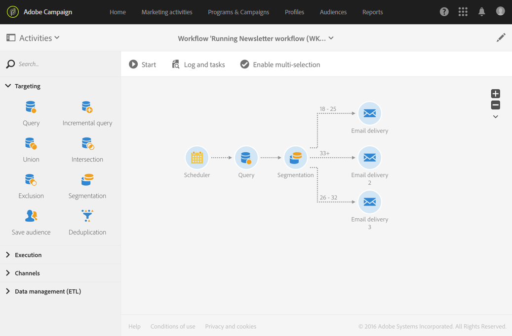
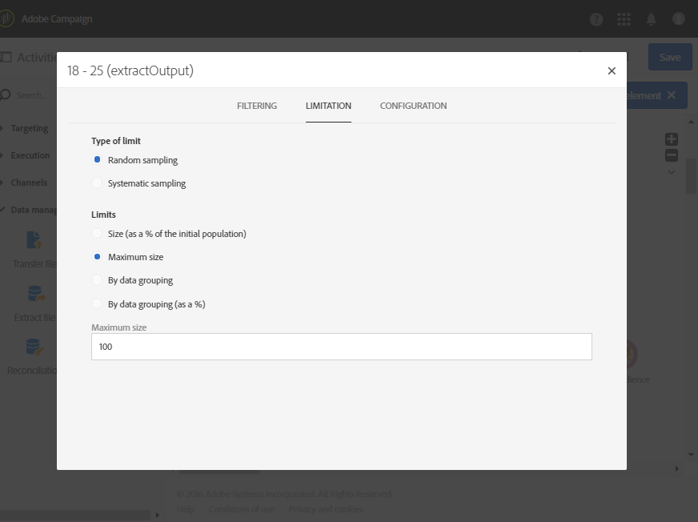

# 根据年龄组进行细分 {#segmentation-age-groups}

以下示例显示了根据年龄组对数据库用户档案进行分段的情况。

该工作流旨在为每个年龄组发送特定的电子邮件。考虑到此工作流是测试营销策划的一部分，每个区段最多只能包含 100 个随机选择的用户档案，以便使用受限且具有代表性的受众。

工作流由以下元素组成：

* A [调度程序活动](../../automating/using/segmentation.md) 以指定工作流的执行日期。
* A [查询](../../automating/using/query.md) 定向已输入生日和电子邮件地址之用户档案的活动。
* A [分段](../../automating/using/segmentation.md) 用于创建3个区段的活动，这些区段将划分不同的叫客过渡：18-25岁、26-32岁以及32岁以上的用户档案。 区段根据以下参数进行定义：

  

   * 用于定义区段年龄组的年龄过滤器

     

   * 链接到 **[!UICONTROL Maximum size]** 限制为 100 的 **[!UICONTROL Random sampling]** 类型限制

     

* An [电子邮件投放](../../automating/using/email-delivery.md) 每个区段的活动。
