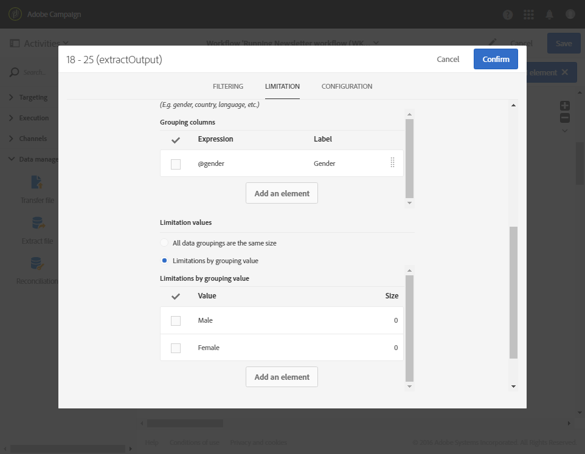

# 分段{#segmentation}

## 说明 {#description}

利用 **[!UICONTROL Segmentation]** 活动，可根据由之前放在工作流中的活动计算出的客户群体，创建一个或多个区段。在活动结束时，可以在单一过渡或多个不同过渡中处理这些区段。

>[!NOTE]
>
>默认情况下，集客群体的一个成员只能属于一个单一区段。根据活动中区段的顺序应用过滤器。

**相关主题：**
* [用例：按位置分段](../../automating/using/workflow-segmentation-location.md)
* [用例：根据年龄组进行分段](../../automating/using/segmentation-age-groups.md)

## 使用环境 {#context-of-use}

**[!UICONTROL Segmentation]**&#x200B;活动通常位于定向活动（查询、交集、并集、排除等）之后，以便定义基于其构成区段的标准群体。

**相关主题**

* [用例：根据年龄组对配置文件进行分段](../../automating/using/segmentation-age-groups.md)。

## 配置 {#configuration}

1. 将 **[!UICONTROL Segmentation]** 活动拖放到工作流中。
1. 选择活动，然后使用所显示快速操作中的  按钮将其打开。
1. 在&#x200B;**[!UICONTROL General]**&#x200B;选项卡中，选择要对其执行分段的&#x200B;**[!UICONTROL Resource type]**：

   * 如果对数据库中已存在的数据执行分段，则是 **[!UICONTROL Database resource]**。根据要分段的数据选择 **[!UICONTROL Filtering dimension]**。默认情况下，会对&#x200B;**轮廓**&#x200B;执行分段。
   * 如果对工作流的临时数据执行分段，则是 **[!UICONTROL Temporary resource]**：选择包含待分段数据的 **[!UICONTROL Targeted set]**。在导入文件后或扩充数据库中的数据后，可以会遇到此使用案例。

1. 选择要使用的叫客过渡类型：

   * **[!UICONTROL Generate one transition per segment]**：在活动结束时，为每个已配置的区段添加一个叫客过渡。
   * **[!UICONTROL Generate all segments in one transition]**：所有已配置的区段都将重组为一个叫客过渡。指定过渡标签。每个区段的成员都会保留分配给它们的段码。

1. 使用  或 **[!UICONTROL Add an element]** 按钮添加区段，并指定标准属性：

   * **[!UICONTROL Do not activate the transition if the population is empty]**：只有在检索数据时，才会启用此区段。
   * **[!UICONTROL Filter initial population (query)]**：用于筛选此区段的群体。
   * **[!UICONTROL Limit segment population]**：用于限制区段的大小。
   * **[!UICONTROL Filter and limit segment population]**：用于筛选区段群体并限制其大小。
   * **[!UICONTROL Label]**：区段标签。
   * **[!UICONTROL Segment code]**：分配给区段群体的代码。段码可以使用标准表达式和事件变量进行个性化（请参阅[此页面](../../automating/using/customizing-workflow-external-parameters.md)）。
   * **[!UICONTROL Exclude segment from population]**：用于从活动的叫客群体中排除指定的区段。只有选择了 **[!UICONTROL Generate all segments in the same transition]** 选项时，才可使用此选项。

   

1. 打开区段的详情视图，可访问后者的配置选项。要实现此目的，请勾选活动区段列表中相关的方框，然后选择 。
1. 如果勾选了筛选初始群体的选项，请打开 **[!UICONTROL Filter]** 选项卡并指定区段的群体。基于第 4 步中选择的过滤维度进行筛选。有关群体筛选的更多信息，请参阅[查询编辑](../../automating/using/editing-queries.md)一节。

   如果对临时资源进行分段，则此选项卡中无法对群体进行计数和预览。

1. 如果勾选了限制区段大小的选项，则打开 **[!UICONTROL Limitation]** 选项卡。

   首先，选择要使用的 **[!UICONTROL Type of limit]**：

   * **[!UICONTROL Random sampling]**：必要时，会考虑 **[!UICONTROL Filter]** 选项卡的配置，随机选择区段群体。
   * **[!UICONTROL Ordered sampling]**：按顺序选择区段群体。因此，您必须指定要考虑的列和要应用的排序类型。例如，如果在选择了 **Age** 字段作为排序列的同时应用了 **[!UICONTROL Descending sort]** 并将限制设置为 100，则仅保留前 100 名年龄最大之人的轮廓。

   现在，指定区段的大小 **[!UICONTROL Limit]**：

   * **[!UICONTROL Size (as a % of the initial population)]**：使用活动初始群体的百分比指定区段大小。
   * **[!UICONTROL Maximum size]**：指定区段群体的成员数上限。
   * **[!UICONTROL By data grouping]**：根据集客群体的指定字段的值，限制区段群体。选择要分组的字段，然后指定要使用的值。
   * **[!UICONTROL By data grouping (as a %)]**：根据指定集客群体字段的值，使用百分比限制区段群体。选择要应用分组的字段，然后指定要使用的值。

     >[!NOTE]
     >
     >可以对每个值使用不同的限制。例如，您可以为 **[!UICONTROL Gender]** 字段指定分组，并将 **[!UICONTROL Male]** 成员的群体限制为 10 人，将 **[!UICONTROL Female]** 成员的群体限制为 30 人。如果您使用多个数据分组字段，则所有分组必须具有相同的大小。

   

1. 确认区段的配置。
1. 重复此过程的第 6 步到第 10 步，根据需要添加所需数量的区段。
1. 根据需要，编辑 **[!UICONTROL Advanced options]** 选项卡中的参数：

   * **[!UICONTROL Enable overlapping of outbound populations]**&#x200B;选项定义如何管理属于多个区段的用户档案：
      * 未启用该选项时，**[!UICONTROL Segmentation]**&#x200B;活动会检查在多个输出转换中不存在配置文件，即使此配置文件满足多个子集的条件也是如此。
      * 启用该选项后，如果用户档案符合筛选条件，则可以在多个子集中找到这些用户档案。
   * 如果已经为集客群体分配了要保留的段码，请选中&#x200B;**[!UICONTROL Concatenate the code of each segment]**&#x200B;选项。 在活动中指定的段码，将被添加到初始段码。
   * 如果需要利用剩余群体，请选中&#x200B;**[!UICONTROL Generate complement]**&#x200B;选项。 请参阅[用例：创建具有补码](../../automating/using/workflow-created-query-with-complement.md)的投放。

1. 确认活动的配置并保存工作流。
