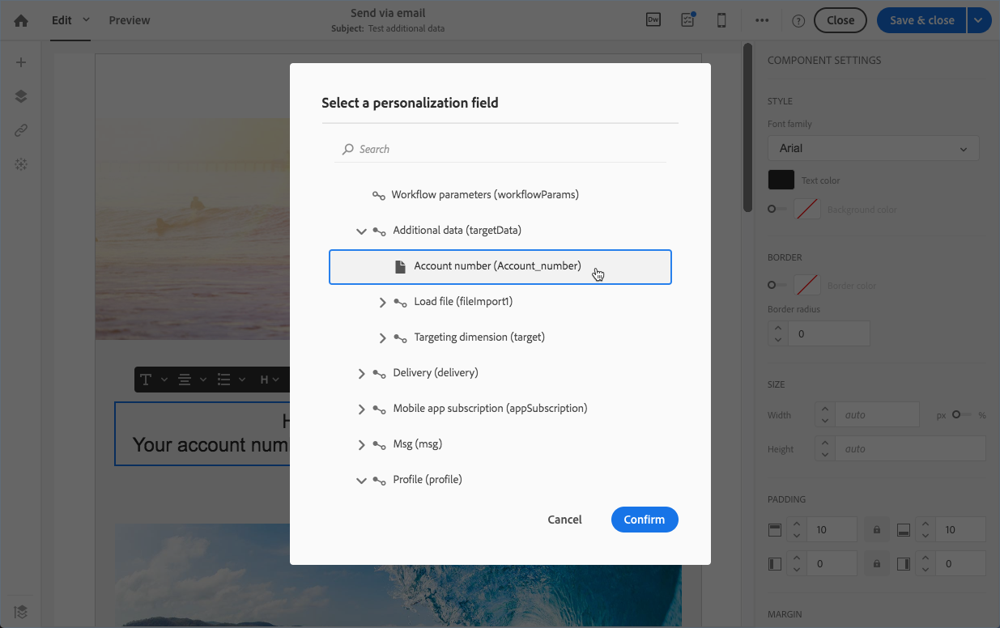

# 发送包含扩充字段的电子邮件 {#sending-email-enriched-fields}

<!--A new example showing how to send an email containing additional data retrieved from a load file activity has been added. [Read more](example-2-email-with-enriched-fields)-->

利用加载文件活动，还可发送（在同一工作流使用外部文件）扩充了附加数据的电子邮件。

下方的示例展示了如何使用通过加载文件活动，发送使用了（检索自外部文件的）附加数据的电子邮件。在本例中，外部文件包含一系列用户档案及其关联的帐号。您想要导入此数据，以向每个用户档案发送一封包含其帐号的电子邮件。

若要建立工作流程，請遵循下列步驟：

1. 拖放 [查詢](../../automating/using/query.md) 活動放入工作流程中，並開啟它以定義主要目標。

   <!--The Query activity is presented in the [Query](../../automating/using/query.md) section.-->

1. 拖放 [載入檔案](../../automating/using/load-file.md) 活動，將部分資料指派給設定檔。 在本例中，就是加载一个其中包含了对应于数据库某些用户档案之帐号的文件。

   

1. 拖放 [擴充](../../automating/using/enrichment.md) 將活動連結至工作流程，並將載入檔案和查詢活動連結至工作流程。

1. 在扩充活动的 **[!UICONTROL Advanced relations]** 选项卡中，选择 **[!UICONTROL 0 or 1 cardinality simple link]** 并定义要用于协调的字段。这里，我们使用“姓氏”将数据与数据库用户档案协调。

   

1. 在 **[!UICONTROL Additional data]** 选项卡中，选择要用在电子邮件中的元素。在此，选择帐号（通过加载文件活动检索之文件中的帐号列）。

   

   <!---->

   有关更多信息，请参阅[扩充](../../automating/using/enrichment.md)一节。

1. 拖放 [細分](../../automating/using/segmentation.md) 活動放入工作流程中，並開啟它以調整主要目標。

   

   有关更多信息，请参阅[分段](../../automating/using/segmentation.md)一节。

1. 拖放 [電子郵件傳遞](../../automating/using/email-delivery.md) 活動至工作流程並開啟。

   <!--The Email delivery activity is presented in the [Email delivery](../../automating/using/email-delivery.md) section.-->

1. 添加个性化字段，并从 **[!UICONTROL Additional data (targetData)]** 节点选择扩充活动中定义的附加数据（此处为“帐号”）。这样即可动态检索电子邮件内容中每个用户档案的帐号。

   

1. 保存电子邮件并启动工作流。

将发送电子邮件给目标。每个用户档案都会收到与其帐号相对应的电子邮件。

