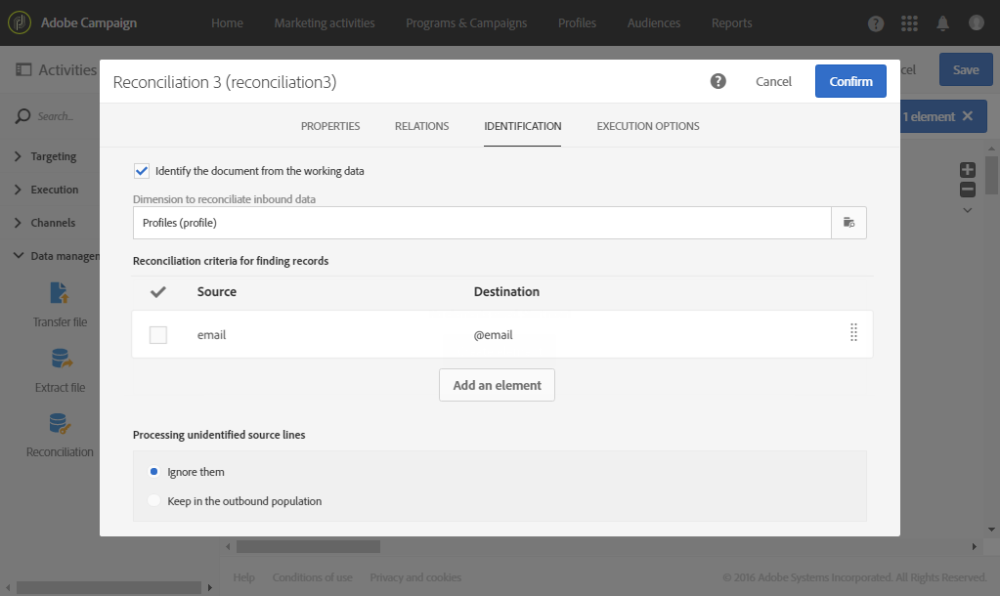
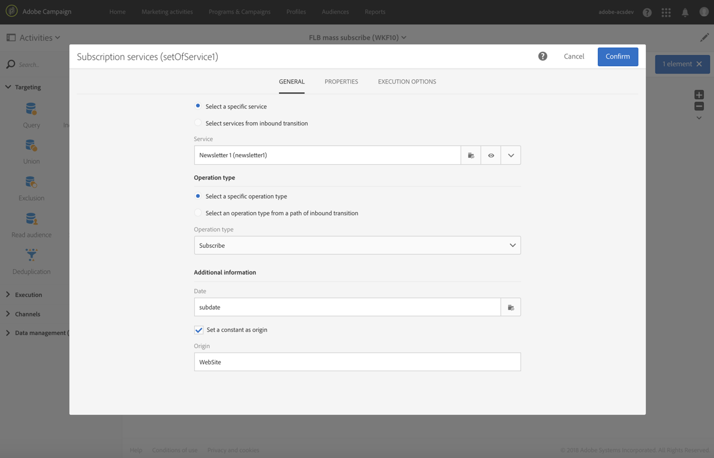

# 在导入文件{#subscribing-profiles-to-a-specific-service-after-importing-a-file}后为特定服务订阅用户档案

此示例说明如何导入包含用户档案的文件并为其订阅现有服务。导入文件后，需要执行协调，以便将导入的数据标识为用户档案。为确保文件不包含任何重复项，将对数据执行重复数据删除活动。

其工作流如下所示：


* [加载文件](../../automating/using/load-file.md)活动加载用户档案文件并定义导入列的结构。

   在本例中，加载的文件采用 .csv 格式并包含以下数据：

   ```
   lastname;firstname;email;birthdate;subdate
   jackman;megan;megan.jackman@testmail.com;07/08/1975;10/08/2017
   phillips;edward;phillips@testmail.com;09/03/1986;10/08/2017
   weaver;justin;justin_w@testmail.com;11/15/1990;10/08/2017
   martin;babeth;babeth_martin@testmail.net;11/25/1964;10/08/2017
   reese;richard;rreese@testmail.com;02/08/1987;11/08/2017
   cage;nathalie;cage.nathalie227@testmail.com;07/03/1989;11/08/2017
   xiuxiu;andrea;andrea.xiuxiu@testmail.com;09/12/1992;11/08/2017
   grimes;daryl;daryl_890@testmail.com;12/06/1979;12/08/2017
   tycoon;tyreese;tyreese_t@testmail.net;10/08/1971;12/08/2017
   ```

   

* [协调](../../automating/using/reconciliation.md)活动将文件中的数据标识为属于Adobe Campaign库的用户档案维。 仅配置 **[!UICONTROL Identification]** 选项卡。该功能将根据用户档案的电子邮件地址来标识文件数据。

   

* 基于临时资源的&#x200B;**email**&#x200B;字段的[外部重复数据删除](../../automating/using/deduplication.md)标识任何重复。 如果从文件导入的重复包含任何重复项，则所有数据的服务订阅都将失败。

   

* [订阅服务](../../automating/using/subscription-services.md)活动允许您选择用户档案必须订阅的服务、与订阅日期对应的字段以及订阅的来源。

   
