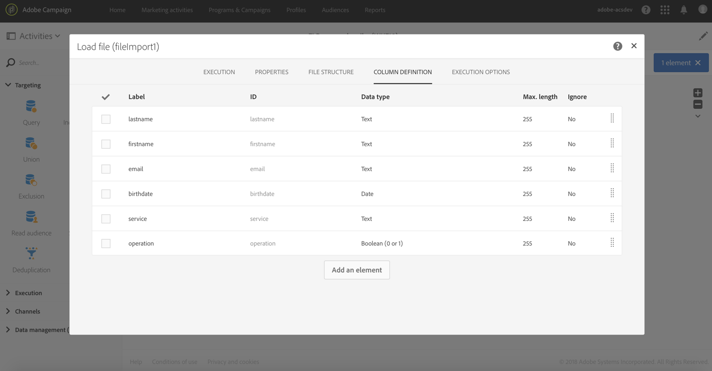

# 订阅服务 {#subscription-services}

## 说明{#description}


利用 **[!UICONTROL Subscription Services]** 活动，可让多个用户档案批量订阅服务或退订服务。

>[!CAUTION]
>
>在工作流环境中管理订阅时，订阅或未订阅用户档案不会接收在服务属性中定义的各种确认电子邮件。

## 使用环境{#context-of-use}

**[!UICONTROL Subscription Services]** 活动是唯一可通过单次操作，为多个用户档案订阅或退订服务的 Adobe Campaign 功能。

执行定向或从导入带有已识别数据的文件后，即可使用此活动。

如果通过专用列在文件中指定，则还可通过此活动选择操作（订阅或退订）以及执行该操作的服务。

**相关主题：**

* [用例：从文件更新多个订阅状态](../../automating/using/updating-subscriptions-from-file.md)
* [用例：将用户档案从文件订阅到特定服务](../../automating/using/subscribing-profiles-from-file.md)

## 配置{#configuration}

1. 将 **[!UICONTROL Subscription Services]** 活动拖放到工作流中。
1. 将其连接到其他定向活动之后，例如导入后的查询或协调。
1. 选择活动，然后使用所显示快捷操作中的  按钮将其打开。
1. 选择要使用以下选项之一管理订阅的 **[!UICONTROL Service]**：

   * **[!UICONTROL Select a specific service]**：手动选择服务。
   * **[!UICONTROL Select services from the inbound transition]**：在集客过渡中指定服务。例如，可以导入一个文件，在该文件中指定用于管理各行的服务。如果选择此选项，请确保事先在数据和&#x200B;**服务**&#x200B;资源之间创建了链接，如[本例](#example--updating-multiple-subscription-statuses-from-a-file)所示。

      然后，会为每个记录动态选择要执行操作的服务。

1. 使用以下选项之一选择要执行的 **[!UICONTROL Operation type]**：

   * **[!UICONTROL Select a specific operation type]**：手动选择是要 **[!UICONTROL Subscribe]** 还是 **[!UICONTROL Unsubscribe]** 用户档案。
   * **[!UICONTROL Select an operation type from a path of inbound transition]**：选择集客数据的列，在该列中指定要对每个记录执行的操作。

      在此列中，操作必须指定为 Boolean 或 Integer。使用 **0** 表示退订记录，使用 **1** 表示订阅记录。

      如果导入文件中包含的值与上述要求不匹配，您仍可使用 **[!UICONTROL Load file]** 活动中提供的 [Remapping of values](../../automating/using/load-file.md#column-format) 选项。

1. 如果集客数据包含对应于用户档案订阅服务日期对应的列，请选择该列。您可以将其留空，但运行工作流时就不会设置订阅日期。
1. 定义订阅的来源。您可以将其设置为集客数据的一个字段，也可以通过选中 **[!UICONTROL Set a constant as origin]** 选项将其设定为所选的常数值。您可以将其留空，但运行工作流时就不会设置订阅来源。
1. 您也可以根据需要生成叫客过渡。该过渡包含与集客活动完全相同的数据。
1. 确认活动的配置并保存工作流。

   工作流现已准备就绪，可供执行。一旦执行，您就可以在服务详情查看订阅或退订服务的用户档案。

## 示例：在导入文件后为用户档案订阅特定服务{#example--subscribing-profiles-to-a-specific-service-after-importing-a-file}

此示例说明如何导入包含用户档案的文件并为其订阅现有服务。导入文件后，需要执行协调，以便将导入的数据标识为用户档案。为确保文件不包含任何重复项，将对数据执行重复数据删除活动。

其工作流如下所示：


* 通过 **[!UICONTROL Load file]** 活动加载用户档案文件并定义导入列的结构。

   在本例中，加载的文件采用 .csv 格式并包含以下数据：

   ```
   lastname;firstname;email;birthdate;subdate
   jackman;megan;megan.jackman@testmail.com;07/08/1975;10/08/2017
   phillips;edward;phillips@testmail.com;09/03/1986;10/08/2017
   weaver;justin;justin_w@testmail.com;11/15/1990;10/08/2017
   martin;babeth;babeth_martin@testmail.net;11/25/1964;10/08/2017
   reese;richard;rreese@testmail.com;02/08/1987;11/08/2017
   cage;nathalie;cage.nathalie227@testmail.com;07/03/1989;11/08/2017
   xiuxiu;andrea;andrea.xiuxiu@testmail.com;09/12/1992;11/08/2017
   grimes;daryl;daryl_890@testmail.com;12/06/1979;12/08/2017
   tycoon;tyreese;tyreese_t@testmail.net;10/08/1971;12/08/2017
   ```

   

* 通过 **[!UICONTROL Reconciliation]** 活动标识来自文件的数据，使其归属至 Adobe Campaign 数据库的用户档案维度。仅配置 **[!UICONTROL Identification]** 选项卡。该功能将根据用户档案的电子邮件地址来标识文件数据。

   

* **[!UICONTROL Deduplication]** 根据临时资源的 **email** 字段（由协调产生）标识所有重复项。如果从文件导入的重复包含任何重复项，则所有数据的服务订阅都将失败。

   

* 通过 **[!UICONTROL Subscription Services]** 活动，选择用户档案必须订阅的服务、对应于订阅日期的字段以及订阅的来源。

   

## 示例：从文件更新多个订阅状态{#example--updating-multiple-subscription-statuses-from-a-file}

此示例说明如何导入包含用户档案的文件，并将其订阅更新为文件中指定的多项服务。导入文件后，需要执行协调，以便将导入的数据标识为带服务链接的用户档案。为确保文件不包含任何重复项，将对数据执行重复数据删除活动。

其工作流如下所示：


* 通过 **[!UICONTROL Load file]** 活动加载用户档案文件并定义导入列的结构。

   在本例中，加载的文件采用 .csv 格式并包含以下数据：

   ```
   lastname;firstname;email;birthdate;service;operation
   jackman;megan;megan.jackman@testmail.com;07/08/1975;SVC2;sub
   phillips;edward;phillips@testmail.com;09/03/1986;SVC3;unsub
   weaver;justin;justin_w@testmail.com;11/15/1990;SVC3;sub
   martin;babeth;babeth_martin@testmail.net;11/25/1964;SVC3;unsub
   reese;richard;rreese@testmail.com;02/08/1987;SVC3;sub
   cage;nathalie;cage.nathalie227@testmail.com;07/03/1989;SVC3;sub
   xiuxiu;andrea;andrea.xiuxiu@testmail.com;09/12/1992;SVC4;sub
   grimes;daryl;daryl_890@testmail.com;12/06/1979;SVC3;unsub
   tycoon;tyreese;tyreese_t@testmail.net;10/08/1971;SVC2;sub
   ```

   

   如您所见，文件中的操作为“订阅”或“退订”。系统需要 **Boolean** 或 **Integer** 值以识别要执行的操作：“0”代表退订，“1”代表订阅。为满足此要求，将在“operation”列的详情中执行重映射值的操作。

   

   如果文件已使用“0”和“1”来标识操作，则无需重映射这些值。在 **[!UICONTROL Column definition]** 选项卡中确保仅将该列作为 **Boolean** 或 **Integer** 进行处理。

* 通过 **[!UICONTROL Reconciliation]** 活动标识来自文件的数据，使其归属至 Adobe Campaign 数据库的用户档案维度。通过 **[!UICONTROL Identification]** 选项卡，将文件的 **email** 字段与用户档案资源的 **email** 字段匹配。

   

   在 **[!UICONTROL Relations]** 选项卡中，使用服务资源创建一个链接，以识别文件的 **service** 字段。在本例中，这些值与服务资源的 **name** 字段匹配。

   

* 利用基于临时资源 **email** 字段（由协调产生）的 **[!UICONTROL Deduplication]**，可标识重复项。消除重复项很重要，因为如果存在重复项，则所有数据的服务订阅都将失败。

   

* 利用 **[!UICONTROL Subscription Services]** 将服务标识为通过 **[!UICONTROL Reconciliation]** 活动中所创建的链接，从过渡进行更新。

   将 **[!UICONTROL Operation type]** 标识为来自文件的 **operation** 字段。此处只能选择 Boolean 或 Integer 字段。如果列表中未显示包含要执行操作的文件列，请确保已根据本例前文所述，在 **[!UICONTROL Load file]** 活动中正确设置了列格式。

   

