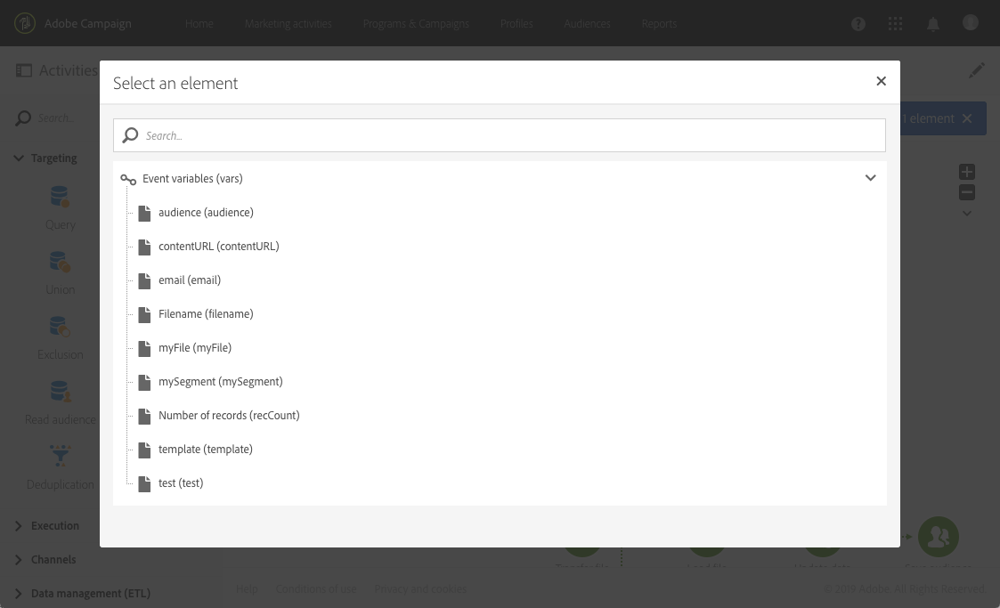

# 测试{#test}

## 说明 {#description}

该活 **[!UICONTROL Test]** 动根据测试结果启用转换。

## 使用环境 {#context-of-use}

“测 **试** ”活动激活满足与其关联的条件的第一个过渡。

如果未满足任何条件，并且如果激活了“ **使用默认过渡** ”选项，则将激活默认过渡。

条件可以基于函 **数**，也可以基于变量 **，例如，已在工作流活动中声明的事件变****[!UICONTROL External signal]** 量。

**相关主题：**

* [功能列表](../../automating/using/list-of-functions.md)
* [使用外部参数调用工作流](../../automating/using/calling-a-workflow-with-external-parameters.md)

## 配置 {#configuration}

1. 将活动拖放 **[!UICONTROL Test]** 到工作流中。
1. 选择活动，然后使用显示的快  速操作中的按钮将其打开。
1. 定义每个条件的属性：

   编辑字段时， **[!UICONTROL Condition]** 两个按钮提供调用事件变量和编辑组合变量和函数的表达式的帮助：

   * :在工作流中可用的所有变量中选择事件变量(请参阅使 [用外部参数自定义工作流](../../automating/using/calling-a-workflow-with-external-parameters.md#customizing-a-workflow-with-external-parameters))

      

   * :编辑组合变量和函数的表达式。 有关表达式编辑器的详细信息，请参 [阅此部分](../../automating/using/advanced-expression-editing.md)。

      

