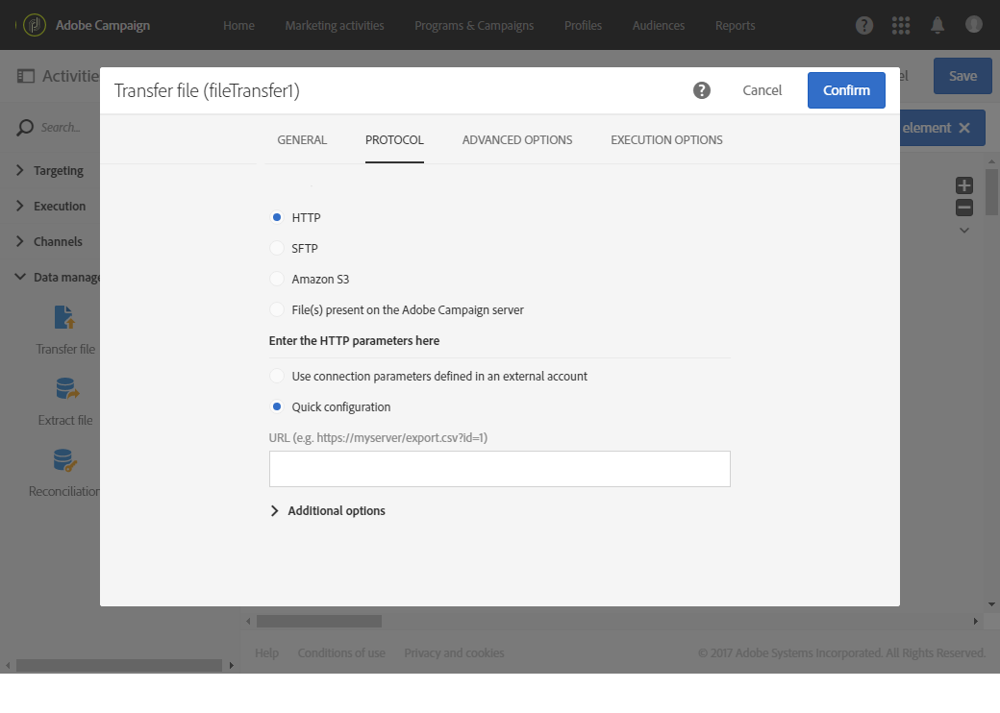

# 传输文件{#transfer-file}

## 说明 {#description}

利用 **[!UICONTROL Transfer file]** 活动，可接收或发送文件、测试文件是否存在或列出 Adobe Campaign 中的文件。

## 使用环境 {#context-of-use}

可在配置活动时定义数据的提取方式。例如，要加载的文件可以是联系人的列表。

您可以使用此活动取回随后将要使用 **[!UICONTROL Load file]** 活动构建的数据。

**相关主题：**

* [用例：根据自动文件下载更新数据](../../automating/using/update-data-automatic-download.md)

## 配置 {#configuration}

1. 将 **[!UICONTROL Transfer file]** 活动拖放到工作流中。
1. 选择活动，然后使用所显示快捷操作中的  按钮将其打开。
1. 使用 **[!UICONTROL Action]** 字段中的下拉列表，选择以下活动操作之一：

   

   * **文件下载**：用于下载文件。
   * **文件上传**：用于上传文件。从 Adobe Campaign 文件上传文件，会在 **[!UICONTROL Export audits]** 菜单中生成日志条目。有关导出审核的更多信息，请参阅[审核导出](../../administration/using/auditing-export-logs.md)一节。
   * **测试以查看文件是否存在**：用于检查文件是否存在。
   * **文件列表**：用于列出 **[!UICONTROL Protocol]** 选项卡中规定服务器上存在的文件。此操作主要用于调试，主要是为了在从远程服务器下载文件之前，检查活动配置是否符合您的需要。

1. 选择要使用的协议：
   * [HTTP](#HTTP-configuration-wf)
   * [SFTP](#SFTP-configuration-wf)
   * [Amazon S3](#S3-configuration-wf)
   * [Microsoft Azure Blob Storage](#azure-blob-configuration-wf)
   * [Adobe Campaign 服务器上存在的文件](#files-server-configuration-wf)

1. 根据所选协议提供的 **[!UICONTROL Additional options]** 部分，可用于向协议添加参数。

   您可以：

   * **[!UICONTROL Delete the source files after transfer]**:清除远程服务器上的文件。 如果未选中此选项，请确保手动监控SFTP目录中已存档内容的大小。

   * **[!UICONTROL Sorting files]**:允许您对文件进行字母数字排序。 默认情况下，此选项处于禁用状态。

      <!--**[!UICONTROL Disable passive mode]**: allows you to specify the connection port to be used for data transfer.-->

   * **[!UICONTROL List all files]**:选择 **[!UICONTROL File listing]** 中的操作 **[!UICONTROL General]** 选项卡。 利用此选项可在 **vars.filenames** 事件变量中索引服务器上存在的所有文件，其中各个文件名之间以 **&#39;n’** 字符进行分隔。

1. 通过 **[!UICONTROL Advanced options]** 选项卡的 **[!UICONTROL If no files are found]** 部分，可配置如果在启动活动时检测到任何错误或不存在文件，应执行的特定操作。

   您还可以定义重试。工作流执行日志中会显示各项不同的重试。

   

1. 确认活动的配置并保存工作流。

### 使用 HTTP 进行配置 {#HTTP-configuration-wf}

利用 HTTP 协议，可从外部帐户或 URL 开始下载文件。

使用此协议，您可以选择 **[!UICONTROL Use connection parameters defined in an external account]** 选项。 在这种情况下，选择所需的帐户并指定下载文件的路径。

您还可以选择 **[!UICONTROL Quick configuration]** 选项。只需在 URL 字段中输入 URL 即可。

**[!UICONTROL Follow redirections]**, **[!UICONTROL Ignore the HTTP return code]**&#x200B;和 **[!UICONTROL Add received HTTP headers to the file]** 是选择HTTP协议时可用的其他选项。

### 使用 SFTP 进行配置 {#SFTP-configuration-wf}

利用 SFTP 协议，可从 URL 或外部帐户开始下载文件。

使用此协议，您可以选择 **[!UICONTROL Use connection parameters defined in an external account]** 选项，然后选择所需的帐户并指定下载文件的路径。

>[!CAUTION]
>
>支持使用通配符。

您还可以选择 **[!UICONTROL Quick configuration]** 选项。只需在 URL 字段中输入 URL 即可。

### 使用 Amazon S3 进行配置 {#S3-configuration-wf}

利用 Amazon S3 协议，可通过 Amazon Simple Storage Service (S3) 从 URL 或外部帐户下载文件。

1. 选择 Amazon S3 外部帐户。有关更多信息，请参见此[页面](../../administration/using/external-accounts.md#amazon-s3-external-account)。

2. 选择是要 **[!UICONTROL Define a file path]** 还是 **[!UICONTROL Use a dynamic file path]**。

3. 指定下载文件的路径。

   

   >[!CAUTION]
   >
   > Amazon S3不支持通配符。
   >
   > 要定位多个文件，例如 `my_file_02` 和 `my _file_3433`，您可以使用以下语法： `acs-myawsbucket.s3.amazonaws.com/object-path/my_file_`.

4. 如果要在传输完成时删除源文件，请勾选 **[!UICONTROL Delete the source files after transfer]**。

### 使用 Microsoft Azure Blob Storage 进行配置 {#azure-blob-configuration-wf}

利用 Microsoft Azure Blob 协议，您可以访问位于 Microsoft Azure Blob Storage 帐户上的 Blob。

1. 选择 **[!UICONTROL Microsoft Azure Blob]** 外部帐户。有关更多信息，请参见此[页面](../../administration/using/external-accounts.md#microsoft-azure-external-account)。

1. 选择是要 **[!UICONTROL Define a file path]** 还是 **[!UICONTROL Use a dynamic file path]**。

   

1. 指定下载文件的路径，它可以匹配多个 Blob。在此类情况下，**[!UICONTROL File transfer]** 活动将为找到的每个 Blob 激活一次传出过渡。随后将根据字母顺序对它们进行处理。

   >[!CAUTION]
   >
   >不支持匹配多个文件名的通配符。相反，您还需要输入前缀。所有与该前缀匹配的 Blob 名称都符合条件。

   下方提供了一系列文件路径的示例：

   * **“Campaign/”**：匹配位于容器根目录 Campaign 文件夹中的所有 Blob。
   * **“Campaign/new-”**：匹配 Campaign 文件夹下所有文件名以“new-”开头的 Blob。
   * **“”**：添加空路径可匹配容器中所有可用的 Blob。

### 使用 Adobe Campaign 服务器上存在的文件进行配置 {#files-server-configuration-wf}

**[!UICONTROL File(s) present on the Adobe Campaign server]** 协议对应于包含待取回文件的存储库。
可将元字符或通配符（例如 * 或 ?）用于筛选文件。

选择是要 **[!UICONTROL Define a file path]** 还是要 **[!UICONTROL Use a dynamic file path]**
利用 **[!UICONTROL Use a dynamic file path]** 选项，可使用标准表达式和事件变量将待传输文件的名称个性化。有关详细信息，请参见[此页面](../../automating/using/customizing-workflow-external-parameters.md)。

请注意，该路径必须对应于 Adobe Campaign 服务器的存储空间目录。文件位于 **sftp&lt;您的实例名称>/** 目录中。您无法浏览存储空间的上级目录。

例如：

`user&lt;yourinstancename>/my_recipients.csv` 是正确的。

`../hello/my_recipients.csv` 不正确。

`//myserver/hello/myrecipients.csv` 不正确。

## 历史化设置 {#historization-settings}

每次执行 **[!UICONTROL Transfer file]** 活动时，都会将上传或下载的文件存储在专用文件夹中。它会为工作流的每个 **[!UICONTROL Transfer file]** 活动创建一个文件夹。因此，必须限制此文件夹的大小以保留服务器上的物理空间。

为此，您可以在 **[!UICONTROL Transfer File]** 活动的 **[!UICONTROL Advanced options]** 中定义 **[!UICONTROL Historization settings]**。

利用 **[!UICONTROL Historization settings]**，可定义活动文件夹的文件数目上限或文件总计大小上限。默认为 100 个文件和 50 MB。

每次执行活动时，都会按如下方式检查文件夹：

* 只考虑创建时间早于执行活动 24 小时以上的文件。
* 如果需考虑的文件数大于 **[!UICONTROL Maximum number of files]** 参数值，则会删除最早的文件，直到达到允许的 **[!UICONTROL Maximum number of files]** 为止。
* 如果需考虑的文件总大小大于 **[!UICONTROL Maximum size (in MB)]** 参数值，则会删除最早的文件，直到达到允许的 **[!UICONTROL Maximum size (in MB)]** 为止。

>[!NOTE]
>
>如果不再执行活动，则不会检查或清除其文件夹。考虑到这一点，在传输大文件时要多加小心。

## 输出变量 {#output-variables}

的 **[!UICONTROL Transfer file]** 活动会生成事件变量作为输出，您可以在其他活动中利用该变量，例如，使用 [测试](../../automating/using/test.md) 活动。

请注意，事件变量还可以使用外部信号传递到另一个工作流(请参阅 [使用外部参数自定义工作流](../../automating/using/customizing-workflow-external-parameters.md))。

可用的输出变量包括：

* **[!UICONTROL fileName]**:已传输文件的名称。
* **[!UICONTROL filesCount]**:已传输文件的数量。
