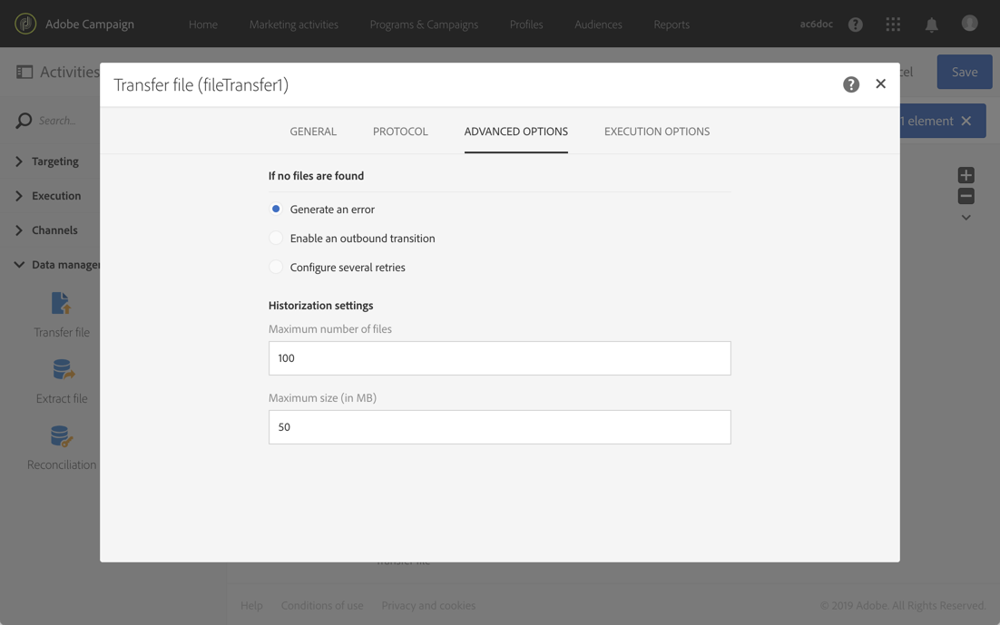

# 传输文件{#transfer-file}

## 描述 {#description}

**[!UICONTROL Transfer file]** 活动允许您接收或发送文件，测试是否存在文件或在Adobe Campaign中列出文件。

## 使用情境 {#context-of-use}

将在配置活动时定义数据的提取方式。例如，要加载的文件可能是联系人列表。

您可以使用此活动恢复随后将使用活动 **[!UICONTROL Load file]** 构造的数据。

## 配置 {#configuration}

1. 将 **[!UICONTROL Transfer file]** 活动放入工作流程中。
1. 选择活动，然后使用出现的快速操作中  的按钮打开该活动。
1. 使用 **[!UICONTROL Action]** 字段中的下拉列表选择下列活动操作之一：

   

   * **文件下载**：允许您下载文件。
   * **文件上传**：允许您上传文件。从Adobe Campaign文件上传文件可在 **[!UICONTROL Export audits]** 菜单中生成日志条目。有关导出审核的详细信息，请参阅 [审核导出](../../administration/using/auditing-export-logs.md) 部分。
   * **测试以查看文件是否存在**：允许您检查是否有文件。
   * **文件列表**：允许您列出Adobe Campaign中的文件。
   根据所选的操作，有一个或多个协议可用：

   * **HTTP**：此协议允许您从外部帐户或URL开始下载文件。

      * 单击该 **[!UICONTROL Use connection parameters defined in an external account]** 选项，然后选择您需要的帐户并指定要下载的文件路径。

         

      * 单击 **[!UICONTROL Quick configuration]** 该选项，然后在显示的字段中输入URL。

         
   * **S3**：此协议允许您开始通过Amazon Simple Storage Service(S3)从URL或外部帐户下载文件。

      * 选择外部帐户并指定要下载的文件路径。

         
   * **SFTP**：此协议允许您从URL或外部帐户开始下载文件。

      * 单击该 **[!UICONTROL Use connection parameters defined in an external account]** 选项，然后选择您需要的帐户并指定要下载的文件路径。

         

         >[!CAUTION]
         >
         >支持通配符。

      * 单击 **[!UICONTROL Quick configuration]** 该选项，然后在显示的字段中输入URL。
      * 如果要对导入的文件进行排序，请从章节中选择 **[!UICONTROL Sort alphanumerically]****[!UICONTROL Additional options]** 该选项。随后将按顺序处理文件。

         
   * **Adobe Campaign服务器上存在的文件**：此协议与包含要恢复的文件的存储库相对应。

      元字符或通配符(例如*或？)可用于筛选文件。

      填写此字段并确认您的活动使用此协议。

      >[!NOTE]
      >
      >路径必须相对于Adobe Campaign服务器的存储空间目录。文件位于 **sftp&lt; yourbecename&gt;/** directory中。您还无法浏览存储空间上方的目录。例如： **user&lt; yourbublename&gt;/my_ recipients. csv** 是正确的。**../hello/my_recipients.csv** 不正确。**//myserver/hello/myrecipients.csv** 不正确。
   选择您的协议并填写相关字段。

   此 **[!UICONTROL Use a dynamic file path]** 选项可用于每个协议，允许您使用标准表达式和事件变量个性化要传输的文件名称。有关此操作的详细信息，请参阅自 [定义活动变量](../../automating/using/calling-a-workflow-with-external-parameters.md#customizing-activities-with-events-variables) 部分的自定义活动。

1. **[!UICONTROL Additional options]** 此部分根据选定的协议提供，允许您向协议中添加参数。您可以：

   * **[!UICONTROL Delete the source files after transfer]**
   * **[!UICONTROL Disable passive mode]**
   * **[!UICONTROL List all files]**：此选项在选择 **[!UICONTROL File listing]** 操作时可用。它允许您对 **vars. filenames** 事件变量中服务器上显示的所有文件进行索引，其中文件名由 **“n”** 字符分隔。

1. **[!UICONTROL If no files are found]****[!UICONTROL Advanced options]** 如果在启动活动时检测到任何错误或存在的文件，则选项卡的部分允许您配置特定操作。

   您还可以定义重试。工作流执行日志中会显示不同的重试。

   

1. 确认活动的配置并保存工作流。

## 历史记录设置 {#historization-settings}

每次执行 **[!UICONTROL Transfer file]** 活动时，都会将上传的或下载的文件存储在专用文件夹中。为工作流的每 **[!UICONTROL Transfer file]** 个活动创建一个文件夹。因此，必须能够限制此文件夹的大小，以保留服务器上的物理空间。

为此，您可以在 **[!UICONTROL Historization settings]** 活动中 **[!UICONTROL Advanced options]****[!UICONTROL Transfer File]** 定义。

**[!UICONTROL Historization settings]** 允许定义活动文件夹的最大文件数或总大小。默认情况下，授权100个文件和50MB。

每次执行活动时，都会按如下方式检查文件夹：

* 只有在执行活动的24小时内创建的文件才会被考虑。
* 如果考虑到的文件数量大于 **[!UICONTROL Maximum number of files]** 该参数的值，则会删除最旧的文件，直到 **[!UICONTROL Maximum number of files]** 达到允许的文件数。
* 如果考虑到的文件的总大小大于 **[!UICONTROL Maximum size (in MB)]** 参数的值，则会删除最旧的文件，直到 **[!UICONTROL Maximum size (in MB)]** 达到允许的大小。

>[!NOTE]
如果未再次执行活动，则不会选中或清除其文件夹。记住，传输大型文件时要小心。

## 示例 {#example}

以下示例显示 **了文件传输** 活动的配置，随后将后跟 **加载文件** 活动，然后 **更新数据** 活动。此工作流程的目标是使用工作流恢复的数据添加或更新Adobe Campaign数据库配置文件。

1. 将文件 **** 活动拖放到工作流中。
1. 选择活动，然后使用出现的快速操作中  的按钮打开该活动。
1. **[!UICONTROL Protocol]** 在选项卡中，选择 **SFTP**。
1. 选择在 **外部帐户** 选项中定义的使用连接参数。
1. 输入外部帐户的名称。
1. 在远程服务器上输入 **File路径**。

   

1. 确认活动并保存工作流程。

