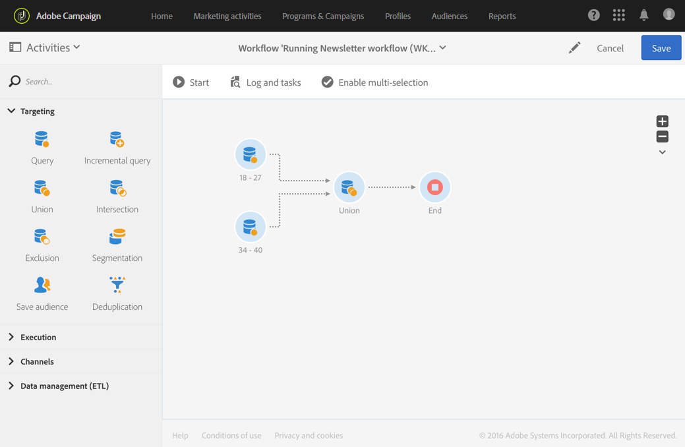

# 并集{#union}

## 说明 {#description}

利用 **[!UICONTROL Union]** 活动，可将多个活动的结果重组为单个目标。

>[!NOTE]
>
>这些集不需要具有同样的性质。

## 使用环境 {#context-of-use}

例如，当执行分段、定义受众或准备消息目标时，可使用 **[!UICONTROL Union]** 活动以组合来自集客过渡的群体。

**相关主题：**

* [用例：两个优化受众的并集](../../automating/using/union-on-two-refined-audiences.md)

## 配置 {#configuration}

1. 将 **[!UICONTROL Union]** 活动拖放到工作流中。
1. 将其连接至其前方的其他活动，例如查询。
1. 选择活动，然后使用所显示快速操作中的  按钮将其打开。
1. 选择 **[!UICONTROL Reconciliation type]** 以定义如何处理集客群体之间重复项的冲突：

   * **[!UICONTROL Keys only]**：这是默认模式。当来自不同集客过渡的元素具有相同的键值时，该活动只保留一个元素。仅当集客群体具有同样的性质时，才能使用此选项。
   * **[!UICONTROL All shared columns]**：根据集客过渡共有的所有列协调数据。因此，您必须选择要在出现重复时保留的主集。如果集客群体定向维度不同，则可以使用此选项。
   * **[!UICONTROL A selection of columns]**：选择此选项可定义要应用数据协调之列的列表。必须先选择主集（包含源数据的集），然后选择用于连接的列。

1. 如果您希望仅保留所有集客过渡中的附加数据，请勾选 **[!UICONTROL Use common additional data only]** 方框。
1. 如果要限制最终群体的大小，请选中 **[!UICONTROL Limit size of generated population]** 方框。可以在 **[!UICONTROL Maximum number of records]** 字段中指定大小。
1. 如果需要，可以管理活动的[过渡](../../automating/using/activity-properties.md)，以访问计算群体的高级选项。
1. 确认活动的配置并保存工作流。

## 示例 {#example}

下方的示例显示了两个查询活动的结果，这些活动旨在重组 Adobe Campaign 数据库 18 至 27 岁和 34 至 40 岁的轮廓。结果包含两个查询的所有轮廓，或在配置期间中指定的最大记录数量轮廓（如果适用）。

