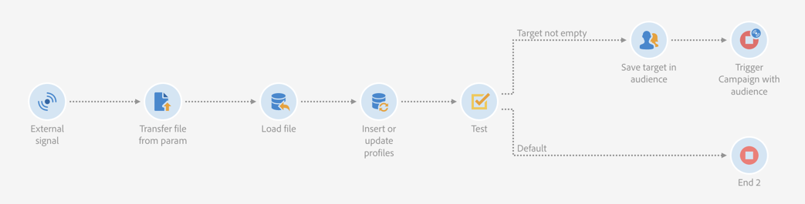
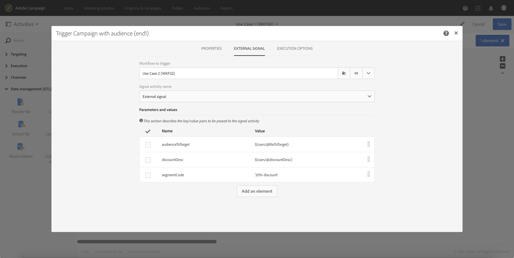

# 用例 {#use-case}

以下用例展示了如何使用工作流中的参数调用工作流。

目标是使用外部参数从API调用触发工作流。 此工作流会将数据从文件加载到数据库中，并创建关联受众。 创建受众后，将触发第二个工作流，以使用API调用中定义的外部参数发送个性化消息。

要执行此用例，您需要执行以下操作：

1. **进行API调用** 以使用外部参数触发工作流1。 请参阅 [步骤1：配置API调用](../../automating/using/use-case-calling-workflow.md#step-1--configuring-the-api-call).
1. **构建工作流1**：工作流将传输文件并将其加载到数据库中。 然后，它将测试数据是否为空，并最终将用户档案保存到受众。 最后，它会触发工作流2。 请参阅 [步骤2：配置工作流1](../../automating/using/use-case-calling-workflow.md#step-2--configuring-workflow-1).
1. **构建工作流2**：工作流将读取在工作流1中创建的受众，然后向用户档案发送个性化消息，并使用参数自定义段代码。 请参阅 [步骤3：配置工作流2](../../automating/using/use-case-calling-workflow.md#step-3--configuring-workflow-2).


## 先决条件 {#prerequisites}

在配置工作流之前，您需要使用创建工作流1和2 **[!UICONTROL External signal]** 活动。 这样，您就可以在调用工作流时定位这些信号活动。

## 步骤1：配置API调用 {#step-1--configuring-the-api-call}

进行API调用以通过参数触发工作流1。 有关API调用语法的更多信息，请参阅 [Campaign StandardREST API文档](../../api/using/triggering-a-signal-activity.md).

在本例中，我们希望使用以下参数调用工作流：

* **fileToTarget**：要导入到数据库中的文件的名称。
* **折扣说明**：我们要在投放中显示的有关折扣的描述。

```
-X POST https://mc.adobe.io/<ORGANIZATION>/campaign/<TRIGGER_URL>
-H 'Authorization: Bearer <ACCESS_TOKEN>' 
-H 'Cache-Control: no-cache' 
-H 'X-Api-Key: <API_KEY>' 
-H 'Content-Type: application/json;charset=utf-8' 
-H 'Content-Length:79' 
-i
-d {
-d "source:":"API",
-d "parameters":{
-d "fileToTarget":"profile.txt",
-d "discountDesc":"Running shoes"
-d } 
```

## 步骤2：配置工作流1 {#step-2--configuring-workflow-1}

工作流1将构建如下：

* **[!UICONTROL External signal]** 活动：其中必须声明外部参数才能在工作流中使用。
* **[!UICONTROL Transfer file]** 活动：使用参数中定义的名称导入文件。
* **[!UICONTROL Load file]** 活动：将数据从导入的文件加载到数据库中。
* **[!UICONTROL Update data]** 活动：使用导入文件中的数据插入或更新数据库。
* **[!UICONTROL Test]** 活动：检查是否存在导入的数据。
* **[!UICONTROL Save audience]** 活动：如果文件包含数据，则将用户档案保存到受众。
* **[!UICONTROL End activity]** 活动：使用要在其中使用的参数调用工作流2。



请按照以下步骤配置工作流：

1. 声明已在API调用中定义的参数。 为此，请打开 **[!UICONTROL External signal]** 活动，然后添加参数的名称和类型。

   

1. 添加 **[!UICONTROL Transfer file]** 活动将数据导入数据库。为此，请拖放活动，将其打开，然后选择 **[!UICONTROL Protocol]** 选项卡。
1. 选择 **[!UICONTROL Use a dynamic file path]** 选项，然后使用 **fileToTarget** 要传输的文件形式的参数：

   ```
   $(vars/@fileToTarget)
   ```

   

1. 将数据从文件加载到数据库中。

   为此，请拖放 **[!UICONTROL Load file]** 活动，然后根据需要进行配置。

1. 使用导入文件中的数据插入并更新数据库。

   为此，请拖放 **[!UICONTROL Update data]** 活动，然后选择 **[!UICONTROL Identification]** 选项卡以添加协调条件(在我们的示例中， **电子邮件** 字段)。

   

1. 选择 **[!UICONTROL Fields to update]** 选项卡，然后指定要在数据库中更新的字段(在我们的示例中， **名字** 和 **电子邮件** 字段)。

   

1. 检查是否从文件检索数据。 为此，请拖放 **[!UICONTROL Test]** 活动添加到工作流中，然后单击 **[!UICONTROL Add an element]** 按钮以添加条件。
1. 命名并定义条件。 在本例中，我们希望测试叫客过渡是否包含使用以下语法的数据：

   ```
   $long(vars/@recCount)>0
   ```

   

1. 如果检索到数据，则将其保存到受众中。 为此，请添加 **[!UICONTROL Save audience]** 的活动 **目标不为空** 过渡，然后打开它。
1. 选择 **[!UICONTROL Use a dynamic label]** 选项，然后使用 **fileToTarget** 参数作为受众的标签：

   ```
   $(vars/@fileToTarget)
   ```

   

1. 拖放 **[!UICONTROL End]** 使用参数调用工作流2的活动，然后打开它。
1. 选择 **[!UICONTROL External signal]** 选项卡，然后指定要触发的工作流及其关联的信号活动。
1. 定义要在工作流2中使用的参数及其关联值。

   在本例中，我们要传递最初在API调用中定义的参数(**fileToTarget** 和 **折扣说明**)，以及另一个 **segmentcode** 整比率（“20%折让”）。

   

工作流1已配置，您现在可以构建工作流2。 如需详细信息，请参阅[此部分](../../automating/using/use-case-calling-workflow.md#step-3--configuring-workflow-2)。

## 步骤3：配置工作流2 {#step-3--configuring-workflow-2}

工作流2将构建如下：

* **[!UICONTROL External signal]** 活动：其中必须声明参数才能在工作流中使用。
* **[!UICONTROL Read audience]** 活动：读取保存在工作流1中的受众。
* **[!UICONTROL Email delivery]** 活动：向目标受众发送定期消息，并使用参数进行个性化。


请按照以下步骤配置工作流：

1. 声明已在工作流1中定义的参数。

   为此，请打开 **[!UICONTROL External signal]** 活动，然后添加中定义的每个参数的名称和类型 **[!UICONTROL End]** 工作流1的活动。

   

1. 使用工作流1中保存的受众。 为此，请拖放 **[!UICONTROL Read audience]** 活动添加到工作流中，然后将其打开。
1. 选择 **[!UICONTROL Use a dynamic audience]** 选项，然后使用 **fileToTarget** 参数作为要读取的受众的名称：

   ```
   $(vars/@fileToTarget)
   ```

   

1. 根据命名叫客过渡 **segmentcode** 参数。

   要执行此操作，请选择 **[!UICONTROL Transition]** 选项卡，然后 **[!UICONTROL Use a dynamic segment code]** 选项。

1. 使用 **segmentcode** 参数作为叫客过渡的名称：

   ```
   $(vars/@segmentCode)
   ```

   

1. 拖放 **[!UICONTROL Email delivery]** 活动，向受众发送消息。
1. 识别消息中要使用的参数，以使用 **折扣说明** 参数。 为此，请打开活动的高级选项，然后添加参数名称和值。

   

1. 您现在可以配置消息。 打开活动，然后选择 **[!UICONTROL Recurring email]**.

   

1. 选择要使用的模板，然后根据需要定义电子邮件属性。
1. 使用 **折扣说明** 参数作为个性化字段。 要实现此目的，请从个性化字段列表中选择它。

   

1. 您现在可以完成消息的配置，然后照常发送。

   

## 执行工作流 {#executing-the-workflows}

构建工作流后，即可执行这些工作流。 确保在执行API调用之前启动这两个工作流。
