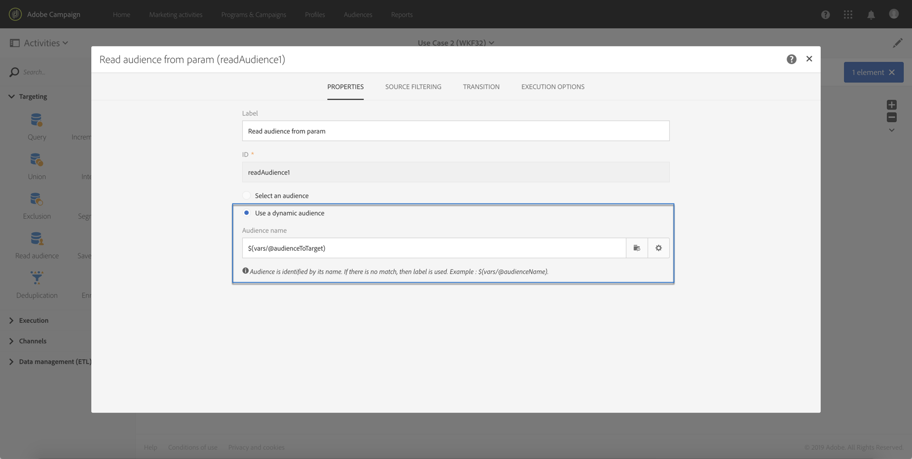

# 用例 {#use-case}

以下用例说明如何使用工作流中的参数调用工作流。

其目标是使用外部参数从API调用触发工作流。 此工作流将从文件将数据加载到数据库并创建关联受众。 创建受众后，将触发第二个工作流以发送个性化的消息，该消息使用在API调用中定义的外部参数。

要执行此用例，您需要执行以下操作：

1. **进行API调用** ，用外部参数触发Workflow 1。 请参 [阅第1步：配置API调用](../../automating/using/use-case-calling-workflow.md#step-1--configuring-the-api-call)。
1. **构建工作流1**:该工作流将传输一个文件并将其加载到数据库中。 然后，它将测试数据是否为空，并最终将用户档案保存到受众中。 最后，它将触发工作流2。 请参 [阅第2步：配置工作流1](../../automating/using/use-case-calling-workflow.md#step-2--configuring-workflow-1)。
1. **构建工作流2**:该工作流将读取在工作流1中创建的受众，然后向用户档案发送个性化消息，并使用参数自定义的段代码。 请参 [阅步骤3:配置工作流2](../../automating/using/use-case-calling-workflow.md#step-3--configuring-workflow-2)。


## 先决条件{#prerequisites}

在配置工作流之前，您需要创建Workflow 1和Workflow 2，每个 **[!UICONTROL External signal]** 活动中都有一个。 这样，您就能够在调用目标时工作流这些信号活动。

## 第1步：配置API调用 {#step-1--configuring-the-api-call}

进行API调用以触发包含参数的Workflow 1。 有关API调用语法的详细信息，请参阅 [Campaign StandardREST API文档](../../api/using/triggering-a-signal-activity.md)。

在本例中，我们要使用以下参数调用工作流：

* **fileToTarget**:要导入到数据库的文件的名称。
* **折扣设计**:要在投放中显示的折扣描述。

```
-X POST https://mc.adobe.io/<ORGANIZATION>/campaign/<TRIGGER_URL>
-H 'Authorization: Bearer <ACCESS_TOKEN>' 
-H 'Cache-Control: no-cache' 
-H 'X-Api-Key: <API_KEY>' 
-H 'Content-Type: application/json;charset=utf-8' 
-H 'Content-Length:79' 
-i
-d {
-d "source:":"API",
-d "parameters":{
-d "fileToTarget":"profile.txt",
-d "discountDesc":"Running shoes"
-d } 
```

## 第2步：配置工作流1 {#step-2--configuring-workflow-1}

工作流1将按如下方式构建：

* **[!UICONTROL External signal]** 活动:其中必须声明外部参数才能在工作流中使用。
* **[!UICONTROL Transfer file]** 活动:导入具有参数中定义的名称的文件。
* **[!UICONTROL Load file]** 活动:将数据从导入的文件加载到数据库。
* **[!UICONTROL Update data]** 活动:插入或更新导入文件中的数据。
* **[!UICONTROL Test]** 活动:检查是否导入了数据。
* **[!UICONTROL Save audience]** 活动:如果文件包含用户档案，则将数据保存到受众中。
* **[!UICONTROL End activity]** 活动:调用工作流2，其中包含您要使用的参数。


请按照以下步骤配置工作流：

1. 声明在API调用中定义的参数。 为此，请打开 **[!UICONTROL External signal]** 活动，然后添加参数的名称和类型。

   

1. 添加一 **[!UICONTROL Transfer file]** 个活动以将数据导入活动库。要执行此操作，请拖放，打开它，然后选择选 **[!UICONTROL Protocol]** 项卡。
1. 选择选 **[!UICONTROL Use a dynamic file path]** 项，然后使 **用fileToTarget** 参数作为要传输的文件：

   ```
   $(vars/@fileToTarget)
   ```

   

1. 将数据从文件加载到数据库。

   为此，请将活动拖放 **[!UICONTROL Load file]** 到工作流中，然后根据需要配置它。

1. 插入数据库并用导入文件中的数据更新数据库。

   为此，请拖放一个 **[!UICONTROL Update data]** 活动，然后选 **[!UICONTROL Identification]** 择选项卡以添加对帐条件(在我们的例 **子中为email** 字段)。

   

1. 选择选 **[!UICONTROL Fields to update]** 项卡，然后指定要在数据库中更新的字段(在我们的例 **子中为** “名” **和“电子邮件** ”字段)。

   

1. 检查是否从文件检索数据。 为此，请将活动拖放 **[!UICONTROL Test]** 到工作流中，然后单击 **[!UICONTROL Add an element]** 按钮以添加条件。
1. 命名并定义条件。 在本例中，我们要测试出站过渡是否包含具有以下语法的数据：

   ```
   $long(vars/@recCount)>0
   ```

   

1. 如果检索到数据，则将其保存到受众中。 为此，请向活动 **[!UICONTROL Save audience]** 添加目标, **而非空的** 过渡，然后打开它。
1. 选择 **[!UICONTROL Use a dynamic label]** 选项，然后使 **用fileToTarget** 参数作为受众的标签：

   ```
   $(vars/@fileToTarget)
   ```

   

1. 拖放一个将用 **[!UICONTROL End]** 参数调用Workflow 2的活动，然后打开它。
1. 选择选 **[!UICONTROL External signal]** 项卡，然后指定要触发的工作流及其关联的信号活动。
1. 定义要在工作流2中使用的参数及其关联值。

   在我们的情况下，我们希望传递最初在API调用中定&#x200B;**义的参数** (fileToTarget **和discountDesc**)，以及一个具有常 **数值（“20%折扣”）的** 额外segmentCode参数。

   

工作流1已配置，您现在可以构建工作流2。 如需详细信息，请参阅[此部分](../../automating/using/use-case-calling-workflow.md#step-3--configuring-workflow-2)。

## 第3步：配置工作流2 {#step-3--configuring-workflow-2}

工作流2将按如下方式构建：

* **[!UICONTROL External signal]** 活动:其中必须声明参数才能在工作流中使用。
* **[!UICONTROL Read audience]** 活动:读取在工作流1中保存的受众。
* **[!UICONTROL Email delivery]** 活动:向目标受众发送重复消息，并使用参数进行个性化。


请按照以下步骤配置工作流：

1. 声明已在工作流1中定义的参数。

   为此，请打开 **[!UICONTROL External signal]** 活动，然后添加在工作流1的活动中定义的每个参数的名称 **[!UICONTROL End]** 和类型。

   

1. 使用已保存在Workflow 1中的受众。 为此，请将活动拖放到 **[!UICONTROL Read audience]** 工作流中，然后打开它。
1. 选择 **[!UICONTROL Use a dynamic audience]** 选项，然后使 **用fileToTarget** 参数作为要读取的受众的名称：

   ```
   $(vars/@fileToTarget)
   ```

   

1. 根据segmentCode参数命名出站 **过渡** 。

   To do this, select the **[!UICONTROL Transition]** tab, then the **[!UICONTROL Use a dynamic segment code]** option.

1. 使用 **segmentCode** 参数作为出站过渡的名称：

   ```
   $(vars/@segmentCode)
   ```

   

1. 拖放活动 **[!UICONTROL Email delivery]** 以向受众发送消息。
1. 确定消息中使用的参数，以便使用discountDesc参数对其进 **行个** 性化。 为此，请打开活动的高级选项，然后添加参数名称和值。

   

1. 您现在可以配置消息。 打开活动，然后选择 **[!UICONTROL Recurring email]**。

   

1. 选择要使用的模板，然后根据您的需要定义电子邮件属性。
1. 将discountDesc **参数** 用作个性化字段。 为此，请从个性化字段列表中选择它。

   

1. 您现在可以完成消息的配置，然后照常发送。

   

## 执行工作流 {#executing-the-workflows}

构建工作流后，即可执行它们。 在执行API调用之前，请确保已启动两个工作流。
