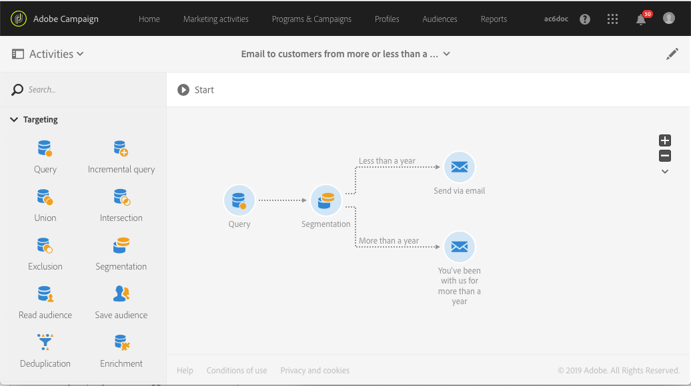

# 使用补充创建投放 {#deliveries-with-complement}

您可以向客户发送电子邮件：一款面向不到一年前创建的客户，一款面向一年多前创建的客户。

1. 在 **[!UICONTROL Marketing Activities]** 中，单击 **[!UICONTROL Create]** 并选择 **[!UICONTROL Workflow]**。
1. 选择 **[!UICONTROL New Workflow]** 作为工作流类型并单击 **[!UICONTROL Next]**。
1. 输入工作流的属性并单击 **[!UICONTROL Create]**。

## 创建查询活动{#create-a-query-activity}

1. 在 **[!UICONTROL Activities]** > **[!UICONTROL Targeting]** 中，拖放[查询](../../automating/using/query.md)活动。
1. 双击该活动。
1. 在&#x200B;**[!UICONTROL Shortcuts]**&#x200B;中，拖放&#x200B;**[!UICONTROL Profiles]**&#x200B;并使用运算符&#x200B;**[!UICONTROL is not empty]**&#x200B;选择&#x200B;**[!UICONTROL email]**。
1. 在&#x200B;**[!UICONTROL Shortcuts]**&#x200B;中，拖放&#x200B;**[!UICONTROL Profiles]**&#x200B;并选择值为&#x200B;**[!UICONTROL no]**&#x200B;的&#x200B;**[!UICONTROL no longer contact by email]**。
1. 单击 **[!UICONTROL Confirm]**.

## 创建分段活动{#create-a-segmentation-activity}

1. 在&#x200B;**[!UICONTROL Activities]** > **[!UICONTROL Targeting]**&#x200B;中，拖放[Segmentation](../../automating/using/segmentation.md)活动，然后多次单击它。
1. 将鼠标悬停在区段上，然后单击以目标今年在数据库中添加的客户。
1. 拖放&#x200B;**[!UICONTROL Profiles]**&#x200B;并选择&#x200B;**[!UICONTROL Created]**（过滤器类型为&#x200B;**[!UICONTROL Relative]**）。
1. 将&#x200B;**[!UICONTROL Level of precision]**&#x200B;更改为&#x200B;**[!UICONTROL Year]**&#x200B;并选择&#x200B;**[!UICONTROL This year]**。
1. 单击 **[!UICONTROL Confirm]** 两次。
1. 在&#x200B;**[!UICONTROL Advanced Options]**&#x200B;中，选中&#x200B;**[!UICONTROL Generate complement]**&#x200B;以创建面向其余收件人的区段。
1. 单击 **[!UICONTROL Confirm]**.
1. 单击 **[!UICONTROL Save]**.

>[!NOTE]
>
>要观察规则的结构，请单击&#x200B;**[!UICONTROL Advanced Mode]**。

## 创建电子邮件投放 {#create-an-email-delivery}

1. 在&#x200B;**[!UICONTROL Activities]** > **[!UICONTROL Channels]**&#x200B;中，将[电子邮件投放](../../automating/using/email-delivery.md)活动拖放到每个区段之后。
1. 单击活动，然后选择  以进行编辑。
1. 选择 **[!UICONTROL Single send email]** 并单击 **[!UICONTROL Next]**。
1. 选择电子邮件模板，然后单击 **[!UICONTROL Next]**。
1. 输入电子邮件属性，然后单击 **[!UICONTROL Next]**。
1. 要创建电子邮件的布局，请单击 **[!UICONTROL Email Designer]**。
1. 插入元素或选择现有模板。
1. 使用特定于每个优惠的投放个性化您的电子邮件。
1. 单击 **[!UICONTROL Preview]** 以检查布局。
1. 单击 **[!UICONTROL Save]**。

有关更多信息，请参阅[设计电子邮件](../../designing/using/designing-from-scratch.md#designing-an-email-content-from-scratch)。

