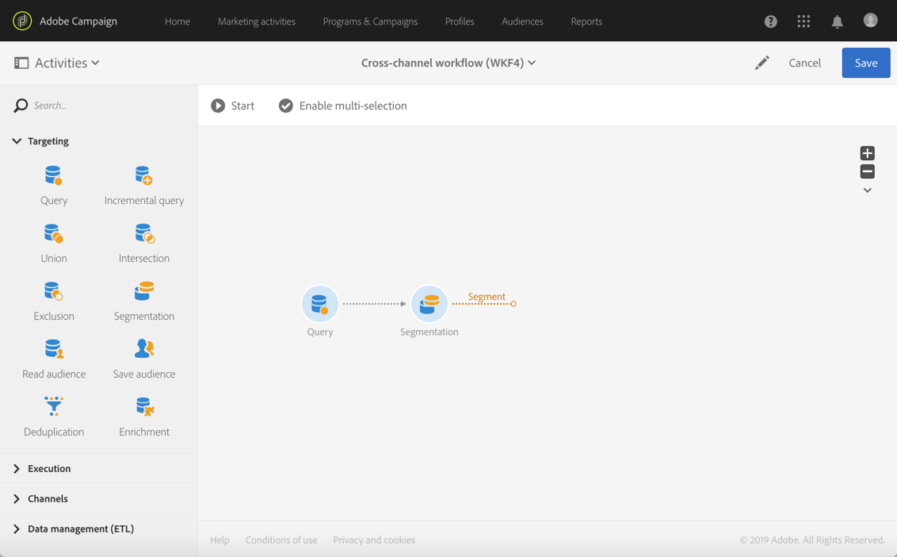

# 创建跨渠道投放{#cross-channel-delivery}

本文档介绍了如何通过标准使用案例了解以下 Adobe Campaign 功能：创建跨渠道投放工作流。

本使用案例的目标是从数据库的收件人中选择受众，并将其划分为两个不同的组，以便向第一组发送电子邮件，向第二组发送短信消息。

有关 Adobe Campaign 可用的工作流和各种渠道的更多详细信息，请参见以下文档:

* [了解工作流](../../automating/using/get-started-workflows.md)
* [了解通信渠道](../../channels/using/get-started-communication-channels.md)

## 创建工作流 {#creating-workflow}

要将两个不同的投放发送至给定的组，您必须先定义目标。

要实现此目的，您需要创建查询以标识收件人，因此，您必须创建工作流。

在选择的项目或营销策划中创建新工作流：

1. 在 **[!UICONTROL Marketing Activities]** 中，单击 **[!UICONTROL Create]** 并选择 **[!UICONTROL Workflow]**。
1. 选择 **[!UICONTROL New Workflow]** 作为工作流类型并单击 **[!UICONTROL Next]**。
1. 输入工作流的属性并单击 **[!UICONTROL Create]**。

有关创建工作流的详细步骤，请参阅[构建工作流](../../automating/using/building-a-workflow.md)一节。

## 创建查询活动 {#creating-query-activity}

创建工作流后，即可访问其界面。

将查询活动插入您的工作流，以定向接收投放的轮廓。

1. 在 **[!UICONTROL Activities]** > **[!UICONTROL Targeting]** 中，拖放[查询](../../automating/using/query.md)活动。
1. 双击该活动。
1. 在 **[!UICONTROL Target]** 选项卡中，浏览快捷方式并选择您的[受众](../../audiences/using/about-audiences.md)之一。
1. 将快捷方式拖放到编辑区域中。随即将根据所选快捷方式的类型，显示一个窗口。
1. 配置定向元素，然后确认查询。

您可以基于一个或多个元素创建查询。

使用 **[!UICONTROL Count]** 该按钮可查看通过查询定向之轮廓数量的估算值。

## 创建分段活动 {#creating-segmentation-activity}

一旦通过查询活动标识了目标，您就必须选择条件以将目标分为两个不同的群体：一个接收电子邮件，另一个接收短信。

您必须使用[分段](../../automating/using/segmentation.md)活动从查询上游计算的群体创建一个或多个区段。

**电子邮件**&#x200B;组的目标是定义了电子邮件地址但没有手机号码的收件人。**短信**&#x200B;组则包含其轮廓中保存了手机号码的收件人。

要配置第一个过渡（电子邮件），请执行以下步骤：

1. 在 **[!UICONTROL Segments]** 选项卡中，默认显示第一个区段。编辑其属性以配置该区段。

   

1. 选择轮廓的 **[!UICONTROL Email]** 作为筛选条件。

   

1. 在屏幕上显示的新窗口中，选择 **[!UICONTROL Is not empty]** 运算符。

   

1. 添加第二个筛选条件 **[!UICONTROL Mobile]**，然后选择运算符 **[!UICONTROL Is empty]**。

   

   所有来自查询的、拥有电子邮件地址但未定义手机号码的轮廓，都将被纳入到此过渡中。

1. 要使工作流程更清晰，您可以编辑过渡标签。确认更改。

   

第一个过渡配置完成。配置第二个过渡（短信）：

1. 单击 **[!UICONTROL Add an element]** 按钮以添加一个新过渡。
1. 定义一个条件，用于检索提供了手机号码的所有轮廓。要实现此目的，请使用 **[!UICONTROL Is not empty]** 逻辑运算符在 **[!UICONTROL Mobile]** 字段上创建规则。

   

   来自查询的、所有拥有手机号码的轮廓，都将被纳入到此过渡中。

1. 您可以编辑过渡的标签。确认更改。

第二个过渡配置完成。

## 创建投放 {#creating-deliveries}

由于已创建两个过渡，您现在必须将两种类型的投放添加到分段活动的叫客过渡中：[电子邮件投放](../../automating/using/email-delivery.md)活动和[短信投放](../../automating/using/sms-delivery.md)活动。

利用 Adobe Campaign 可向工作流中添加投放。要实现此目的，请从工作流活动面板的 **[!UICONTROL Channels]** 类别中选择一个投放。

要创建电子邮件投放，请执行以下步骤：

1. 将[电子邮件投放](../../automating/using/email-delivery.md)活动拖放到第一个区段之后。
1. 双击该活动以对其进行编辑。
1. 选择 **[!UICONTROL Simple email]**。
1. 选择 **[!UICONTROL Add an outbound transition with the population]** 并单击 **[!UICONTROL Next]**。

   

   利用叫客过渡，可取回群体和跟踪日志。例如，您将能够使用叫客过渡向未点击第一封邮件的用户发送第二封邮件。

1. 选择电子邮件模板，然后单击 **[!UICONTROL Next]**。
1. 输入电子邮件属性，然后单击 **[!UICONTROL Next]**。
1. 要创建电子邮件的布局，请选择 **[!UICONTROL Use the Email Designer]**。
1. 编辑并保存您的内容。
1. 在消息仪表板的&#x200B;**[!UICONTROL Schedule]**&#x200B;部分中，取消选择&#x200B;**[!UICONTROL Request confirmation before sending messages]**&#x200B;选项。

创建短信投放：

1. 将[短信投放](../../automating/using/sms-delivery.md)活动拖放到另一个区段之后。
1. 双击该活动以对其进行编辑。
1. 选择 **[!UICONTROL SMS]** 并单击 **[!UICONTROL Next]**。
1. 选择短信模板并单击 **[!UICONTROL Next]**。
1. 输入短信属性并单击 **[!UICONTROL Next]**。
1. 编辑并保存您的内容。

创建并编辑投放后，工作流即准备就绪，可以启动。

## 运行工作流 {#running-the-workflow}

启动工作流后，将对&#x200B;**[!UICONTROL Query]**&#x200B;活动定向的群体进行分段，以接收电子邮件或短信投放。

要执行工作流，请单击操作栏中的 **[!UICONTROL Start]** 按钮。

您可以通过 Adobe Campaign 徽标访问 **[!UICONTROL Marketing plans]** > **[!UICONTROL Marketing activities]** 高级菜单，以访问相关投放。单击投放，然后单击 **[!UICONTROL Reports]** 按钮以访问[投放报告](../../reporting/using/about-dynamic-reports.md#accessing-dynamic-reports)，例如投放摘要、打开率或基于收件人消息收件箱的电子邮件渲染。
