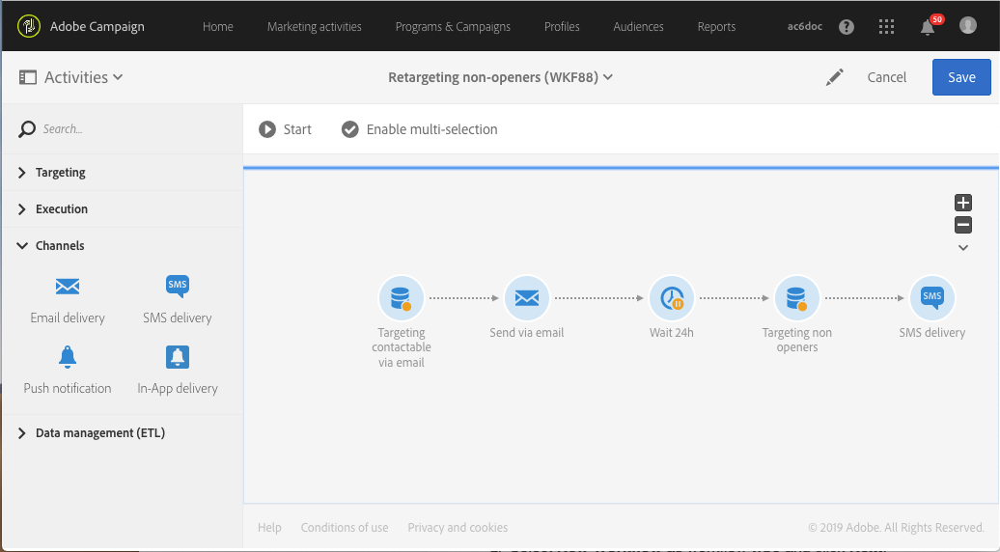

# 重新定位傳送新傳遞給非開啟者的工作流程{#retargeting-delivery-to-non-openers}

您可以傳送電子郵件給客戶，然後傳送簡訊給未開啟郵件的客戶。

1. 在 **[!UICONTROL Marketing Activities]** 中，单击 **[!UICONTROL Create]** 并选择 **[!UICONTROL Workflow]**。
1. 选择 **[!UICONTROL New Workflow]** 作为工作流类型并单击 **[!UICONTROL Next]**。
1. 输入工作流的属性并单击 **[!UICONTROL Create]**。

## 建立查詢活動{#creating-a-query-activity}

1. 在 **[!UICONTROL Activities]** > **[!UICONTROL Targeting]** 中，拖放[查询](../../automating/using/query.md)活动。
1. 双击该活动。
1. 在 **[!UICONTROL Shortcuts]**，拖放 **[!UICONTROL Profiles]** 並選取 **[!UICONTROL email]** 使用運運算元 **[!UICONTROL is not empty]**.
1. 在 **[!UICONTROL Shortcuts]**，拖放 **[!UICONTROL Profiles]** 並選取 **[!UICONTROL no longer contact by email]** 包含值 **[!UICONTROL no ]**.
1. 单击 **[!UICONTROL Confirm]**。

## 创建电子邮件投放{#creating-an-email-delivery}

1. 拖放 [電子郵件傳遞](../../automating/using/email-delivery.md) 在每個區段之後。
1. 单击活动，然后选择  以进行编辑。
1. 选择 **[!UICONTROL Simple email]** 并单击 **[!UICONTROL Next]**。
1. 选择 **[!UICONTROL Add an outbound transition without the population]** 并单击 **[!UICONTROL Next]**。
1. 选择电子邮件模板，然后单击 **[!UICONTROL Next]**。
1. 输入电子邮件属性，然后单击 **[!UICONTROL Next]**。
1. 要创建电子邮件的布局，请单击 **[!UICONTROL Using the Email Designer]**。
1. 插入元素或选择现有模板。
1. 使用每個位置專屬的優惠方案個人化您的電子郵件。如需詳細資訊，請參閱 [設計電子郵件](../../designing/using/designing-from-scratch.md#designing-an-email-content-from-scratch).
1. 单击 **[!UICONTROL Preview]** 以检查布局。
1. 单击 **[!UICONTROL Save]**。

## 在查詢活動中鎖定非開啟者{#targeting-non-openers-in-a-query-activity}

1. 在 **[!UICONTROL Activities]** > **[!UICONTROL Execution]**，拖放 [等待](../../automating/using/wait.md) 活動。
1. 在 **[!UICONTROL Duration]**，按一下  並選取一天。
1. 在 **[!UICONTROL Activities]** > **[!UICONTROL Targeting]** 中，拖放 **[!UICONTROL Query activity]**。
1. 双击该活动。
1. 在 **[!UICONTROL Shortcuts]**，拖放 **[!UICONTROL Tracking Logs]** 和搭配運運算元 **[!UICONTROL exists]**.
1. 在 **[!UICONTROL Shortcuts]**> **[!UICONTROL Delivery]**，拖放 **[!UICONTROL delivery]** 使用運運算元 **[!UICONTROL is equal to]** 並選取傳遞作為值。
1. 在 **[!UICONTROL Shortcuts]**> **[!UICONTROL Delivery]**，拖放 **[!UICONTROL type]** 和檢查 **[!UICONTROL Open]** 作為值。
1. 在規則之間選取運運算元作為 **[!UICONTROL except]**.
1. 单击 **[!UICONTROL Confirm]**。

## 建立簡訊傳送{#creating-a-sms-delivery}

1. 在每個區段後拖放簡訊傳送。
1. 单击活动，然后选择  以进行编辑。
1. 选择 **[!UICONTROL Simple sms]** 并单击 **[!UICONTROL Next]**。
1. 選取簡訊範本並按一下 **[!UICONTROL Next]**.
1. 輸入簡訊屬性並按一下 **[!UICONTROL Next]**.
1. 若要建立簡訊的版面配置，請按一下 **[!UICONTROL Email Designer]**.
1. 插入元素或选择现有模板。
1. 使用每個位置專屬的選件，個人化您的SMS。
如需詳細資訊，請參閱 [設計簡訊](../../channels/using/creating-an-sms-message.md) 區段。
1. 单击 **[!UICONTROL Preview]** 以检查布局。
1. 单击 **[!UICONTROL Save]**。

**相关主题：**

* [电子邮件渠道](../../channels/using/creating-an-email.md)
