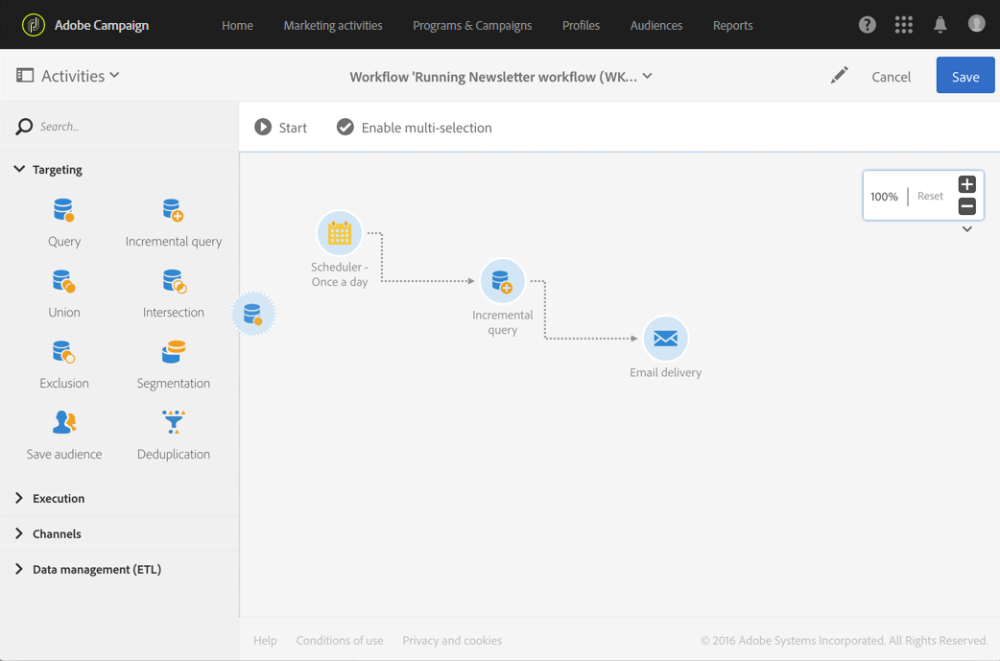

# 工作流界面{#workflow-interface}

您可以创建工作流来管理活动和项目中的整个流程。

工作流编辑屏幕由以下元素组成：

* 调 [色板](#palette)，引用可用活动。
* Workspace ，在Workspace中配置和组织活动。
* 操 [作栏](#action-bar)，它由允许您与工作流和／或其组件交互的按钮组成。
* 快 [速操作](#quick-actions)(显示在选定活动周围)允许您与其交互。

## 面板{#palette}

调色板位于屏幕的左侧。 所有可用活动均按多个类别进行分类：

* [定位](../../automating/using/about-targeting-activities.md):活动(针对定位、操作人口数据和筛选活动)
* [执行](../../automating/using/about-execution-activities.md):活动特定于组织和执行工作流
* [渠道](../../automating/using/about-channel-activities.md):活动表示不同的可用通信渠道
* [数据管理(ETL)](../../automating/using/about-data-management-activities.md):活动特定于处理数据

要使用工作流中调色板中的活动，请将其拖放到工作区中。

必须先配置从调色板添加的每个活动，然后才能启动工作流。

## 工作区{#workspace}

工作区是工作流编辑器中的中心区域。 您可以在此区域中放置活动，使用过渡将它们链接在一起并进行配置。

要链接两个活动，请将箭头的末尾从第一个活动移到下一个活动，直到它们连接。 您还可以将活动移向其后面箭头的点，以将其链接到前一个活动。 如果移动任何活动，它们将保持链接。

过渡跟踪处理数据的活动包含中间群体。 如果选中工作流属性部分 **[!UICONTROL Keep interim results]** 中的选项， **[!UICONTROL Execution]** 则可以访问它们。

>[!CAUTION]
>
>使用此选项会占用大量磁盘空间，其目的在于帮助您构建工作流并确保配置和行为正确。在制作实例中，请不要勾选该选项。

选择活动后，活动周围会显示快速操作，允许您与其交互。 例如，要配置活动，请选择该，然后使用快速操作  中的按钮将其打开。

某些功能仅在工作区中启用：

* 通过在活动和过渡周围绘制一个区域来选择它们。
* 按 **Ctrl** +左键单击以选择多个活动和／或过渡。
* 按 **Enter** 视图当前选定活动或过渡的详细信息。
* 按 **删除** ，以删除当前选定的活动。
* 按 **Ctrl + C** ，复制选定活动, **按Ctrl + V** ，将其粘贴到工作区中。

## 操作栏{#action-bar}

根据工作区中选择的元素或工作流的执行状态，操作栏中可用的按钮可能会有所不同。

 **[!UICONTROL Open activity]** 允许您编辑工作流的属性。

 **[!UICONTROL Start]** 开始工作流。

 **[!UICONTROL Pause]** 暂停工作流。

 **[!UICONTROL Stop]** 中断工作流执行。 无法从停止位置恢复。

 **[!UICONTROL Restart]** 重新启动工作流。

 **[!UICONTROL Log and tasks]** 打开工作流的执行日志。

 **[!UICONTROL Enable multi-selection]** 启用多选模式。 该工作流必须至少由两个活动组成。

 **[!UICONTROL Disable multi-selection]** 禁用多选模式。 

 **[!UICONTROL Open transition]** 打开选定过渡。 

  **[!UICONTROL Normal execution]** 如果之前已禁用或标记为已暂停，则重新启用选择。 

 **[!UICONTROL Execution suspended]** 在所选活动暂停工作流。 

 **[!UICONTROL No execution]** 禁用活动。 

 **[!UICONTROL Delete selection]** 删除选定的活动。 

 **[!UICONTROL Copy selection]** 复制选定的活动。

 **[!UICONTROL Paste]** 粘贴已复制的活动。

## 快速操作 {#quick-actions}

选择活动后，活动周围会显示快速操作按钮，允许您与其交互。

 **[!UICONTROL Open activity]** 打开选定活动。

 **[!UICONTROL Copy selection]** 复制所选活动。

 **[!UICONTROL Open the activity's advanced options]** 打开选定“电子邮件”或“短信”投放活动的高级选项。

 **[!UICONTROL Normal execution]** 如果之前已禁用或标记为已暂停，则重新启用选择。

 **[!UICONTROL Execution suspended]** 在所选活动暂停工作流。

 **[!UICONTROL No execution]** 禁用活动。

 **[!UICONTROL Immediate execution]** 强制立即处理选择。 此按钮仅对调度程序和 等待活动 可用。

 **[!UICONTROL Delete selection]** 删除选定的活动。

## 复制工作流活动 {#duplicating-workflow-activities}

通过工作区，您可以将工作流重复复制粘贴到同一工作流中，或从同一活动实例复制到另一个工作流中。

复制活动后，将保留其整个配置。 对于投放活动（电子邮件、短信、推送通知……），与活动连接的投放对象是重复的。

>[!NOTE]
>
>无法将工作流活动从实例复制到其他实例。 不能复制来自技术工作流的活动。

要重复活动，请执行以下步骤：

1. 选择活动，然后单击快 **[!UICONTROL Copy selection]** 速操作中的按钮。

   您还可以使用 **Ctrl + C** （键盘）快捷键。

   

1. 在目标工作流工作区中右键单击，然后单击按 **[!UICONTROL Paste]** 钮。

   您还可以使用 **CTRL + V键** 盘快捷键。

   

1. 该活动是重复的，其中包含最初配置的所有设置。

还可以复制粘贴多个活动，从而重复整个工作流。

为此，请通过在活动周围绘制一个区域来选取这些区域。 然后，单 **[!UICONTROL Copy selection]** 击操作栏中的按钮(或按 **Ctrl + C**)。 然后，可将其粘贴到所需位置。

