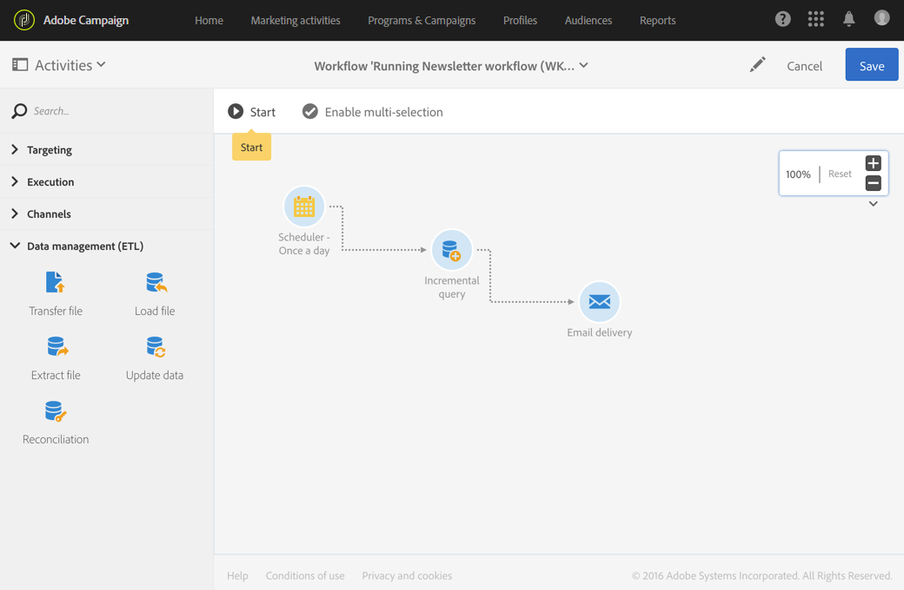

# 工作流操作原则{#workflow-operating-principles}

工作流是一系列可 **配置的活动**。 每个活动在该过程中都具有特定角色。 每个活动的结果都通过一个由箭头表示的过渡转 **发到以**&#x200B;下活动。

在一个活动和另一个活动之间交换的数据类型可能影响以下活动的配置方式。 例如，如果在电子邮件发送活动之前建立了人口，则人口可以作为相关电子邮件的目标。

您可以在执行工作流之前或之后打开活动以检查或编辑参数。

您可以打开过渡以检查在执行工作流期间或之后发送的数据是否正确。 要访问过渡的详细视图，您必须选中工作 **[!UICONTROL Keep interim results]** 流属性部分 **[!UICONTROL Execution]** 中的选项。

