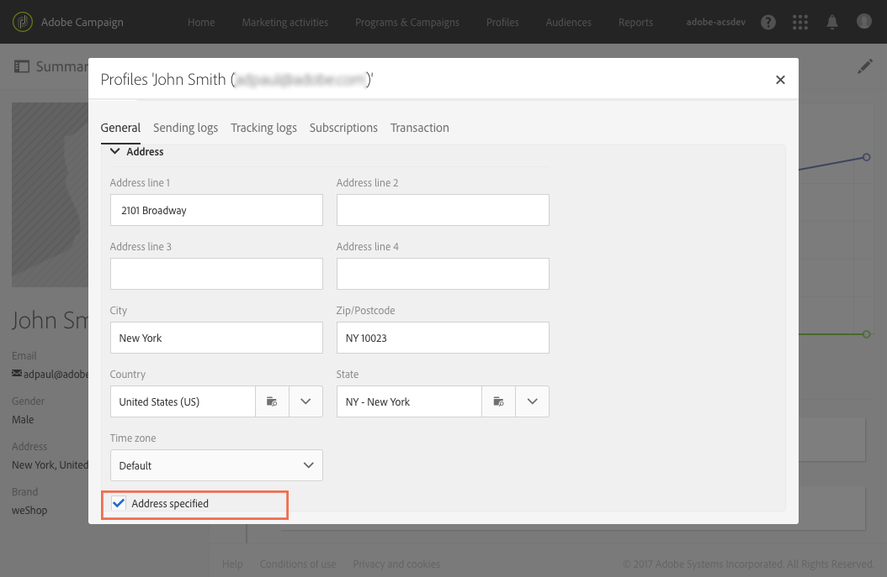

# 关于直邮{#about-direct-mail}

直邮是一种线下渠道，用于生成直邮提供商所需的个性化文件。利用这种手段，可将线上和线下渠道有机地结合，用在客户历程中。

>[!NOTE]
>
>此功能属于可选功能。请核实您的许可协议。使用直邮必须具备 **[!UICONTROL Export]** 角色。请联系您的管理员。

利用线上渠道，可创建消息（电子邮件、短信、移动应用投放等）并直接从 Adobe Campaign 发送至受众。线下渠道则不同。在准备直邮投放时，Adobe Campaign 会生成一个文件，其中包含了所有定向的用户档案和选定的联系信息（例如邮政地址）。然后，您可以将此文件发送给直邮提供商，由其负责发送纸质信函。

以下章节将介绍如何创建和生成一次性直邮投放。您也可以在工作流中加入直邮活动，以策划结合线上和线下渠道的营销策划。有关更多信息，请参阅[工作流](../../automating/using/get-started-workflows.md)指南。

Adobe Campaign 中的用户进程如下所示：

1. 创建投放
1. 选择受众
1. 定义内容
1. 设置联系日期
1. 生成文件

**相关主题：**

* [用例：耦合电子邮件和直邮投放](../../automating/using/coupling-email-direct-mail.md)

## 推荐做法 {#recommendations}

### 直邮提供商 {#direct-mail-providers}

首先，您需要联系直邮提供商并收集其建议。确定提取文件中需要包含哪些用户档案信息，以便提供商将通信内容个性化并发送给受众。例如，名字和姓氏、邮政地址、促销代码等。您需要在直邮内容的 [Defining the extraction](../../channels/using/defining-the-direct-mail-content.md#defining-the-extraction) 选项卡中添加这些字段。

确保在用户档案信息中勾选 **[!UICONTROL Address specified]** 复选框。如果激活了此选项，则会将用户档案添加到目标。如果不勾选，则会在准备阶段期间被分类规则排除（请参阅[创建直邮](../../channels/using/creating-the-direct-mail.md)）。在用户档案导入期间，请谨记更新此字段。

### 邮政地址 {#postal-addresses}

添加要包含在提取文件中的字段时，**[!UICONTROL Location]** 节点中提供了邮政地址字段。

Adobe Campaign 提供了一组遵循最常见邮政地址标准的预定义计算字段。**[!UICONTROL Postal address]** 节点中提供了这些字段。

默认情况下，地址最多可包含六行：第一行是计算出的字段（**[!UICONTROL Line 1]** 包含名字和姓氏，下一行包含邮政地址(门牌号码等)），最后一行包含邮政编码和城镇或城市。

