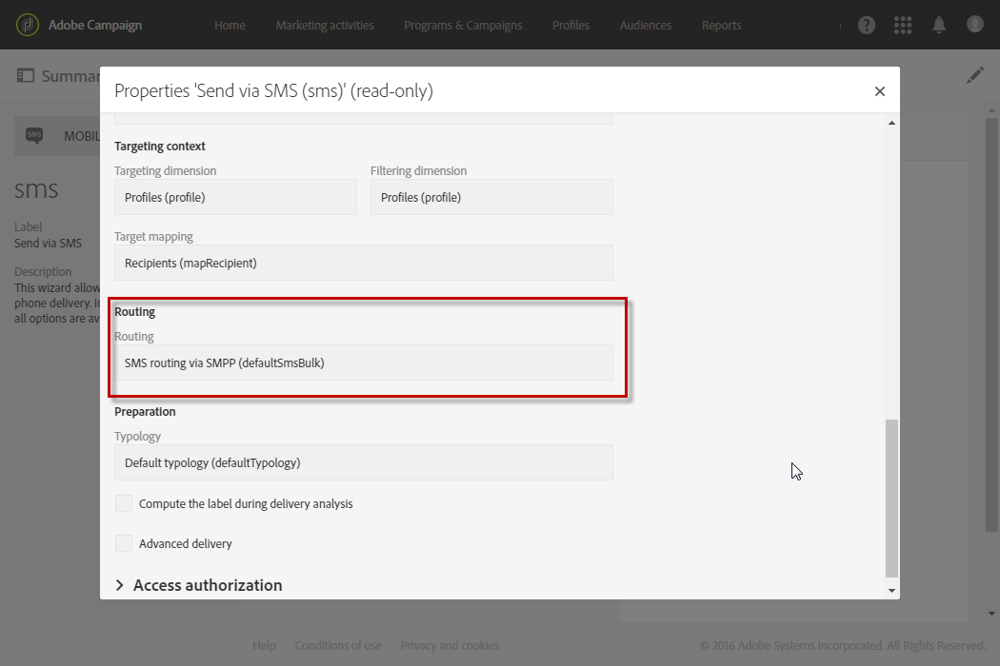

# 关于SMS消息{#about-sms-messages}

Adobe Campaign允许您发送SMS（短消息服务）消息。

>[!NOTE]
>
>SMS频道是一个附加功能。 请检查您的许可协议。

对于SMS消息，您只能以文本格式创建、修改和个性化消息。 您还可以在发送SMS消息之前预览这些消息。

如果GSM编码中的SMS消息长度限制为160个字符，如果采用Unicode，则仅限70个字符。 但是，某些特殊字符会影响消息的长度。 有关详细信息，请参阅 [SMS编码部分](../../administration/using/configuring-sms-channel.md#sms-encoding--length-and-transliteration) 。

可以从菜单、营销活 **[!UICONTROL Marketing activities]** 动或工作流中创建SMS消息，请参 [阅创建SMS消息](../../channels/using/creating-an-sms-message.md)。

要将SMS消息传送到移动电话，您需要：

* 在渠 **[!UICONTROL Routing]** 道上使用该模式配 **[!UICONTROL Mobile (SMS)]** 置的外部帐 **[!UICONTROL Bulk delivery]** 户。 For more on this, refer to the [Routing](../../administration/using/configuring-sms-channel.md#defining-an-sms-routing) section.
* 正确链接到此外部帐户的分发模板。

**相关主题：**

* [管理模板](../../start/using/about-templates.md)
* [SMS配置](../../administration/using/configuring-sms-channel.md#defining-an-sms-routing)
* [SMS报告](../../reporting/using/sms-report.md)

## SMS交付模板 {#sms-delivery-template}

Adobe Campaign为移动设备提供了分发模板。 此模板必须正确链接到用于渠道的外部帐 **[!UICONTROL Mobile (SMS)]** 户。 要访问和修改它：

1. 从高 **[!UICONTROL Resources]** 级菜 **[!UICONTROL Templates]** 单中 **[!UICONTROL Delivery templates]** 选择&gt; &gt;。
1. 将鼠标悬停 **[!UICONTROL Send via SMS]** 在模板上，然后选择“复 **制”元素** 。
1. 选择新模板。
1. Click the **[!UICONTROL Edit properties]** button.
1. 在模 **[!UICONTROL Advanced parameters]** 板属性的部分，确保模板已链接到要用于传送SMS的外部帐户。

   

**相关主题：**

* [管理模板](../../start/using/about-templates.md)

