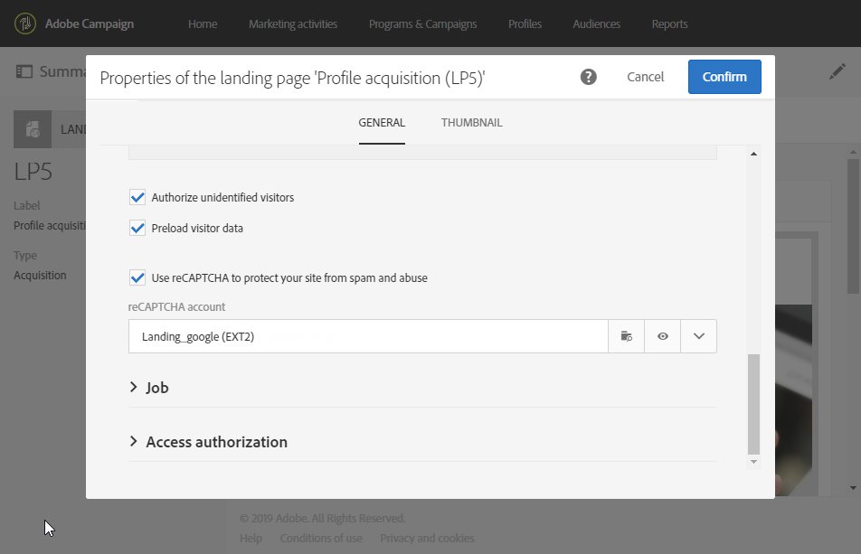

# 配置登陆页面 {#configuring-landing-page}

## 确认登陆页面提交 {#confirm-a-landing-page-submission}

您可以配置当访客提交登陆页面时触发的操作。操作步骤：

1. 编辑通过登陆页面仪表板中的  图标访问的登陆页面属性，并显示 **[!UICONTROL Job]** 参数。

   

1. 在 **[!UICONTROL Specific actions]** 部分之下，选择 **[!UICONTROL Start sending message]** 以确定是否发送自动消息，例如确认订阅服务。然后，您需要选择电子邮件投放模板。

   请注意，如果已在服务级别配置了确认消息，则不应在此屏幕中选择确认消息，以避免发送多条确认消息。请参阅[配置服务](../../audiences/using/creating-a-service.md)。

1. 创建 **[!UICONTROL Additional data]** 以允许在提交登陆页面时存储附加数据。访问该页面的用户不会看到此数据。仅考虑常量值。

   

## 将登陆页面链接到服务 {#linking-a-landing-page-to-a-service}

您可以将表单链接到服务，以便用户档案在验证登陆页面时订阅特定服务。

利用链接登陆页面的参数，可指定执行的操作类型以及登陆页面是专门链接到单项服务还是链接到通用服务。

要选择链接的服务，您需要：

1. 编辑通过登陆页面仪表板中的  图标访问的登陆页面属性，并显示 **[!UICONTROL Job]** 参数。

   

1. 在 **[!UICONTROL Specific actions]** 下拉列表中选择 **[!UICONTROL Subscription]**。

   

1. 选择 **[!UICONTROL Specific service]** 以将登陆页面链接到单项服务。如果要为登陆页面使用多项服务，请勿选择此选项。

   使用 **[!UICONTROL Specified service in the URL]** 选项，可允许登陆页面用于多项服务。此时，配置服务时必须引用登陆页面。

## 设置权限和预加载数据 {#setting-permissions-and-pre-loading-data}

可将登陆页面限制为仅供来自 Campaign 所发送消息中链接的已标识访客访问，例如发送给特定组织单位的链接。
对于已标识的访客，您可以在登陆页面中预载其数据。操作步骤：

1. 编辑通过登陆页面仪表板中的  图标访问的登陆页面属性，并显示 **[!UICONTROL Access & loading]** 参数。

   

1. 选择 **[!UICONTROL Preload visitor data]**。

   如果页面访客与数据库中的用户档案相对应，则其数据将显示在使用数据库数据映射的表单字段中，且登陆页面的个性化元素也会被考虑在内。

   

您还可以使用&#x200B;**[!UICONTROL Authorize unidentified visitors]**&#x200B;选项授权任何访客访问登陆页面。

<!--Use the URL parameters to identify the visitors, using the **[!UICONTROL Authorize visitor identification via URL parameters]** option: then you must choose the loading key and map the filter parameters with the parameters of the corresponding URL.-->

登陆页面还可以链接到组织单位。这样可定义用户对不同登陆页面的访问权限。要分配组织单位，请执行以下操作：

1. 通过 **[!UICONTROL Edit properties]** 图标访问登陆页面属性。

   

1. 展开 **[!UICONTROL Access authorization]**。

1. 单击下拉菜单并选择组织单位。有关如何创建组织单位的更多信息，请参阅此[页面](../../administration/using/organizational-units.md)。

   

1. **[!UICONTROL Created by]**、**[!UICONTROL Created]**、**[!UICONTROL Access authorization]** 和 **[!UICONTROL Last modified]** 字段会自动填写。

1. 单击 **[!UICONTROL Confirm]**，然后单击 **[!UICONTROL Save]**。

现在，您的登陆页面只能由所选组织单位内的用户进行访问和管理。

## 设置 Google reCAPTCHA {#setting-google-recaptcha}

您可以为登陆页面设置 Google reCAPTCHA V3，以防护来自机器人程序的垃圾邮件和滥用。要将其用于登陆页面，您首先需要创建外部帐户。有关其配置方式的更多信息，请参阅此[章节](../../administration/using/external-accounts.md#google-recaptcha-external-account)。

设置 Google reCAPTCHA V3 外部帐户后，您可以将其添加到登陆页面：

1. 在发布登陆页面之前，请使用登陆页面仪表板的  图标访问页面属性。

   

1. 展开 **[!UICONTROL Access & loading]** 菜单。
1. 勾选 **[!UICONTROL Use reCAPTCHA to protect your site from spam and abuse]** 选项。
1. 选择您之前创建的 Google reCAPTCHA 外部帐户。

   

1. 单击 **[!UICONTROL Confirm]**。

登陆页面现已设置 Google reCAPTCHA，您可在页面底部查看。

然后，Google reCAPTCHA 将根据用户与页面的交互情况返回一个分数。要查看分数，请连接到 [Google 管理控制台](https://g.co/recaptcha/admin)。
