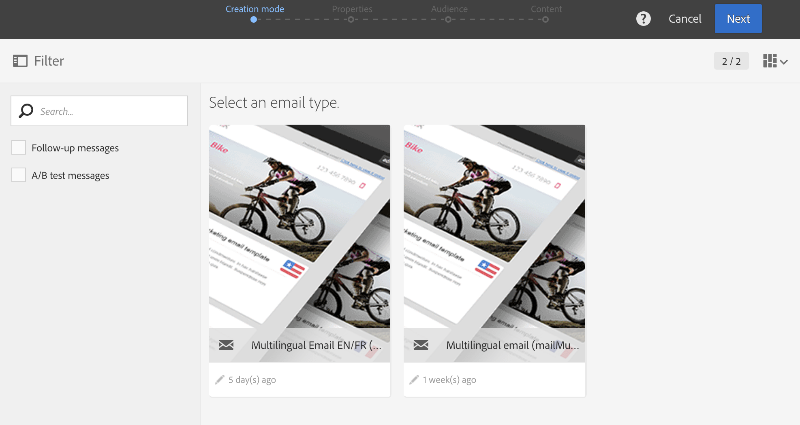

# 创建多语言电子邮件{#creating-a-multilingual-email}

您可以向使用不同首选语言的用户档案发送多语言电子邮件：每位用户档案将收到其首选语言的电子邮件变体。

为此，请检查您是否提供多语言电子邮件模板。 否则，请了解如何在[此部分](../../channels/using/multilingual-messages-template.md)中创建。

该受众基于具有完整的首选语言信息的用户档案。

1. 根据[多语言模板](../../channels/using/multilingual-messages-template.md)创建新电子邮件。

   

1. 定义电子邮件的常规属性和目标受众，操作方式与标准电子邮件类似。请参阅[创建受众](../../audiences/using/creating-audiences.md)一节。
1. 在创建向导的第四步中，定义变体选项。 如果[多语言模板](../../channels/using/multilingual-messages-template.md)已包含所有正确的参数，则可以直接单击&#x200B;**[!UICONTROL Create]**&#x200B;按钮。

   

   如果需要，请使用&#x200B;**[!UICONTROL Add an element]**&#x200B;按钮添加变体。 **[!UICONTROL Default]** 不得删除变量。当设置为&#x200B;**[!UICONTROL default]**&#x200B;时，[将使用用户档案的首选语言](../../audiences/using/creating-profiles.md)选择变体。 您还可以将&#x200B;**[!UICONTROL Default]**&#x200B;变体设置为任何其他语言。

1. 确认创建电子邮件：随后将显示电子邮件仪表板。
1. 定义每个变体的电子邮件内容。 根据您选择的模板，您可以定义多个主题、多个发件人名称或多个不同的内容。使用下拉菜单在元素的不同变体之间导航。 有关更多信息，请参阅[内容编辑器](../../designing/using/designing-content-in-adobe-campaign.md)一节。

   

1. 测试和验证您的消息。 请参阅[发送验证](../../sending/using/sending-proofs.md)部分。
1. 计划发送与&#x200B;**[!UICONTROL Send after confirmation option]**。
1. 发送电子邮件后，您可以访问其日志和报告以衡量活动的成功。 有关报告的更多信息，请参考[此章节](../../reporting/using/about-dynamic-reports.md)。

**相关主题：**

* [使用一个工作流程触及多语言受众](https://helpx.adobe.com/cn/campaign/kb/simplify-campaign-management.html#Engageyourcustomersateverystep)
