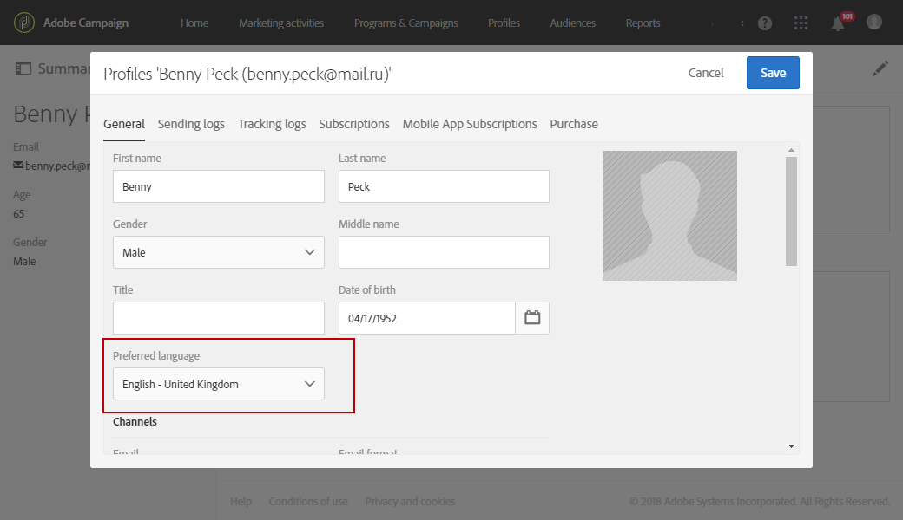
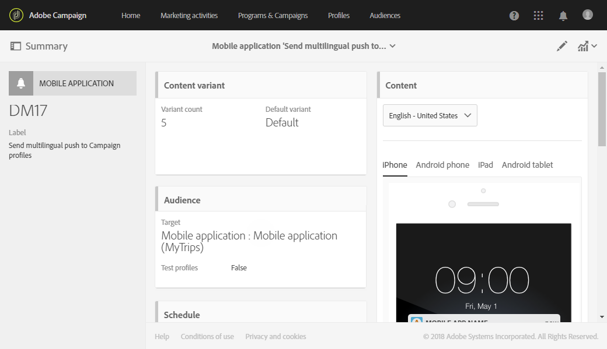
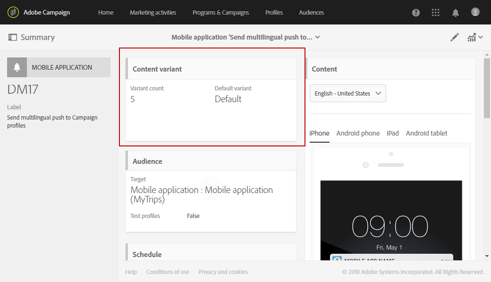

# 创建多语言推送通知{#creating-a-multilingual-push-notification}

## 关于多语言推送通知 {#about-multilingual-push-notification}

根据用户首选的语言和区域，通过发送消息，个性化您的推送通知内容。 您可以在内容编辑器中直接导入多语言推送通知内容变体，并在单次投放中发送多语言推送通知。

此功能根据用于推送通知的投放模板，利用收件人配置文件中指定的首选语言或移动应用程序订阅者的系统语言偏好设置。 如果未为特定用户填充语言首选项，则系统将使用在创建多语言推送通知时定义的默认变体。 有关如何管理用户档案和订阅者的更多信息，请参阅此 [指南](../../audiences/using/get-started-profiles-and-audiences.md).

要在推送通知投放中使用多语言内容变体，请执行以下步骤：

* [步骤1：上传多语言内容变体](#step-1--upload-multilingual-content-variant)
* [步骤2：使用多语言内容变体预览和完成推送通知](#step-2--preview-and-finalize-a-push-notification-using-multilingual-content-variants)
* [步骤3：发送和分析多语言推送通知投放](#step-3--send-and-analyze-multilingual-push-notification-delivery)

## 步骤1：上传多语言内容变体 {#step-1--upload-multilingual-content-variant}

在对多语言推送通知进行个性化之前，我们首先需要在多语言投放模板中上传内容变体并创建投放。

>[!NOTE]
>
>如果要手动为每个语言变体创建变体，也可以跳过此步骤。

1. 在 **[!UICONTROL Marketing activities]**，单击 **[!UICONTROL Create]** 按钮，然后选择 **[!UICONTROL Push notification]**.
1. 选择模板 **[!UICONTROL Send multilingual push to Campaign profiles]** 如果您要定位已订阅您的移动应用程序或模板的Adobe Campaign用户档案 **[!UICONTROL Send multilingual push to app subscriber]** 向所有选择接收来自您的移动应用程序的通知的用户发送推送通知。

   

1. 输入推送通知属性，然后在以下位置选择您的移动应用程序： **[!UICONTROL Associate a Mobile App to a delivery]** 字段。

   请注意，下拉菜单将显示SDK V4和Adobe Experience Platform SDK应用程序。

1. 在 **[!UICONTROL Audiences]** 在Windows中拖放查询以优化受众。

   添加的查询取决于选择的模板：如果您选择 **[!UICONTROL Send multilingual push to Campaign profiles]** 模板，您可以查询移动应用程序的已知收件人。 而如果您选择 **[!UICONTROL Send multilingual push to app subscriber]** 模板时，您可以查询已选择加入的特定应用程序的所有订阅者。
   >[!NOTE]
   >
   >如果您以特定语言定位受众，则需要在CSV文件中列出每种目标语言。

   

1. 在 **[!UICONTROL Manage Content Variants]** 窗口中，拖放文件或从计算机中选择文件。

   该文件必须采用UTF8编码，并且必须具有特定布局，您可通过单击 **[!UICONTROL Download the sample file]** 选项。 您还应使用适当的语法来表示语言环境值。 有关文件格式和支持的区域设置的详细信息，请参阅此 [页面](../../channels/using/generating-csv-multilingual-push.md).

   

1. 上传文件后，语言变体将自动填充到 **[!UICONTROL Variants]** 选项卡。 请注意，您可以提供 **[!UICONTROL Default variant]** 如果未为目标用户指定首选语言，则在将成为默认内容变体的文件中。

   

1. 此 **[!UICONTROL Variant selection]** 选项卡将提供脚本以确定根据投放模板要考虑的语言偏好设置。 这是一个现成的脚本，它不需要您进行任何更改。
1. 如果要添加导入文件中不存在的更多变体，可以通过单击 **[!UICONTROL Add an element]** 按钮并添加所需数量的新语言变体。

   通过添加从文件上传的变体以外的变体，不会将任何内容链接到此语言。 您必须直接在投放仪表板中编辑内容。

   

1. 单击 **[!UICONTROL Create]** 配置完成后。 您可以随时返回 **[!UICONTROL Content variant]** 并从投放仪表板中进行一些更改。

   

您现在可以开始个性化多语言推送通知。

## 步骤2：使用多语言内容变体预览和完成推送通知 {#step-2--preview-and-finalize-a-push-notification-using-multilingual-content-variants}

上传包含内容变体的文件后，您现在可以从推送通知投放中预览不同的变体。

除了从文件上传的变体外，还可以创建和编辑更多变体。

1. 在 **[!UICONTROL Content]** 投放仪表板中的窗口，您可以使用下拉菜单根据选择的语言预览推送通知内容。

   

1. 如果没有为特定语言指定内容变体，请单击预览下的铃铛图标，以便开始将内容添加到此语言变体。

   通过单击 **[!UICONTROL Content]** 窗口中，推送通知表示来自在下拉列表中所选语言的内容。 在此窗口中进行的更改只会影响一种语言。

1. 您还可以单击内容变体以进一步对其进行自定义，例如使用个性化字段。

   有关如何自定义推送通知的更多信息，请参阅此 [部分](../../channels/using/customizing-a-push-notification.md).

   

1. 单击 **[!UICONTROL Content variant]** 窗口。

   请注意，添加新语言后，您必须手动将内容添加到链接到所添加语言的推送通知。

   

您的多语言推送通知投放现已准备就绪，可供发送。

## 步骤3：发送和分析多语言推送通知投放 {#step-3--send-and-analyze-multilingual-push-notification-delivery}

您的多语言内容变体推送通知现已准备就绪，可发送给您的用户。

1. 要开始准备发送，请单击 **[!UICONTROL Prepare]** 按钮。
1. 完成准备工作且没有出现警告时，您可以单击 **[!UICONTROL Confirm]** 按钮以开始发送多语言推送。

   

1. 成功发送推送通知后，单击 **[!UICONTROL Reports]** 图标 **[!UICONTROL Dynamic reports]** 以分析您的交付是否成功。

   

1. 选择 **[!UICONTROL Push notification report]**。
1. 拖放 **[!UICONTROL Variant]** 添加到面板中以开始过滤数据。

   

您现在可以衡量多语言推送通知投放对收件人的影响。

**相关主题：**

* [推送通知报告](../../reporting/using/push-notification-report.md)
* [在工作流中发送推送通知](../../automating/using/push-notification-delivery.md)
