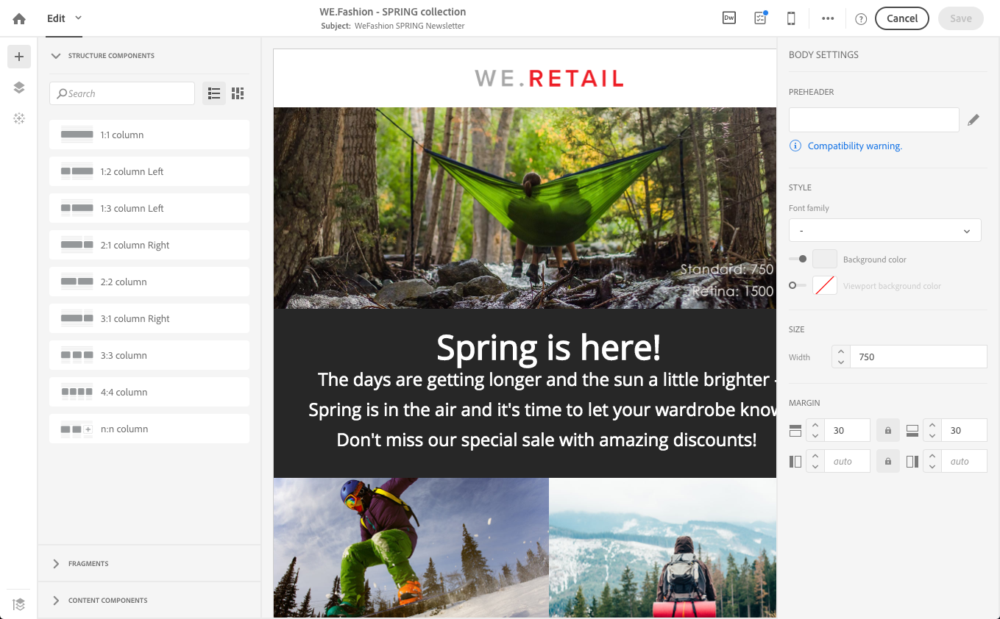

# 创建电子邮件{#creating-an-email}

您可以從以下位置建立電子郵件： [行銷活動](../../start/using/marketing-activities.md#creating-a-marketing-activity)，來自Adobe Campaign [首頁](../../start/using/interface-description.md#home-page)，或中的 [行銷活動清單](../../start/using/marketing-activities.md#about-marketing-activities). 您还可以根据工作流创建单一发送和重复发送的电子邮件。

 [在视频中发现此功能](#video)

1. 開始建立電子郵件行銷活動後，請選取您要使用的範本。

   依預設，您可以為每個行銷活動從數個範本中進行選擇。 這可讓您根據需求預先設定特定引數，並為您的傳送指派品牌。 如需詳細資訊，請參閱 [管理範本](../../start/using/marketing-activity-templates.md).

   

   >[!NOTE]
   >
   >跟进和 A/B 测试模板默认隐藏。勾選左側的方塊( **[!UICONTROL Filter]** 橫向面板)。

1. 輸入電子郵件的一般屬性。 您可以在 **標籤** 並編輯ID。

   >[!NOTE]
   >
   >活動名稱及其ID都會顯示在介面中，但訊息收件者看不到它們。
   >
   >確認ID欄位未包含任何空白以避免出現任何差異，例如與Adobe Analytics整合時。

   您可以添加用户会在营销策划内容中看到的描述。

   

   >[!NOTE]
   >
   >您可以從首頁或行銷活動清單，在父行銷活動中建立電子郵件。 從已建立的行銷活動中選取它。

1. 根據您的業務條件定義訊息目標。 另請參閱 [關於設定檔](../../audiences/using/about-profiles.md).

   您也可以定義將驗證訊息的測試設定檔。 请参阅[管理测试用户档案](../../audiences/using/managing-test-profiles.md)。

   

1. 使用定義並個人化訊息內容、寄件者名稱和主旨 [電子郵件設計工具](../../designing/using/designing-content-in-adobe-campaign.md). 如需詳細資訊，請參閱 [關於電子郵件內容設計](../../designing/using/designing-content-in-adobe-campaign.md).

   

   您可以使用預先定義的內容範本，或使用Dreamweaver或Adobe Experience Manager直接設計訊息。 如果您不覺得自己是設計人員，也可以上傳已為您準備的內容，或從URL匯入現有內容。 请参阅[选择现有内容](../../designing/using/using-existing-content.md)。

1. 預覽您的訊息。 请参阅[预览消息](../../sending/using/previewing-messages.md)。
1. 确认创建电子邮件。

   >[!NOTE]
   >
   >若要儲存電子郵件，您首先需要對內容進行一些編輯。 如果您按一下 **[!UICONTROL Cancel]** 此時，您無法完成精靈，且不會建立您的電子郵件。

   然後會顯示電子郵件控制面板。 它可讓您檢查訊息並 [準備傳送](../../sending/using/preparing-the-send.md).

   此 **[!UICONTROL Edit properties]** 按鈕可讓您編輯電子郵件的屬性。 例如，您可以設定電子郵件，以便在傳遞準備時計算其標籤。  可用的引數列於 [本節](../../administration/using/configuring-email-channel.md#list-of-email-properties).

   

1. 安排发送。请参阅[计划消息发送](../../sending/using/about-scheduling-messages.md)。

   

1. 準備訊息以分析其目標。 另請參閱 [準備傳送](../../sending/using/confirming-the-send.md).

   

   >[!NOTE]
   >
   >您可以设置全局跨渠道疲劳规则，以便自动从营销方案中排除过度投放的用户档案。如需詳細資訊，請參閱 [疲勞規則](../../sending/using/fatigue-rules.md).

1. 发送校样以检查和验证您的消息并监视其收件箱呈现。另請參閱 [傳送證明](../../sending/using/sending-proofs.md).

   

1. 傳送訊息，並透過訊息控制面板和記錄檔檢查其傳送。 另請參閱 [傳送訊息](../../sending/using/confirming-the-send.md).

   

1. 透過傳遞報告測量訊息的影響。 如需報告的詳細資訊，請參閱 [本節](../../reporting/using/about-dynamic-reports.md).

**相关主题**：

* [建立個人化電子郵件](../../channels/using/key-steps-to-send-a-message.md) 逐步指南
* [Adobe Campaign與Dreamweaver整合](../../designing/using/using-integrations.md#editing-content-in-dreamweaver)
* [與Adobe Experience Manager整合](../../integrating/using/integrating-with-experience-manager.md)

## 教學課程影片 {#video}

本影片說明如何建立電子郵件。

>[!VIDEO](https://video.tv.adobe.com/v/23721?quality=12)

提供其他Campaign Standard操作影片 [此處](https://experienceleague.adobe.com/docs/campaign-standard-learn/tutorials/overview.html?lang=zh-Hans).
